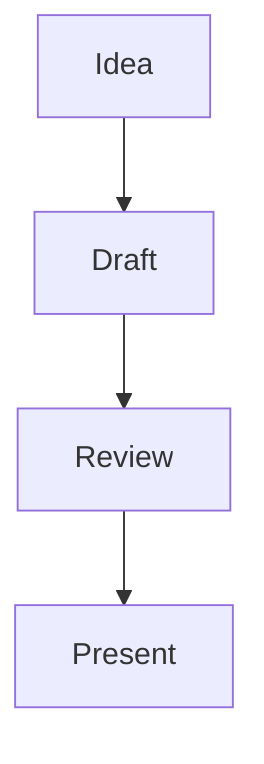

---
slides:
  formatVersion: 1
  title: Slides feature tour
  master:
    theme: signal
    footer: Made with Slides
    logo: Slides.
    metadata:
      metadataTopLeft: deckTitle
      metadataBottomLeft: footer
      metadataBottomRight: slideNumber
---

::slide{id="welcome" section="Welcome" layout="title-image-right" metadataBottomRight="none"}
# Your story, your slides

Write in Markdown. Edit locally. Present anywhere on your network.

:::slot{name="image"}

:::

:::notes
This tour is an ordinary, editable deck. Speaker notes stay private to the presenter.
:::

::slide{id="welcome-left" section="Welcome" layout="title-image-left" metadataTopLeft="none"}
# A cover with the image on the left

The image fills its half of the slide; choose either side in the layout selector.

:::notes
Switch between title-image-left and title-image-right to compare full-height image placement.
:::

:::slot{name="image"}

:::

::slide{id="story" section="Layout examples"}
# One source, many slide types

Choose a layout above any slide preview. Change the **section** in Slide settings to group related slides in the outline.

:::notes
Open the outline to show how sections group related slides without changing their source order.
:::

::slide{id="key-ideas" parent="story" section="Layout examples"}
# Heading and content

- Capture ideas as Markdown
- Rearrange slides in the source
- Use child slides for a deeper dive

This slide is a child of the preceding one. Use the tree navigation while presenting.

:::notes
Use Parent to return to One source, many slide types. The child remains next to its parent in the Markdown source.
:::

::slide{id="two-columns" section="Layout examples" layout="two-columns"}
# Two columns

:::notes
Each column is a named slot in this slide's Markdown. The audience sees only the rendered content.
:::

:::slot{name="left"}
## Write

Keep your message clear and direct.
:::

:::slot{name="right"}
## Show

Present the same source to a read-only audience.
:::

::slide{id="three-columns" section="Layout examples" layout="three-columns"}
# Three columns

:::notes
Use left, center, and right slots to keep three short ideas aligned.
:::

:::slot{name="left"}
## Plan

Start with a question.
:::

:::slot{name="center"}
## Build

Add examples and visuals.
:::

:::slot{name="right"}
## Share

Present and collaborate.
:::

::slide{id="picture-text" section="Image layouts" layout="picture-text"}
# Image beside text

:::notes
This layout pairs an image slot with a text slot rather than using a full-bleed image.
:::

:::slot{name="image"}

:::

:::slot{name="text"}
## Give the image context

Pair a visual with a short explanation.
:::

::slide{id="image-only" section="Image layouts" layout="image-full" metadataTopLeft="none" metadataBottomLeft="none" metadataBottomRight="none"}


:::notes
Use image-full when a visual should fill the entire stage. The provided image is bundled with Slides.
:::

::slide{id="comparison" section="Rich content"}
# Comparison table

| Slide format | Best for | Effort |
| --- | --- | --- |
| Title and content | A short message | Low |
| Columns | Side-by-side ideas | Medium |
| Full image | A visual pause | Low |
| Chart | Data with context | Medium |

:::notes
The table has bold headers and alternating row colors. Edit the Markdown cells to change its contents.
:::

::slide{id="code" section="Rich content"}
# Code with highlighting

```typescript
type Slide = { id: string; title: string };
const slides: Slide[] = [{ id: 'intro', title: 'Hello' }];
console.log(slides[0].title);
```

Code is highlighted, not executed.

:::notes
Fenced code gets syntax highlighting; it is displayed as text and never runs in the presentation.
:::

::slide{id="math" section="Rich content"}
# Math

Inline math works: $a^2 + b^2 = c^2$.

$$E = mc^2$$

:::notes
Inline and block math are rendered from the Markdown source using KaTeX.
:::

::slide{id="bar-chart" section="Charts" metadataTopCenter="slideTitle"}
# A bar chart

```chart
{"type":"bar","labels":["Discover","Build","Share"],"series":[{"name":"Projects","data":[3,8,12]}]}
```

This slide adds its title at the top center without changing the master.

:::notes
The chart is driven by inline JSON. Its data table remains available to screen readers but is not drawn below the chart.
:::

::slide{id="donut-chart" section="Charts"}
# A donut chart

```chart
{"type":"donut","labels":["Design","Build","Review"],"series":[{"name":"Time","data":[25,50,25]}]}
```

:::notes
The same chart data format supports other chart types, including donut, line, area, and scatter.
:::

::slide{id="diagram" section="Diagrams"}
# A visible Mermaid flow



:::notes
Mermaid renders this flow from idea to presentation. The diagram scales to fit the stage without clipping labels.
:::

::slide{id="reveal" section="Presenting"}
# A reveal and private notes

Advance once to reveal the next point.

:::reveal{step="1"}
This point appears only after the first advance.
:::

:::notes
The audience cannot see this instruction or the owner-side source file.
:::

::slide{id="finish" section="Presenting" layout="blank" metadataBottomRight="none"}

:::notes
The blank slide can be used as a pause. Return to the editor to customize this tour.
:::
