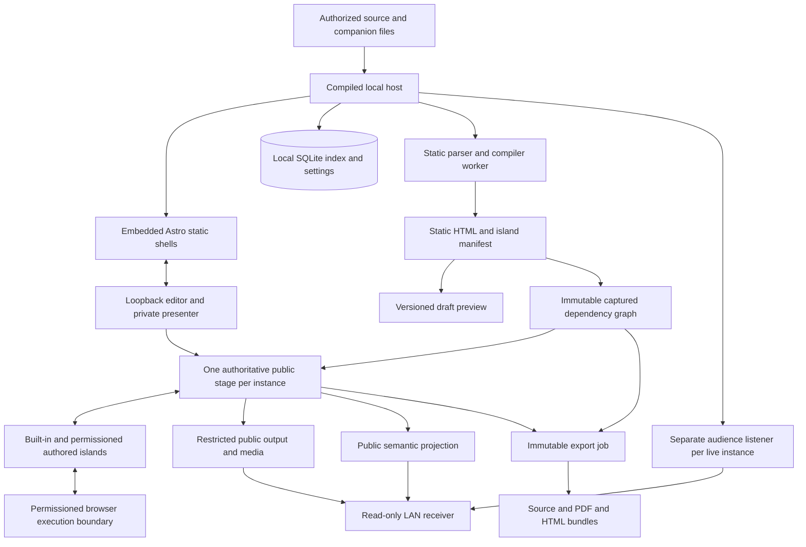
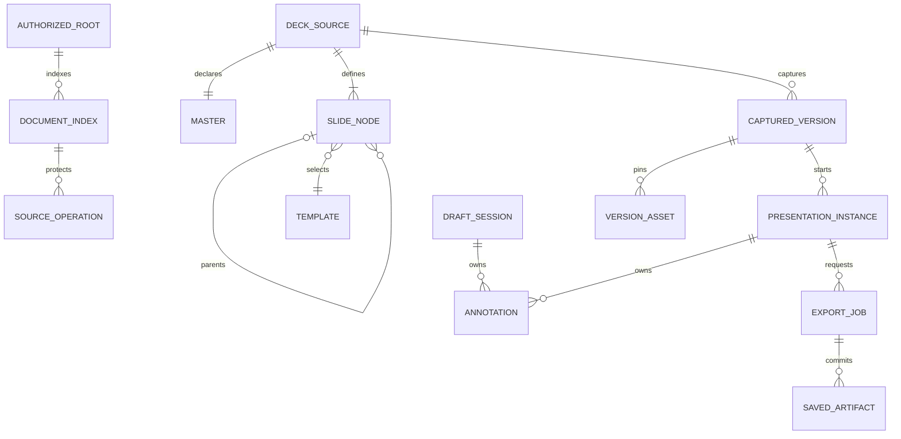

# Technical Design: Slides

**Date**: 2026-09-22 | **Updated**: 2026-09-25 | **Status**: Draft | **Requirements**: [2026-09-21_slides_discovery.md](2026-09-21_slides_discovery.md)

## 1. Overview

Build a file-owned, executable-launched technical presentation application with a local deck gallery/pages view, browser editing, recursive slides, continuous reading, immutable presentation instances, temporary annotations, chrome-free public exports, and explicitly enabled LAN audience delivery. Reuse established content renderers; implement the product-specific tree, permission, version, and annotation contracts.

**Approval boundary:** the discovery and full technical design remain Draft. The stack direction below is selected, but this does not approve Proposed requirements, a reduced v1, implementation, or new browser prerequisites. Other choices remain proposals, subject to owner approval and the feasibility gates in section 10.

Discovery owns product behavior and priorities; this design maps them to implementation contracts. A proposed mechanism that fails a gate must change or remain blocked, not silently weaken a Must. Optional Should/Could capabilities remain nonblocking for v1; when offered, they must meet their documented contract.

**Decision update:** follow-up owner discussion selected Bun + Astro + TypeScript with an islands architecture as the application/frontend direction. Astro is a build-time static shell, not the runtime deck compiler or a resident SSR server. Built-in deck content remains framework-independent; React is an optional, permissioned island adapter. This selection is recorded here without marking the full design Final or treating unrun feasibility gates as passed.

**Repository baseline:** before this design, inspection on 2026-09-22 found only the discovery document and Git metadata, with no application, package manifest, tests, or CI. There is no existing implementation to preserve or migrate. Deckrun is the workflow reference, not the chosen dependency.

**Research scope:** cover the materially different implementation families and credible library alternatives, not every package or every combination. Pros/cons are architectural assessments, not measured performance results. Official documentation is evidence of a capability, not evidence that this complete product meets its requirements. No benchmark or cross-platform prototype has been run.

### Recommendation In Brief

Recommend a custom TypeScript application host compiled with [Bun](https://bun.sh/docs/bundler/executables). Prebuild and embed the browser surfaces and export-player shells with [Astro static output](https://docs.astro.build/en/guides/on-demand-rendering/). At runtime, Bun compiles selected MDX into `DeckIR`, static HTML, and an island manifest; it does not rebuild Astro after each edit. Built-in navigation, annotations, equations, diagrams, charts, and media use framework-independent TypeScript adapters. Include [React](https://react.dev/) in deck/player entrypoints only when runnable React islands need it; packaging can remain inert, while activation requires permission. Keep a [Node.js single-executable application](https://nodejs.org/api/single-executable-applications.html) as the packaging alternative if Bun fails the real dependency/platform tests. Do not start by forking an entire presentation product.

The harder decision is audience delivery. Arbitrary React state cannot be faithfully synchronized merely by sending slide numbers or replaying clicks. Prefer one authoritative public renderer and delivery of its output, with a separate accessible public representation. Whether element-restricted browser capture can satisfy privacy, media, offline networking, and performance on all supported hosts is a blocking experiment, not an established fact.

Retain every v1 Must, whether confirmed or still marked Proposed in discovery: 14 themes, four initial templates, five transitions plus no-motion, browser and external editing, comments, all export formats, all three desktop OS families, and full public-output parity. Feasibility gates order implementation; they do not defer those features out of v1.

## 2. Tech Stack Selection

### 2.1 Whole-Product Approaches

| Approach | Pros | Cons and requirement conflicts | Recommendation |
| --- | --- | --- | --- |
| A. Adapt/fork [Deckrun](https://github.com/arpitbbhayani/deckrun) | Closest executable-to-browser workflow; existing editor, content examples, themes, presenter controls, and browser PDF integration. | Its documented Markdown/HTML model, browser-owned library, flat navigation, annotation/export behavior, and CDN-dependent resources require substantial changes. MDX, recursive trees, permission isolation, frozen dependency graphs, and authoritative LAN output are not established. Fork maintenance and upstream drift remain. | Useful reference and possible source of individually reviewed, license-compatible ideas; not the default foundation. |
| B. Bun + Astro static shell + TypeScript islands | Direct access to the MDX/React ecosystem; mostly static HTML; selective interactivity; one primary language; no separately installed runtime or bundled browser required for core distribution; explicit product/security boundaries. | Astro client directives require components known to its compiler, so runtime user imports need our typed island manifest/loader. We still own orchestration, durable saves, lifecycle handling, authoring syntax, isolation, and LAN fidelity. | Owner-selected direction, conditional on packaging, isolation, export, and LAN gates. |
| C. Native host or desktop shell plus web renderer | Greater process/window lifecycle control; potential native capture and file-operation integration; a Chromium-bundling shell can stabilize rendering. | A native host still needs a JavaScript/MDX compilation strategy; system webviews vary across OSs; bundled Chromium increases download, memory, and security-update obligations. A shell alone does not solve audience parity. | Contingency if browser-host limitations are demonstrated, not an automatic improvement. Detailed variants follow. |

### 2.2 Evidence That Controls The Choice

| Finding | Design consequence | Evidence |
| --- | --- | --- |
| A compiled JavaScript executable can embed its runtime and application assets. | End users need not install Bun/Node. This does not establish artifact size, browser compatibility, signing, or native dependency portability. | [Bun executable documentation](https://bun.sh/docs/bundler/executables), [Node SEA documentation](https://nodejs.org/api/single-executable-applications.html). |
| Astro defaults to prerendered static HTML and selectively hydrates explicit client islands. Its `client:*` directives require directly imported components visible to the compiler and do not support runtime dynamic tags. | Use Astro to prebuild trusted application/player shells. Runtime deck compilation emits a separate framework-independent island manifest; do not run an Astro rebuild per preview edit or pretend arbitrary user imports are native Astro islands. | [Astro islands](https://docs.astro.build/en/concepts/islands/), [Astro client directives](https://docs.astro.build/en/reference/directives-reference/#client-directives), [Astro React integration](https://docs.astro.build/en/guides/integrations-guide/react/). |
| Ordinary screen capture leaves source selection to the user and needs a fresh user gesture/permission. Audio availability varies. | Do not assume silent capture or treat a preferred-tab hint as a privacy boundary. Never send an unrestricted desktop/window stream as a fallback. | [getDisplayMedia security and compatibility](https://developer.mozilla.org/en-US/docs/Web/API/MediaDevices/getDisplayMedia). |
| Element Capture restricts video to a DOM subtree, excluding occluding siblings; its documented implementation is desktop Chrome self-capture. | It is a promising scoped capture candidate, but needs feature detection and tests for source changes, nested content, audio, and host support. Video restriction does not restrict an audio track. | [Element Capture](https://developer.chrome.com/docs/web-platform/element-capture). |
| WebRTC provides media transport, not the application permission, capture, or persistence model. | Evaluate transport separately from source capture and content isolation. A supported API is not a LAN connectivity guarantee. | [RTCPeerConnection](https://developer.mozilla.org/en-US/docs/Web/API/RTCPeerConnection). |

Research used official documentation and GitHub repositories, including a code search for Deckrun's `parseSlides`. The npm registry search could not be completed because of extraction/TLS failures; no npm freshness, download-count, or dependency-audit conclusions are claimed. Documentation is live and may describe versions outside the eventual support matrix. Pin and test exact releases during feasibility work, not by assuming that every latest-documentation feature is available in a selected LTS release.

### 2.3 Existing Presentation Engines

| Candidate | Advantages | Disadvantages for this discovery | Verdict |
| --- | --- | --- | --- |
| [Deckrun](https://github.com/arpitbbhayani/deckrun) | Most similar complete workflow; useful editor/presenter ergonomics; MIT repository. | Changes affect central ownership, parsing, lifecycle, permissions, and export assumptions, not just a few plugins. Its README contains some inconsistent older/newer behavior descriptions, so adoption needs source tests. | Reference, not fork by default. |
| [Slidev](https://sli.dev/guide/) | Rich technical content, themes/layouts, editor, drawing, presenter view, and exports. | Vue-based authoring rather than React MDX; documented CLI needs Node. Packaging is solvable, but recursive navigation, isolation, and full live-state fidelity remain additional work. | Best ready-made alternative only if the owner changes the React/tree/workflow constraints. No such change is assumed. |
| [reveal.js](https://revealjs.com/vertical-slides/) | Mature presentation behavior, fragments, speaker view, themes, scroll view, and plugin ecosystem. | Horizontal roots/vertical stacks are not arbitrary-depth alternating trees. Flattening our tree into a linear deck still requires replacing directional navigation, overview, state ownership, and exports. | A rendering adapter is possible; its navigation abstraction removes little of our hardest work. |
| [Spectacle](https://github.com/FormidableLabs/spectacle) | React-native presentation components, layouts, notes, and live demos; active maintenance stated by the project. | JSX-first composition is not a complete MDX file/library application. Recursive traversal and all security/session contracts still belong to us. | Strong React presentation reference; reconsider if a prototype demonstrates substantial reuse without parallel navigation models. |
| [MDX Deck](https://github.com/jxnblk/mdx-deck) | Closest MDX/React authoring language; themes, steps, notes, presenter mode. | Repository activity inspected is old; its documented Gatsby/Theme UI stack adds migration and maintenance risk. No demonstrated frozen-instance or secure LAN model. | Do not base a new v1 on it without a separate maintenance assessment. |
| [Marp/Marpit](https://marp.app/) | Good Markdown-to-HTML/PDF pipeline; plain CSS themes; lean, export-oriented foundation. | CommonMark converter, not our React runtime, recursive presenter, file library, or annotation product. | Prefer for a static conversion product, which is not the agreed scope. |
| [Quarto](https://quarto.org/docs/presentations/revealjs/) | Strong scientific documents, citations, computed content, and multiple outputs. | Additional authoring/toolchain conventions; executable Python/R capabilities are not needed; reveal.js hierarchy mismatch remains. | Better when scientific publishing is primary and our application behavior is negotiable. |
| Custom tree controller with existing content renderers | One canonical traversal model shared by every output; precise master/session/permission ownership. | Navigation, overview, controls, and orchestration require our tests and maintenance. | Recommended. Custom product logic does not mean custom Markdown, math, charts, or drawing engines. |

### 2.4 Runtime And Distribution Options

| Option | Pros | Cons / dependency cost | Selection rule |
| --- | --- | --- | --- |
| [Bun compiled executable](https://bun.sh/docs/bundler/executables) | TypeScript/JS ecosystem, embedded runtime/assets, HTTP/WebSockets, SQLite, and documented cross-compilation targets. | Runtime contributes a substantial binary baseline; Node compatibility, WASM/asset loading, watchers, browser automation, and signing need real tests. Cross-compiling is not OS acceptance testing. | First candidate; not a promise of meeting 100 MiB or 3 seconds. |
| [Node.js SEA](https://nodejs.org/api/single-executable-applications.html) | Familiar dependency behavior and mature Node APIs; no separate Node installation for users. | Bundling/assets, module loading, code-cache combinations, and supported target matrices are version-sensitive; some addons need extraction. SQLite driver selection depends on the chosen release. | Packaging fallback when compatibility outweighs Bun integration. Use versioned documentation for the chosen release. |
| [Deno compile](https://docs.deno.com/runtime/reference/cli/compile/) | Standalone TypeScript distribution and host permission controls; embedded files and workers. | npm/native-module behavior and runtime bundling need validation; host permissions do not enforce browser document permissions. A third runtime adds little once Bun or Node works. | Credible third JS host, especially if host capability restrictions prove decisive. |
| [Go CLI](https://pkg.go.dev/embed) plus browser | Straightforward server/process implementation; static assets embedded with the standard library; good native networking. | Dynamic MDX/React compilation still needs browser-side JS, an embedded JS engine, or an auxiliary runtime. Noninteractive lint/export must use the same semantics. | Prefer if native networking/capture dominates and a two-language pipeline is accepted. |
| [Rust CLI](https://doc.rust-lang.org/book/) plus browser | Strong native resource control; suitable for filesystem and capture adapters. | MDX ecosystem integration and browser orchestration add bridging; native cross-platform work raises maintainer cost. Reimplementing the remark pipeline risks divergence. | Targeted native adapter before an entire Rust rewrite. |
| [Tauri](https://v2.tauri.app/reference/webview-versions/) | Native windows, file dialogs, permissions, close handling; uses installed system webviews. | WebView2 on Windows versus WebKit on macOS/Linux; prerequisites, codecs, capture, and print behavior vary. Still needs a compilation path for authored components. | Best shell candidate if native window lifecycle is needed and system-webview differences pass tests. |
| [Wails](https://wails.io/) / [Neutralinojs](https://neutralino.js.org/docs/) | Native shell with web UI; useful when Go or a lightweight native bridge is preferred. | Same system-webview and capture concerns; no established advantage for our MDX ecosystem or browser-first launch model. | Not shortlisted without maintainer expertise or a demonstrated shell requirement. |
| [Electron](https://www.electronjs.org/docs/latest/tutorial/offscreen-rendering) | Bundled Chromium, mature window lifecycle, browser APIs, and offscreen frame access. | Chromium/Node download and memory overhead; frequent security updates; native frame encoding/audio are not free. Bundling Chromium is in tension with the lightweight/no-bundled-PDF-browser direction and needs explicit owner review. | Fidelity/lifecycle contingency, not an automatic fallback. |
| [.NET self-contained/AOT](https://learn.microsoft.com/en-us/dotnet/core/deploying/) / [Java jpackage](https://docs.oracle.com/en/java/javase/25/jpackage/packaging-tool-user-guide.pdf) / [PyInstaller](https://pyinstaller.org/en/stable/) | Can ship without separately installed language runtimes; viable if owner expertise strongly favors one. | Additional runtime or interop for the JS content ecosystem; no specific capability advantage here; packaging varies by target. | Viable launchers, weaker fit than the shortlisted hosts. |
| [Flutter](https://docs.flutter.dev/platform-integration/desktop) / [Qt](https://doc.qt.io/qt-6/qtwebengine-overview.html) | Rich native UI and cross-platform application tooling. | Either duplicate browser rendering/export semantics or embed a web engine; extra language, renderer, accessibility, and packaging work. | Poor fit for a Markdown/React/browser-output-first tool. |
| [PWA/browser-only](https://developer.mozilla.org/en-US/docs/Web/Progressive_web_apps) | Minimal application installation; standard web distribution. | Cannot itself bind configurable LAN TCP listeners; browser filesystem/storage support is not a substitute for the required executable and authoritative files. | Does not meet the distribution/serving contract on its own. |

**Why Bun over Go/Rust?** Most required specialized capabilities are JS libraries. A smaller HTTP executable does not remove that compiler/rendering workload. **Why Bun over Node?** Integrated standalone assets, bundling, HTTP/WebSockets, and SQLite make it the lower-assembly starting point. A failed dependency or packaging gate reverses that choice; speculative speed claims do not decide it.

### 2.5 Audience Delivery Options

These are independent of runtime choice. WebSockets synchronize messages; they do not automatically synchronize a React heap or a rendered video frame.

| Method | Pros | Cons / conflicts | Recommendation |
| --- | --- | --- | --- |
| Send slide/reveal plus replay user events | Small payloads, sharp DOM text, easy basic slides. | Randomness, time, asynchronous responses, media clocks, component internals, and late joins diverge. Running document code on viewers requires their permission. | Reject as the full-fidelity design. |
| Explicit serialized state contract for every widget | Deterministic for cooperating components; efficient; accessible native DOM. | Every component needs an adapter and complete state schema; not a general solution for author-supplied React. | Use for built-ins and export representations, not as an undocumented requirement that all arbitrary widgets already satisfy. |
| Authoritative sanitized DOM/output replication, e.g. [Remote DOM](https://github.com/Shopify/remote-dom) | Author code runs once; viewers run only built-in receivers; semantic text and efficient updates. | Canvas/WebGL, CSS pseudo-state/animation, video, shadow DOM, and third-party frames are not fully captured by ordinary DOM mutations. Receiver validation is security-critical. | Strong alternative for a clearly bounded component contract; not proof of arbitrary browser-output fidelity. |
| Authoritative stage capture plus [WebRTC](https://www.w3.org/TR/webrtc/) | Captures visible widget results, hover, animation, and overlays from one renderer; built-in viewer only; media-aware latency/congestion control. | Capture/browser prerequisites, bandwidth, codec text quality, audio isolation, interface control, extra media ports, and accessibility. Pure video cannot satisfy the HTML accessibility target. | Preferred fidelity candidate, paired with public semantics and no-motion output; blocking gate G-02. |
| Encoded stage via [MediaRecorder](https://developer.mozilla.org/en-US/docs/Web/API/MediaRecorder), WebSocket relay, and [Media Source Extensions](https://developer.mozilla.org/en-US/docs/Web/API/Media_Source_Extensions_API) | All LAN delivery can use the bound application port; host controls destination addresses; one encoder can fan out through the host. | Codec/container compatibility, keyframes, join initialization, buffering, and backpressure; chunked recording is not automatically a low-latency live stream. | Transport alternative if WebRTC cannot honor approved-interface/privacy constraints. Same capture gate remains. |
| Screenshots / MJPEG | Simple read-only receiver; broad image support; easy still-state inspection. | High bandwidth for motion, no integrated audio, poor text selection/accessibility; screenshot loops do not establish 60 fps. | Diagnostic or explicitly approved static fallback, not the default live experience. |
| Managed installed Chromium / native offscreen capture | Controlled renderer/window and browser interception; may remove picker and lifecycle ambiguity. | Requires the host to launch and control a debuggable installed Chromium for live presentation (the Element Capture candidate already needs a Chromium presenter browser); remote-debugging APIs are powerful; frame/audio encoding, startup, and OS support still need engineering. | Next capture candidate if element capture fails and the owner approves that prerequisite. |
| Cloud streaming / SFU / general remote desktop | Mature large-audience distribution or broad pixel capture. | Cloud violates offline/no-service scope; remote desktop risks private windows and unwanted control; an SFU adds an unneeded service for the two-client baseline. | No cloud or remote desktop. Revisit a local media relay only after the audience-size profile justifies it. |

**Do not build every transport.** Prove stage capture with two clients, then select one transport from measured results. The blueprint below describes the preferred WebRTC candidate and names its fallback trigger. It is not a claim that browser-only WebRTC already enforces NIC selection or single-port media.

### 2.6 Authored-Code Isolation Options

| Method | Advantages | Limitations | Proposed choice |
| --- | --- | --- | --- |
| Main host `eval`, dynamic import, or [Node vm](https://nodejs.org/api/vm.html) | Easy integration. | Host file/network exposure; `vm` is not a security boundary. Permission to execute is not permission to access everything. | Reject. Never execute deck code in the application server. |
| [Sandboxed iframe](https://developer.mozilla.org/en-US/docs/Web/HTML/Reference/Elements/iframe) plus [CSP](https://www.w3.org/TR/CSP3/) | Broad React/DOM compatibility and origin separation. | Browser API/network/navigation coverage and resource limits are not complete merely because `sandbox` or `connect-src` is present. Same-origin plus scripts can defeat isolation. | Defense in depth for vetted adapters, not the sole hostile-code boundary. |
| Worker alone | Keeps synchronous work off UI thread; terminable. | Has networking and worker globals unless actually constrained; no normal DOM. | Host a real execution boundary inside it. |
| [QuickJS-WASM](https://github.com/justjake/quickjs-emscripten) with explicit host APIs | No ambient host APIs by default; memory/stack/interrupt controls; can run on the presenting device and in recipient browsers. | Interpreter overhead, handle lifetime management, and incomplete browser APIs. React rendering needs a validated bridge such as Remote DOM; those two packages are not a turnkey integrated sandbox. Upstream documents no security audit. | First isolation experiment for the agreed simple JS/React examples; gate G-03 must prove hooks, events, imports, and useful chart demos. |
| OS-isolated managed browser/process | Higher browser compatibility and stronger resource/egress controls if correctly implemented. | Platform-specific enforcement, browser prerequisites, native maintenance; cannot simply transfer the same enforcement into standalone HTML. | Contingency; exported runnable content still needs a recipient-side solution. |

The proposed safe component contract aims to support JSX, React state/effects, events, bounded timers, imported local modules, and application-provided chart/media elements. Direct filesystem, unrestricted DOM escape hatches, arbitrary package installation, and ambient networking are not implicitly granted. This contract requires owner acceptance and a working prototype; inability to run the reference demos is a failed gate, not permission to ship static substitutes for the entire React feature.

Trusted private UI can use normal Astro/ReactDOM hydration. Authored React cannot run that way on the trusted page: the QuickJS candidate needs a compatible guest renderer or constrained DOM polyfill plus a validated output bridge. [Remote DOM](https://github.com/Shopify/remote-dom) supplies DOM mirroring/polyfill primitives, not a proven QuickJS integration or a complete security boundary. G-03 must demonstrate the selected renderer, events, effects, and permitted APIs. Runtime island activation may mount a guest tree over its static fallback; it is not necessarily ReactDOM hydration of host HTML.

### 2.7 Proposed Libraries And Costs

Costs below are qualitative. Actual compressed/unpacked bytes, startup work, and peak memory must be measured on the shipped dependency graph. All runtime resources are packaged locally; documentation CDN examples are not the application's loading policy.

| Layer | Choice / official docs | Why versus alternatives | Cost and containment |
| --- | --- | --- | --- |
| Language | [TypeScript](https://www.typescriptlang.org/docs/) in strict mode | Shared typed contracts versus untyped JS; less interop than native-only hosts. | Build/typecheck tooling; runtime validation still necessary. |
| Host / application bundling | [Bun APIs](https://bun.sh/docs) and built-in bundler | No [Express](https://expressjs.com/), [Hono](https://hono.dev/), or [Fastify](https://fastify.dev/) needed for a small fixed API. Bun embeds the already built browser assets and compiles captured runtime island entrypoints without evaluating them. | Runtime coupling; keep platform calls in host modules. No user-supplied build plugins, macros, project configuration, or package installation. |
| Static shell | [Astro](https://docs.astro.build/en/concepts/islands/) in default static mode | Emits HTML without a client framework runtime and supports route-specific selective hydration. [Next.js](https://nextjs.org/docs), Astro SSR, and a resident [Vite](https://vite.dev/) server add request-time machinery the local host does not need; hand-written HTML templates lose Astro's component/build organization. | Build once for each application release and embed the output. Astro is not invoked per edit, presentation, or ordinary export job. Runtime deck islands use our manifest because Astro hydration directives require compiler-visible imports. |
| Application UI | Astro route shells plus route-specific TypeScript/React islands | Static library/player/audience structure stays HTML-first. Use React only where private editor/master/presenter state materially benefits; [Preact](https://preactjs.com/), [Vue](https://vuejs.org/), and [Svelte](https://svelte.dev/) remain alternatives but add another component compatibility target. | React can load on complex private routes, but a plain deck/player must not import it. CodeMirror and pointer/annotation loops integrate directly through TypeScript. |
| UI controls / style | Native HTML/CSS variables/Grid and [Lucide](https://lucide.dev/); [Base UI](https://base-ui.com/react/overview/quick-start) only inside private React islands | Native controls keep public players framework-free. Base UI avoids inventing complex private menus/dialogs; [Radix](https://www.radix-ui.com/primitives) is credible, while [MUI](https://mui.com/) imposes more visual/runtime surface. A [shadcn](https://ui.shadcn.com/) registry or [Tailwind](https://tailwindcss.com/) is not needed just to obtain tokens. | Test native and island focus behavior. Import only used controls/icons; never make Base UI or React a transitive dependency of a static export. |
| Source editor | [CodeMirror 6](https://codemirror.net/docs/guide/) | Modular Markdown/JS editing, transactions, undo, and diagnostics versus [Monaco](https://microsoft.github.io/monaco-editor/)'s heavier IDE workers. A textarea lacks the selected authoring ergonomics. | Editor-only chunks; configure MDX mixed syntax and screen-reader tests. No collaborative editor subsystem. |
| Parsing / compilation | [MDX](https://mdxjs.com/packages/mdx/), [unified/remark](https://unifiedjs.com/), [remark-directive](https://github.com/remarkjs/remark-directive), [remark-gfm](https://github.com/remarkjs/remark-gfm), [remark-math](https://github.com/remarkjs/remark-math) | AST locations, Markdown/JSX semantics, structured extensions; [marked](https://marked.js.org/) and [markdown-it](https://markdown-it.github.io/) are good Markdown parsers but do not replace the MDX compiler. | Plugin graph and compile cost; shipped plugins only. Parse/compile is separate from running code. |
| Metadata | [remark-frontmatter](https://github.com/remarkjs/remark-frontmatter) plus [yaml](https://eemeli.org/yaml/) | Declarative portable master settings; YAML document API preserves edits better than string replacement; JSON-only metadata is simpler but less ergonomic inside Markdown. | Parser and bounded alias handling; no custom executable tags. |
| Contracts | [Zod](https://zod.dev/) with [JSON Schema 2020-12](https://json-schema.org/draft/2020-12) and [OpenAPI](https://www.openapis.org/what-is-openapi) output | One source for typed inputs and runtime checks versus hand-written duplicate validators. [Ajv](https://ajv.js.org/) is preferable if schema-first contracts become dominant; do not add both initially. | Validation code and schema-generation constraints; file and network boundaries never accept TS types alone as validation. |
| Syntax highlighting | [Shiki](https://shiki.style/guide/) | Precomputed tokens/HAST and consistent export colors versus client-side [Highlight.js](https://highlightjs.org/) or [Prism](https://prismjs.com/) on each viewer. | Grammars/theme data and possible WASM startup; package a declared language catalog and load only needed grammars. Unknown language retains readable plain code plus diagnostic. |
| Equations | [KaTeX](https://katex.org/docs/options) | Explicit discovery requirement; fast HTML/MathML-oriented rendering. [MathJax](https://docs.mathjax.org/) covers broader notation but adds no required advantage; full TeX is excluded. | Math fonts and parser work; `trust: false`, bounded expansion, structured diagnostics. |
| Diagrams | [Mermaid](https://mermaid.js.org/config/usage.html) | Required notation/catalog; [Graphviz](https://graphviz.org/documentation/) or [PlantUML](https://plantuml.com/) introduce other syntax/runtime needs. | Layout engines can dominate CPU/bundle size; cache by source/master/renderer version, strict security, deterministic settings, await rendering. |
| Charts | [Apache ECharts](https://echarts.apache.org/handbook/en/how-to/cross-platform/server/) using SVG initially | All six required chart types, hover/selection, static SVG. [Recharts](https://recharts.org/) suits React composition but couples chart rendering to React; [Chart.js](https://www.chartjs.org/docs/latest/) favors canvas; [Vega-Lite](https://vega.github.io/vega-lite/) favors declarative scientific grammar; [Plotly.js](https://plotly.com/javascript/) has broader scientific scope and bundle cost; [D3](https://d3js.org/) needs more custom chart construction. | Import only required types; data-only safe options, no arbitrary formatter callbacks outside the sandbox; full interaction code only where needed. |
| CSV | [Papa Parse](https://www.papaparse.com/docs) and native `JSON.parse` | Quoting/newlines/encoding diagnostics versus fragile comma splitting; no database/dataframe runtime needed. | Small dedicated parser; cap rows/bytes and explicitly map column types. |
| Shapes / blocks | Native semantic HTML, CSS Grid, and [SVG](https://developer.mozilla.org/en-US/docs/Web/SVG) primitives | The required shapes and composition blocks do not need [Fabric.js](https://fabricjs.com/) or [Konva](https://konvajs.org/)'s object-editor machinery. | Our finite block registry and accessibility/export fixtures; no freeform editor. |
| Pen | [Drauu](https://github.com/antfu/drauu) as a headless SVG drawing engine | Existing stroke/undo mechanics versus drawing from scratch; [Excalidraw](https://docs.excalidraw.com/) / [tldraw](https://tldraw.dev/) provide an unnecessarily broad object editor and additional integration/licensing review. | Adapt stable stroke IDs, reveal ownership, erase, and transaction events; drawing library never owns persistence or session lifetime. |
| Highlights | [Selection/Range](https://developer.mozilla.org/en-US/docs/Web/API/Selection) plus normalized text anchors | Native selection with small product-specific anchors; [W3C Web Annotation](https://www.w3.org/TR/annotation-model/) informs quote/position selectors without adopting a collaboration platform. | Anchor resolution and text-offset tests; unresolved anchors are discarded, never guessed. |
| Motion | [Web Animations API](https://developer.mozilla.org/en-US/docs/Web/API/Web_Animations_API) and CSS | Five presets and pause/no-motion do not need [GSAP](https://gsap.com/docs/v3/) or [Motion](https://motion.dev/). | Own small preset registry and captured timing; deterministic static frame for exports. |
| Files / watching | Standard file/path/crypto APIs plus [Chokidar](https://github.com/paulmillr/chokidar) | Cross-platform atomic-save event normalization versus raw watcher edge cases. | Watch only authorized referenced paths. Watch events are hints, not conflict locks; default long write-settle delays cannot be assumed compatible with preview targets. |
| Library / settings | [SQLite through bun:sqlite](https://bun.sh/docs/api/sqlite), parameterized SQL | Searchable rebuildable index and local config without a server. JSON-only configuration is plausible but needs our own concurrent/index updates; [PostgreSQL](https://www.postgresql.org/docs/) is unnecessary. No ORM required. | Migrations and platform SQLite capability checks; source remains in files, never only in the database. |
| Execution boundary | QuickJS-WASM + reviewed Remote DOM bridge, conditional | Explicit capabilities and termination versus relying solely on iframes or main-thread execution. | Highest-risk dependency integration; lazy-load only when code is permitted. See G-03. |
| Markup sanitization | [DOMPurify](https://github.com/cure53/DOMPurify) in browser contexts and [rehype-sanitize](https://github.com/rehypejs/rehype-sanitize) for static AST output | Established sanitizers versus regex stripping; browser-native Sanitizer API remains an alternative after matrix validation. | Two distinct insertion boundaries, shared allowlist policy and adversarial fixtures; neither sanitizes executable JavaScript into safety. Avoid adding a server DOM solely for this. |
| PDF | [puppeteer-core](https://pptr.dev/guides/installation) + installed supported Chromium | Headless CSS/DOM fidelity without downloading a browser. [Playwright](https://playwright.dev/docs/library) is equally capable but its default browser/version model is better used in tests; [PDFKit](https://pdfkit.org/) / [React-pdf](https://react-pdf.org/) require a second layout implementation. | Browser discovery, version checks, isolated temporary profile, readiness/cancellation; use `page.pdf`, not whole-slide screenshots. |
| Live messaging | Native WebSocket; browser WebRTC candidate | No [Socket.IO](https://socket.io/docs/v4/) rooms/fallback stack or [Yjs](https://docs.yjs.dev/) CRDT needed for one controller. [SSE](https://developer.mozilla.org/en-US/docs/Web/API/Server-sent_events) plus HTTP is a valid simple alternative for one-way status, but separate signaling needs make WebSocket sufficient. | We implement sequence IDs, reconnect and bounded queues, not network protocols. No public STUN/TURN defaults. |
| Tests | [Bun test](https://bun.sh/docs/test), [Playwright Test](https://playwright.dev/docs/intro), [axe-core](https://github.com/dequelabs/axe-core), [PDF.js](https://mozilla.github.io/pdf.js/) for extraction checks | Native host tests plus actual browsers and PDF inspection; [Vitest](https://vitest.dev/) is a fallback if DOM/component testing requires its ecosystem, not a second default test runner. | Dev/CI-only dependencies and browser downloads; none are end-user browser prerequisites beyond the declared matrix. |

## 3. System Architecture

### 3.1 Boundaries



The capture-to-viewer edge is WebRTC media in the preferred candidate, not necessarily traffic through the HTTP listener. Public semantics/signaling use the audience listener. Private controls never attach to that listener.

| Component | Owns | Must not own or receive |
| --- | --- | --- |
| Local host | Writable default deck root, selected-location file grants, saves/conflicts, library index, build scheduling, private authentication, instance records, audience ports, export commit/cancel. | Execution of document JS; ambient serving of the document directory. |
| Astro shell | Trusted application route structure, static player/audience HTML, release-built assets, private-route hydration points. | Runtime deck compilation, authored dependency resolution, source persistence, or a resident SSR lifecycle. |
| Compiler worker | Shipped parser plugins, structural checks, dependency discovery, static output, diagnostics. | User build configuration/plugins/macros, remote package installation, MDX `evaluate`/`run`. A worker is crash isolation, not permission to execute deck code. |
| Island loader | Validated built-in adapters and sandboxed, permission-gated authored JavaScript/React entrypoints from the captured manifest. | Undeclared modules, ambient network/files, private state, or silently executing denied code. |
| Draft | Current edited source revision, last valid coherent version, preview marks, dirty/conflict/save state. | Live instance mutation. |
| Instance | Captured content/master/templates/dependencies, controller lifetime, playback state, own annotation set. | Mutable aliases to draft files or another instance's marks. |
| Public stage | Authoritative widget/media output; visible slide/reveal and public overlays. | Notes, private comments, raw source, editor or authorization credentials. |
| Audience receiver | Decoded public output and accessible public state, current epoch/sequence. | Authored modules, island execution payloads, presenter input authority, or private file lookup, even when the host has granted execution. |
| Export worker | Captured version, options, static representations, selected annotation revisions. | Reads from current draft paths after capture; automatic session recovery. |

### 3.2 Source Contract And Compilation

**Proposed syntax**, to validate with real authoring before approval. Use the same MDX grammar explicitly for both `.mdx` and `.md`; do not let an extension silently change the code-permission model. CommonMark caveats remain documented. A file containing ordinary Markdown and no slide directives becomes one slide automatically.

````mdx
---
slides:
  formatVersion: 1
  master: { theme: signal, headingSize: 48, bodySize: 28, codeSize: 22 }
  layouts: { intro: title-content, detail: two-columns }
---

import Counter from './components/Counter.jsx'

::slide{id="intro"}

# System Overview

Ordinary Markdown content needs no authored JavaScript.

:::reveal{step="1"}
The first additional explanation.
:::

:::notes
Private presenter notes.
:::

::slide{id="detail" parent="intro"}

## A Small Demonstration

<Counter />

::slide{id="conclusion"}

# Conclusion
````

The theme name and sizes above are examples, not an approved catalog. A top-level `slide` leaf directive begins content ending at the next top-level slide directive. Parent IDs define the recursive tree; sibling declaration order is preserved. Reject cycles, missing parents, duplicate IDs, illegal nesting, ambiguous reveal steps, and structural directives produced dynamically by executable code. Reveal groups use contiguous positive integer steps starting at 1; step 0 is the initial state, and groups sharing a step reveal together. An unassigned layout uses `title-content`. Headings remain content, so heading levels do not impose a six-level tree limit. Code fences containing separators/directives are parsed as code, never split with a string regex.

Container directives define notes, reveal groups, named layout slots, and built-in blocks. Catalog insertion generates them. Plain Markdown must remain practical; JSX is optional. Notes are declarative static Markdown, extracted to a private graph before generating any public module. Executable expressions, custom JSX, event handlers, and imports remain inactive until permission. Passive blocks and recognized data-only built-ins render through a static AST path even when other parts of the file contain denied code.

One pipeline produces an internal `DeckIR`: stable node IDs, ordered child lists, depth, preorder position, reveal groups, block/source locations, typed master, template assignments, private notes, and dependency metadata. It also emits static HTML plus a typed island manifest for interactive blocks. Public projection is a separate allowlisted representation, not the IR with a CSS-hidden notes field. Resolve slide titles from their first static public heading, falling back to `Slide <hierarchical number>`; never evaluate code or read notes for a title. Optional declarative `slides.title` supplies the deck title, otherwise use the first public slide heading or the source filename stem. Escape resolved titles as text in cards, pages, and TOC entries.

Use compiler/bundler resolver hooks constrained to authorized real paths. Allow shipped packages such as React and approved local modules; resolve their transitive imports without evaluating them. Nonliteral dependency paths require declared finite assets or a diagnostic. Never automatically install npm imports, run install scripts, execute JSX during bundling, or load a deck's build configuration. Invalid edits retain text/diagnostics and the last valid preview; late build results cannot replace a newer revision.

Astro builds only trusted release-time route/player shells. Its native `client:*` directives are suitable for directly imported application islands, but not runtime components discovered in a user's deck. The runtime manifest identifies each block, its captured entry hash, JSON props, activation policy, independent permission requirements, static fallback, and optional state codec. The TypeScript loader dispatches to framework-independent built-ins or sandboxed JavaScript/React adapters. Deck-rendering entrypoints and public HTML bundles with no runnable React island have no React/ReactDOM dependency. A containing private editor/presenter shell may separately load React for its own controls; that does not make the deck renderer React-dependent.

Permission and scheduling are separate: visibility/idle policies never authorize execution, and JavaScript examples require an explicit Run action. Module initializers, expressions, function-valued props, and state codecs execute only inside the permissioned boundary, not while producing manifest JSON. Keep components sharing React context/state in one authored island tree; do not split every JSX tag into an independent root. Unsupported cross-island dependencies require a diagnostic, not silently changed React semantics.

### 3.3 Canonical Navigation

Precompute preorder node IDs and each node's parent/sibling/child destinations. A position is `(nodeId, revealStep)`, with zero the initial step. Next increments reveal state before the next preorder node; Previous reverses that sequence and enters a preceding node at its final reveal. Direct, parent, overview, and arrow jumps enter step zero. Boundaries do not wrap.

| Current depth | Sibling axis | Enter first child | Backward at first sibling | Forward at last sibling | Enter end of previous branch |
| --- | --- | --- | --- | --- | --- |
| Even, including root depth 0 | Up / Down | Right | Up returns parent if present. | Down continues to the nearest ancestor's next sibling if present. | Left, when the previous sibling has children. |
| Odd | Left / Right | Down | Left returns parent if present. | Right continues to the nearest ancestor's next sibling if present. | Up, when the previous sibling has children. |

"End of previous branch" is the previous sibling's last descendant in preorder; otherwise that perpendicular backward direction is unavailable. A parent control works from any sibling. The supplied fixture must visit `1, 1.1, 1.1.1, 1.1.2, 1.2, 2` with Next. Arrows must reach `1.2` by Down from `1.1.2` and `2` by Right from `1.2`, and reverse those moves by Left from `2` and Up from `1.2`. Private presentation controls and independent HTML navigation show hierarchical numbering from sibling positions and overall node progress, such as `1.1.2` and `4 / 100`; reveal steps never change these counts. The progress control opens the hierarchy-aware jump overview outside the public stage. Library pages view uses the same preorder nodes (one fully revealed static thumbnail per node), while PDF page iteration expands their reveal states. Thumbnail selection does not change a live instance's playback position. Canonical traversal, continuous reading, pages view, and PDF call the same pure model. No graph database, routing library, or presentation engine is needed to compute this tree walk.

### 3.4 Captured Versions And Public Delivery

Capture bytes, not file paths alone. For a draft request, pin the explicitly requested editor revision, even if autosave is pending; an unresolved external-file conflict still blocks rendered export or normal presentation launch. Do not replace editor bytes with the disk version. Build a manifest of source, components, data, local media/fonts, master, and template assignments; copy dependencies into immutable blobs and compile against that captured graph. Recheck dependency hashes around capture and retry or fail if inputs change, without silently selecting a newer editor revision. Validate the captured result before publishing it. This provides a coherent validated version, not a claim of an atomic snapshot across arbitrary external multi-file writes. Hard links to externally editable assets are not immutable copies.

A source/dependency/master change only invalidates the draft. Active instances pin their own versions. The last-valid action selects a retained complete version and rechecks authorization and readiness; it is disabled when only a visual preview survives.

Linked local and LAN audience delivery both require fidelity preflight against the current instance. Private local presentation can remain usable if capture or delivery fails; never substitute divergent receiver content. Local-only delivery must stay on loopback with no LAN listeners or unapproved interface traffic; G-02 must prove that boundary as well as approved-interface LAN sharing.

For the preferred capture candidate:

1. The private presenter owns one visible public stage at a fixed proposed 1600 x 900 logical size. Capture and encode resolution is a separate profile value, so a logical stage size is not a pixel resolution. The presenter can interact with its prepared demos; linked local/LAN views are receivers, not duplicate demo executions.
2. Request capture from a user action on the host's trustworthy loopback origin. Verify self-capture, derive `RestrictionTarget`, and await `restrictTo` before attaching any outgoing track. Stage background is opaque and isolated; no notes or tools are descendants. Never substitute unrestricted capture or assume a rectangular crop excludes overlays.
3. Capture video only. Produce audio from application-owned media using the [Web Audio API](https://developer.mozilla.org/en-US/docs/Web/API/Web_Audio_API), with only public media nodes connected to the outgoing mix. Do not forward system/tab audio merely because video is restricted. Cross-origin/protected media without a safe audio/fidelity path requires a common approved fallback or preflight failure.
4. Use built-in receive-only WebRTC peers and local signaling, no cloud, public STUN/TURN, microphone, camera, or audience input channel. Transport feedback and negotiation are allowed; content controls are not. Late join creates a fresh peer at current output/state, not replay from slide one.
5. Stream matching public text/MathML, alt descriptions, chart data/selected values, captions, and visible comment semantics. No hidden future reveals, notes, or private comment bodies. A screen-reader title alone is not an accessible equivalent to a slide video.
6. Honor reduced motion with an equivalent no-motion public projection using captured state: suppress transitions/reveal movement, use static backdrops, and preserve widget values and media position. This is extra work; a video element cannot selectively remove captured animations. Prove it in G-02 or change the delivery approach before approval.
7. On capture stop/source change/ineligible target or stale transport, stop delivery and indicate disconnection. The [Element Capture draft](https://screen-share.github.io/element-capture/) specifies frame suppression when the target becomes invalid; test actual supported browsers. No frame may leak before restriction or after source switching.

**Unresolved blocker:** WebRTC may gather/bind candidates on interfaces the host application cannot select, including mDNS candidates, and uses media ports beyond the audience HTTP port. `iceServers: []` removes configured public rendezvous servers, not all interface/routing concerns. G-02 must demonstrate approved-interface-only delivery and no unwanted traffic; filtering displayed URLs alone is insufficient. If not possible, choose the host-relayed transport or an approved managed/native capture path. Do not relax the discovery's network boundary.

### 3.5 Master And Templates

The master is declarative source metadata: palette roles, heading/body/code font references and sizes, background, logo, footer, and motion settings. Store `themeId` plus sparse author overrides; the resolved master is the theme preset merged with those overrides. Switching themes changes the preset base and preserves explicit overrides; a separate Reset action clears them. All descendants and all four templates read the same resolved tokens. Math preserves its own required fonts.

The 14-preset catalog (stable IDs, names, palette and typography tokens) is an open design deliverable, frozen before approval (section 13). Acceptance criteria: each preset differs from every other in palette or heading/body font pairing, every supplied text/background role pair meets NFR-014 contrast, and switching presets never rewrites content.

Templates only arrange named content slots. **Proposed slot notation:** a `:::slot{name="left"}` container directive inside a slide; the slide's template comes from the `layouts` front-matter map. Slot names are `title-content`: title, content; `two-columns`: title, left, right; `three-columns`: title, left, center, right; `picture-text`: title, picture, text. The first static heading fills `title` unless a `title` slot is given. Repeated names append in source order. A name not defined by the assigned template produces a diagnostic, and its blocks go to the continuation region. For unassigned content, use deterministic contiguous block grouping in source order, preserving every block; picture/text selects the first eligible image and retains a defined reading order. Explicit slot assignments remain stored when changing layouts, and unused slots are rendered in a visible continuation region with an overflow diagnostic, never dropped. Layouts cannot redefine master palette/fonts/background/shared elements. Master edits update draft previews and draft exports, not instances. Animated backdrops are opt-in master motion settings (FR-048): off by default, pausable as a playback control without editing source, suppressed under reduced motion, and each declares a deterministic static frame used for PDF, offline fallbacks, and no-motion output. All 14 themes, five transitions, and each shipped backdrop require their own fixtures; no-motion is additional.

## 4. Key Workflows

### 4.1 Edit, Save, And External Conflicts

```mermaid
sequenceDiagram
	participant Editor
	participant Host
	participant Files
	participant Compiler
	Editor->>Host: Update text with base revision and disk hash
	Host->>Compiler: Validate latest draft revision
	Host->>Files: Compare current authorized file generation
	alt Competing change
		Host-->>Editor: Conflict plus both versions; stop autosave
	else Eligible save
		Host->>Files: Recoverable replace and durability checks
		Files-->>Host: Persisted generation or failure
		Host-->>Editor: Saved only after persistence; otherwise error
	end
	Compiler-->>Host: Version-tagged result
	Host-->>Editor: New valid preview or diagnostics with stale preview
```

Preview scheduling is independent of the autosave debounce. External clean changes reload; overlapping changes preserve editor and disk candidates. The local host serializes its own writers and uses content-hash preconditions, not timestamps alone. A watcher and a pre-write hash check cannot eliminate the final check-to-replace race with an uncooperative editor. The file adapter must retain the generation it actually displaces, using tested platform replace/swap semantics or an equivalent recoverable operation; a simple rename plus a previously copied backup is not proof. Source-only safety copies are allowed; annotations never enter them. G-04 decides whether a small native adapter is needed.

Preview text editing (FR-109) is a second input path into the same source document, not a separate model. The compiler marks a preview block as text-editable only when it is a heading, paragraph, blockquote, or list item whose `DeckIR` source range contains only plain text and backslash escapes, with no inline formatting, links, math, JSX, or expressions; its rendered element carries that node ID and source range, keyed to the preview revision. On input, the draft workspace computes the replacement text for exactly that range (preserving the block's leading Markdown prefix), escapes any newly typed Markdown- or directive-significant characters, and dispatches it as a CodeMirror transaction. Undo/redo, autosave, conflicts, and hot reload therefore follow the normal edit path above. If the preview revision no longer matches the editor revision, or the preview is stale, invalid, or conflicted, the preview is read-only and edits are rejected rather than remapped. Non-editable blocks (code, diagrams, charts, images, media, components, and richly formatted text) only move the CodeMirror caret to their source location. Presenter, audience, LAN, and export shells never receive editable markup or source ranges.

Rename/duplicate first inspect the source and dependency manifest. Rename within a directory retains relative references; a move recalculates resolvable references or copies authorized dependencies, reports collisions, and retains the original until success. Duplicate gets a new document identity without overwriting shared assets. Library deletion requires confirmation and only deletes the selected source file, never referenced assets or shared resources implicitly.

#### Local Library And Pages View

On first launch, provision a `Decks` directory under the platform's per-user application data, never beside the executable. Display the default location; creating a deck there authorizes that application-owned directory. Creation/write failures leave the library usable with an actionable error and explicit alternative-location selection, never a silent fallback or false saved status. `New deck` saves there unless the author explicitly selects another authorized location.

File-path launch/open grants read-write access to the selected file and read-only resolution of its referenced files beneath its parent directory. That grant does not permit listing or indexing sibling decks; references outside that directory need existing or explicit additional grants. Saving elsewhere authorizes the selected destination. A separately confirmed directory grant permits indexing that directory. Persist those selections and index all app-created/opened decks across restart; watch only granted files/directories and reconcile startup/refresh results. Native canonical path identity prevents duplicate cards from overlapping roots or symlink aliases. Keep missing/denied/invalid entries rather than dropping them. Relink explicitly selects a new authorized source for an unavailable entry, preserves its document identity, and neither moves nor overwrites files; reject collisions with another indexed document. Remove from library deletes only the index entry and any exact-file grant, and records a `library_exclusion`, never touching files; directory reconciliation skips that canonical path until the author reopens or relinks it. The index is rebuildable from retained grants and existing files, not a promise to rediscover moved/deleted files automatically.

`/library` shows searchable cover cards from indexed decks. Covers use the first node's fully revealed static public projection; pages use one such thumbnail per node in canonical order with hierarchical number/title. Both exclude notes and session annotations, execute no authored code, and make no external requests; use packaged static fallbacks or a labeled placeholder. If retained valid pages are shown after invalid edits, label their revision as stale. Key previews by source/dependency/master/renderer revision and ignore obsolete results.

Selecting a card opens `/draft/:id/pages`; choosing a thumbnail opens that slide in the same draft workspace, while a separate Present action starts an instance at the first node, step 0, in its own owner document. Draft changes refresh affected previews; master changes refresh them all. Use the existing static renderer, not another slide ordering or screenshot authority. Neither gallery nor pages view is a live-presentation surface.

### 4.2 Start Presentation And Sharing

A presentation instance can run locally without exposing a LAN listener. Public receiver readiness is separate from creating its private local stage. Explicitly starting LAN sharing performs the range-selected bind automatically on approved addresses; no manual port-selection step is required. Opening a draft never starts sharing. The separate instance/share API calls below support this distinction and may be combined by the live-start UI action.

```mermaid
sequenceDiagram
	participant Presenter
	participant Host
	participant Stage
	participant Listener
	participant Viewer
	Presenter->>Host: Start from valid draft or explicit retained version
	Host->>Host: Check conflicts, permissions, captured graph, fallbacks
	Host->>Stage: Create fixed instance and empty annotations
	Stage-->>Host: Local stage ready; receiver/capture readiness or diagnostics
	opt Explicit LAN sharing
		Presenter->>Host: Approve interfaces and configured range
		Host->>Listener: Bind candidate port on approved addresses
		Listener-->>Host: Success or bounded failure
		Host-->>Presenter: Advertise only bound audience URLs
		Viewer->>Listener: Join audience session
		Listener-->>Viewer: Public state and signaling
		Stage-->>Viewer: Current restricted output and permitted media
	end
```

An invalid draft or an unresolved conflict blocks normal launch. Warnings alone do not block; denied code can use valid readable fallbacks. Sharing failure leaves local editor/presentation and other instances usable. A last-valid launch never resolves or discards draft edits. If sharing starts after local playback, preflight the instance's current public output, not the newer draft. Required fallback approval applies consistently to the local stage and every receiver. Stop-sharing closes only LAN resources, preserving the instance, its local audience view, playback, and marks. Do not advertise a live URL while still checking an unrestricted capture.

### 4.3 Export And Transactional Annotation Decisions

```mermaid
sequenceDiagram
	participant Presenter
	participant Instance
	participant Job
	participant Disk
	Presenter->>Instance: Request export
	Instance->>Job: Capture version, state, options, marks with revisions
	Job-->>Presenter: Disclose preserved content; Save / Clear / Cancel
	Presenter->>Job: Choice, plus decision output for Save/Clear
	alt Cancel
		Job->>Job: Release captured input; no changes
	else Save or Clear
		Job->>Job: Render only captured input, per output
		loop Each requested output
			Job->>Disk: Write and validate output, then commit
			alt Committed (annotation-dependent outputs also need their owner alive)
				Disk-->>Job: Durable receipt for this output
			else Failure, or owner ended before an annotation-dependent output committed
				Job->>Job: Cancel only this output; remove its unfinished file
			end
		end
		alt Decision output committed (save-annotations for Save, clear-gate for Clear)
			opt Clear selected
				Job->>Instance: Remove captured marks only if revisions still match
			end
			Job-->>Presenter: Per-output success/failure receipts
		else Decision output failed or was canceled
			Job-->>Presenter: Per-output receipts; no marks cleared or falsely saved
		end
	end
```

At request, capture the selected instance/draft session, not whichever is later active. The host and renderer must acknowledge a common capture revision for content, runtime representations, and marks before the background job starts; later strokes/playback cannot affect it. For supported blocks, export uses serializable public state and built-in static rendering. For opaque dynamic blocks, use a validated block snapshot or a declared author fallback. Never promise to serialize arbitrary React closures or rerun code later and call the result the earlier state. A missing trustworthy representation blocks that output unless the presenter approves a disclosed substitute.

| Output | Concrete strategy |
| --- | --- |
| Raw source backup | Exact chosen editor/disk/instance source and available authorized companions; malformed syntax allowed, no execution. Report missing companions without blocking text. Warn that source is not audience-safe. |
| Converted Markdown | Captured valid draft AST or selected live instance's captured AST; preserve ordinary Markdown; convert structural/built-in extensions to headings/static equivalents, keep authored notes as labeled Markdown sections, and report unsupported MDX with explicit placeholders/fallbacks. Never read a newer draft for a live request. Not a silent raw rename or audience-safe guarantee. |
| Interactive HTML | Astro-built static player shell, public static projection, canonical tree/reveal runtime, local assets, independent navigation, and only referenced island chunks. Recipient grants authored code/network separately. No author editor dependency; a deck without React ships no React runtime. |
| Continuous HTML | Astro-built reading shell in the same node order, one fully revealed occurrence per node, semantic responsive reading, and only supported referenced islands. |
| Private presenter HTML | Separately labeled private artifact containing notes and private comments/tools. Do not place it inside a public bundle's directory. |
| Default PDF | Construct a print DOM with one page per `(node, step)`, using selectable HTML text/code, vector math/diagrams where supported, and block-level static dynamic output. Use deck-aspect-ratio CSS page sizing, explicit page breaks and zero browser margins; `preferCSSPageSize: true`, `printBackground: true`, `displayHeaderFooter: false`. No application chrome or browser-added date/URL headers. Await fonts, images and renderer readiness; print with `page.pdf`. |
| Final-only PDF | Proposed Should option; one fully revealed page per node plus any saved canvas appendix. Keep default reveal-expanded behavior. |

Public rendering uses a slide/reading-only export shell; it never serializes the library, pages view, editor, presenter tools, notes, or private comments. Independent HTML includes its own navigation, permission, playback, and accessibility controls outside slide content, not the authoring application UI. Authored master logos/footers and explicitly saved public marks/comments/canvas appendices are content. Original source, converted Markdown, and separately labeled private presenter HTML have no public-safety guarantee; do not mislabel them as public output.

PDF options are `revealMode: all | final` (default `all`) and `includeToc: boolean` (default `false`). Final-only and TOC are Should capabilities: advertise their tested availability and reject an explicitly requested unsupported option before rendering, not silently substitute another mode.

Build one ordered output plan from the captured input: optional TOC pages, canonical slide/reveal pages, then saved canvas appendices. A TOC has one entry per node, including descendants, using its resolved title and hierarchical number. Link to that node's first emitted page: step 0 in all-reveals mode, `revealCount` in final-only mode. Generate unique anchors per emitted page, not repeated DOM IDs from copied reveal states. Derive any displayed physical page numbers from the completed plan, including multi-page TOC offsets; authored slide numbering does not change. Validate actual PDF destinations in G-06. If linked TOC is unsupported, disable it with a reason; a requested unsupported TOC fails without blocking a separately requested ordinary PDF. No separate PDF library or bookmark feature is required.

With TOC off, the unannotated reference yields 160 pages in default mode or 100 in final-only mode; enabled TOC and saved canvas pages are additional. Marks are filtered by `creationStep <= pageStep`; final/continuous output includes all surviving marks. Canvas drawings become one labeled final appendix per marked slide after all deck pages, in canonical node order. Export excludes laser, blackout, tool UI, and erased stroke history.

HTML islands start with a readable static fallback. Built-in islands use framework-independent TypeScript modules. Parsing, compiling, and packaging authorized local modules as inert bytes does not require code-execution permission; evaluating them to render, capture state, or invoke a codec does. Runnable HTML may therefore include denied-but-inert authored code. The exported recipient must still grant their own execution permission before activation, and network permission remains separate. A manifest declares requirements, never grants them.

Clean draft exports use authored initial widget/media state. Save-annotations draft exports instead capture the relevant displayed preview state so saved highlights remain aligned; they must not reset a marked dynamic region before capture. A live-instance export always targets export-time state, whether annotations are saved or cleared. For interactive restoration, an island must implement a validated versioned `serializeState` / `restoreState` contract; arbitrary React closure state is not recoverable. Without that contract, retain a labeled capture of the requested state. Restarting from initial state or using a nonmatching author fallback requires a disclosed, explicit substitution; it is not faithful live-state restoration. Marked dynamic regions remain static even when a codec exists, as specified below.

Annotations are exported independently of React as a validated manifest and a built-in SVG overlay in normalized stage coordinates. Each mark carries its node, surface, creation reveal step, geometry/text anchor, style, revision, and permitted comment visibility. Annotated HTML retains reveal navigation but freezes a marked dynamic island or larger affected region into a labeled static representation whose bounds match the saved marks. This prevents an interactive React/chart/media update from moving underneath saved ink. Unmarked islands and clean exports retain supported interaction. Public artifacts physically omit notes/private comment bodies, including data, modules, maps, diagnostics, and note-only assets. Blank canvases remain labeled appendix sections; laser, blackout, and tool chrome are never exported.

Static regions spanning multiple reveal groups need a representation for each target reveal step. Reuse captured runtime values while applying that step's declared visibility; this is not a replay of earlier widget history. Never paste a final-state screenshot into earlier pages if it exposes future reveals. If an opaque capture cannot be separated safely, require a suitable representation or block that output pending an explicit substitute.

Continuous HTML reflow changes geometry, so normalized stage coordinates alone are insufficient. Re-resolve text highlights against saved text anchors after layout. Keep freehand ink and frozen dynamic content together in a stable two-dimensional HTML/SVG region while surrounding content reflows; provide readable semantic equivalents and accessible overflow where needed. Do not silently shift marks, shrink ordinary text to force a fit, or rasterize whole text slides. If alignment cannot be preserved, report the limitation before committing an annotated artifact. G-06 covers narrow viewports and text zoom.

Save leaves open-session marks intact and reports which marks/comments were actually included. Public export confirmation discloses omitted private comments and never claims those comments were saved. Clear explicitly discards the captured marks and attached comments after a clean artifact commits, removing only unchanged IDs/revisions and synchronizing removal. Concurrent new/edited marks remain. Export cannot overwrite source or source dependencies. Raw source and converted Markdown cannot store ink; Save annotations requires a PDF/HTML companion. Text output and its companion have separate result receipts: companion failure does not block raw backup, and text-output success does not mean ink was saved.

Saved-artifact reopening does not require or restore the former live session: PDF shows baked-in marks, and HTML reads its saved annotation/static-region manifest. For the standalone private presenter bundle, new annotations are again memory-only. A browser download trigger is not proof that bytes reached disk. Use an available permissioned file-write API with a completed close/write receipt for transactional Save/Clear; otherwise report download initiation without clearing marks or automatically closing. The supported standalone-save browser contract must be validated in G-06, without requiring the authoring application to view or present the artifact.

### 4.4 Session End And Close

```mermaid
sequenceDiagram
	participant Owner
	participant Host
	participant Export
	participant Audience
	Owner->>Host: Controlled end with unsaved marks
	Host-->>Owner: Save / Discard / Cancel
	alt Save
		Host->>Export: Capture and finish annotation artifact
		Export-->>Host: Success or failure
		Note over Owner,Host: Close only after successful save; failure stays open
	else Cancel
		Note over Owner,Host: Instance remains active
	else Discard or abrupt owner loss
		Host->>Export: Cancel unfinished annotation-dependent outputs
		Host->>Audience: End session and close connections
		Host->>Host: Revoke capabilities, release port, destroy unsaved state
	end
```

The diagram shows a live instance; the annotation ownership rule also applies to draft preview sessions and standalone private presenter pages. Each has a document-bound owner epoch. Closing/reloading that owner cancels its unfinished annotation-dependent outputs (Save or Clear) and destroys unsaved marks; changing pages/editor/master views within the same browser document does not create a new owner. Returning to the library or replacing the draft document uses controlled close first. An independent raw-source backup may finish, but its annotation companion remains subject to the owner check. Ending a draft does not end a live instance captured from it.

After successful Save, run the same teardown as Discard, without canceling the committed artifact. While Save-and-close is pending, freeze annotation mutations for the owning session and recheck the captured revision before ending it; a failure unfreezes it and keeps it open. Saving to a public format does not save private comments: require the private format or explicit acknowledgment that omitted comments will be discarded before closing. A new session starts with empty unsaved marks; a saved artifact displays its saved marks only when explicitly reopened. There is no annotation journal, browser-storage persistence, recording, automatic backup, or restart recovery.

Only the controlling live document owns the instance. Audience disconnect/reload is not an end. Use an owner-bound connection and an in-memory instance key held only by the owning document. Owner `pagehide` (close, reload, or navigation, including BFCache entry), explicit End, or host exit invalidates the owner; a newly restored document cannot reclaim it. A transport disconnect alone enters `owner-connection-lost`: annotations and jobs are retained, and the same live document may reconnect with its in-memory key within a bounded reconnect lease. Lease expiry is treated as abrupt closure, the proposed discovery end condition for an owner that may have crashed; a suspended document that resumes afterward is told the session ended. A browser cannot guarantee a custom async Save dialog for tab-X/crash. Application-controlled End provides it; abrupt closure may not. The lease duration and BFCache behavior are calibrated in G-05, and the same connection-lost/lease rules apply to draft-session owners; fail closed without allowing restored owners to recover marks, and do not retain instances indefinitely to make reconnect easier.

## 5. Data Model

### 5.1 High-Level Entities And Ownership



Only authorized file/directory selections, index, library exclusions, application settings, and source-write protection are database-persistent. The default per-user deck directory is an `authorized_root`; custom saved locations use the same root/index records, not a second library. Source/master/templates remain portable files. Versions, instances, execution/network grants, transient file/destination grants, annotations, and job snapshots are process/session-owned values. Persistent owner-authorized filesystem selections are not code/network permission. Saved artifacts are intentionally persistent output, not resumed live sessions. Every annotation has exactly one draft or live owner despite the two possible relationships in the diagram.

### 5.2 Low-Level Persistent Schema

Proposed small SQLite schema; `PK` is primary key, `UQ` unique, `FK` foreign key. IDs are UUID strings, hashes are SHA-256 hex strings, timestamps are integer UTC milliseconds. Validate path identity using native filesystem semantics, not unconditional lowercasing. Parameterized SQL, foreign keys enabled, `synchronous=FULL`; no network-shared database. WAL is optional after concurrency measurement, not required for one writer.

| Table | Column | Type | Null | Index / constraint | Notes |
| --- | --- | --- | --- | --- | --- |
| authorized_root | root_id | TEXT | No | PK | Local authorization record. |
| authorized_root | canonical_path | TEXT | No | UQ | Resolved authorized file or directory; native path-identity validation precedes insertion. |
| authorized_root | kind | TEXT | No | CHECK file or directory | File scope grants only that file; directory scope is explicitly selected, not inferred from file-open. |
| authorized_root | display_name | TEXT | No | None | User-facing name. |
| authorized_root | access | TEXT | No | CHECK read, read-write, or revoked | Revocation keeps metadata but denies future access; no ambient disk grant. |
| authorized_root | granted_at | INTEGER | No | CHECK >= 0 | Local owner action. |
| document_index | document_id | TEXT | No | PK | Library identity, not a content hash. |
| document_index | root_id | TEXT | No | FK authorized_root | Retain entry on revocation and re-evaluate any remaining explicit grants; never delete source because authorization changes. |
| document_index | relative_path | TEXT | No | UQ(root_id, relative_path) | Confined to directory root; empty for an exact file root. Preserve path spelling. |
| document_index | canonical_path | TEXT | No | UQ | Source identity resolved using native path semantics; deduplicate overlapping grants/aliases and update on explicit rename/relink. |
| document_index | title | TEXT | No | Search field | Derived index; editable title is in source. |
| document_index | content_hash | TEXT | Yes | CHECK length 64 if present | Null if unavailable/unindexed. |
| document_index | search_text | TEXT | No | None initially | Derived plain content/headings; private local data, never transmitted. |
| document_index | last_opened_at | INTEGER | Yes | INDEX(last_opened_at, document_id) | Null means never opened; listing uses a normalized null ordering. |
| document_index | indexed_at | INTEGER | Yes | None | Rebuildable. |
| document_index | availability | TEXT | No | CHECK available, missing, denied, invalid | Invalid/missing/denied source still stays in library with relink/repair guidance. Cover/pages previews derive from source, not another persistent table. |
| app_setting | setting_key | TEXT | No | PK | Allowlisted key. |
| app_setting | value_json | TEXT | No | Validated JSON | Ports, selected roots, UI preferences; no live marks or transferable code grants. |
| app_setting | revision | INTEGER | No | CHECK >= 1 | Compare-and-set updates. |
| source_operation | operation_id | TEXT | No | PK | Temporary/recoverable source transaction, not annotation backup. |
| source_operation | document_id | TEXT | No | FK document_index; INDEX(document_id, started_at) | Protect index deletion until resolved. |
| source_operation | target_path | TEXT | No | Authorized path check | Private; needed to reconcile incomplete operation. |
| source_operation | base_hash | TEXT | Yes | Length 64 if present | Null for a new file. |
| source_operation | candidate_bytes | BLOB | No | Size bound | Exact proposed source bytes. |
| source_operation | observed_bytes | BLOB | Yes | Size bound | Source version observed before replacement. |
| source_operation | displaced_path | TEXT | Yes | Authorized private recovery path | Retains the actual displaced generation where platform operation supports it. |
| source_operation | state | TEXT | No | CHECK prepared, committed, conflict, failed | Terminal operations pruned by documented source-retention policy. |
| source_operation | started_at | INTEGER | No | CHECK >= 0 | Source-operation status only. |
| library_exclusion | canonical_path | TEXT | No | PK | Removed-from-library file identity; directory reconciliation skips it. Explicit open/relink deletes the row. |
| library_exclusion | excluded_at | INTEGER | No | CHECK >= 0 | Local owner action; never deletes or reads the file. |
| schema_migration | version | INTEGER | No | PK; CHECK >= 1 | Ordered schema changes. |
| schema_migration | checksum | TEXT | No | Length 64 | Detect edited applied migrations. |
| schema_migration | applied_at | INTEGER | No | CHECK >= 0 | Recorded after successful transaction. |

Start with bounded substring search of the index for a personal library; add [SQLite FTS5](https://www.sqlite.org/fts5.html) only when measured library search warrants it and all platform builds provide it. Persisting source-operation records does not atomically commit the external file and SQLite together; reconciliation and G-04 fault tests are still required.

### 5.3 Source And In-Memory Records

These are typed records, not extra database tables. Required fields are non-null unless marked `?`.

| Record | Fields / types | Constraints and lookup |
| --- | --- | --- |
| Master | `schemaVersion: integer`, `themeId: string`, `overrides: partial master`, resolved `palette: role->color`, `fonts: role->assetRef`, `sizes: role->number`, `background: typed value`, `logo?: assetRef`, `footer?: string`, `motion: typed settings` | Source stores only `themeId` and `overrides`; resolved fields are theme preset merged with overrides. Validate finite positive sizes and safe color/font/resource values. Resolved once per version. |
| SlideNode | `id: string`, `title: string`, `parentId?: string`, `siblingIndex: integer`, `preorderIndex: integer`, `depth: integer`, `templateId: enum`, `blocks: Block[]`, `revealCount: integer`, `sourceSpan: offsets` | Unique ID, resolved public title, contiguous sibling/reveal order, acyclic parentage, nonnegative depth/reveals; maps by ID and preorder. |
| CapturedVersion | `id: UUID`, `title: string`, `sourceBytes: bytes`, `manifestHash: hash`, `rendererVersion: string`, `master: Master`, `nodes: SlideNode[]`, `assets: AssetRef[]`, `privateNotes: node->staticAST`, `createdAt: timestamp` | Immutable validated graph with resolved deck title; private/public projections are separate objects. No live annotation fields. |
| AssetRef | `id: hash`, `mediaType: string`, `length: integer`, `capturedBytes: blobHandle`, `visibility: public/private`, `licenseInfo?: string` | Authorized transitive dependencies; safe SVG derivative distinct from original; no mutable source-path fallback. |
| DraftSession | `id: UUID`, `documentId: UUID`, `sourceGrantId: UUID`, `ownerEpoch: UUID`, `ownerLease: OwnerLease`, `revision: integer`, `editorBytes: bytes`, `diskHash?: hash`, `conflict?: competingVersions`, `lastValidVersionId?: UUID` | One owning document; last-valid reference pins actual captured dependencies. `sourceGrantId` is the read-write grant used at open; source reads/writes use only that grant, never a re-resolved root. Revoking it blocks source I/O with 403 while editor bytes stay visible; relink is rejected while the draft is open, as are rename and delete; closing the draft releases the binding. Draft marks use this session/epoch, not document ID alone; closing it cancels its unfinished annotation-dependent outputs. |
| PresentationInstance | `id: UUID`, `versionId: UUID`, `ownerEpoch: UUID`, `ownerLease: OwnerLease`, `status: enum`, `position: node/step`, `publicSequence: integer`, `sharingStatus: enum`, `sharingEpoch?: UUID`, `audiencePort?: integer`, `approvedAddresses: IP[]` | One owner/captured version; public playback state held by its authoritative renderer. Sharing epoch changes on every LAN start and is invalidated on stop; local-only instances have no audience port. No source mutation operation. |
| OwnerLease | `connectionState: connected/owner-connection-lost`, `ownerKeyVerifier: hash`, `reconnectDeadline?: timestamp` | Memory only. Deadline set on transport loss and cleared on reconnect with the owning document's in-memory key; expiry ends the owning draft session or instance as abrupt closure (section 4.4). |
| PermissionGrant | `deviceSessionId: UUID`, `documentId: UUID`, `codeGraphHash: hash`, `kind: execute/network/file`, `scope: typed value`, `expiresWith: session/instance` | Memory only by default; lifetime follows the discovery's Proposed permission-lifetime decision; `file` means authored-code file capture, not persisted library roots (section 4.1); new executable graph requires new consent; no grants in exported bundles. |
| Annotation | `id: UUID`, `ownerKind: draft/live`, `ownerId: UUID`, `nodeId: string`, `surface: slide/canvas`, `creationStep: integer`, `kind: pen/highlight`, `geometry: points/quads`, `style: color/width/opacity`, `anchor?: TextAnchor`, `revision: integer`, `comment?: Comment` | Exactly one owner. `kind: highlight` is slide-surface only, requires `anchor`, and may carry `comment`; `kind: pen` has no `anchor` or `comment`. Normalized slide/canvas coordinates, validated style and finite bounds; index `(ownerId,nodeId,surface)`. Retained draft highlights use the current fully revealed step and revalidated anchors after edits. |
| TextAnchor | `blockId: string`, `start: integer`, `end: integer`, `exact: string`, `prefix: string`, `suffix: string` | Normalized text offsets with quote verification; no ambiguous reattachment after edits. |
| Comment | `text: string`, `visibility: private/public`, `revision: integer` | Private default. Sending a highlight never includes its private comment body. |
| IslandManifest | `id: string`, `nodeId: string`, `blockId: string`, `kind: builtin/javascript/react`, `entryHash: hash`, `props: JSON`, `activate: load/idle/visible/manual`, `requiresExecution: boolean`, `networkOrigins: origin[]`, `assetIds: hash[]`, `fallback: staticRegion`, `stateCodecVersion?: integer`, `capturedState?: JSON` | Built-ins resolve through the shipped registry; authored entries through the captured authorized graph. Authored code requires execution permission; network origins are separately approved and file capture separately authorized. JavaScript examples activate manually. Requirements are not grants. Captured state requires a matching validated codec. |
| ExportJob | `id: UUID`, `targetKind: draft/live`, `targetId: UUID`, `versionId?: UUID`, `sourceSelection?: editor/disk/captured-instance`, `capturedInput: immutable handle`, `captureRevision: integer`, `annotationRevisions: id->integer`, `choice: save/clear/none`, `outputs: ExportOutput[]`, `status: enum`, `annotationOwner?: {kind: draft/live, id: UUID, epoch: UUID}`; `ExportOutput` = `{id: UUID, format: enum, options: format-specific record, destinationGrant: handle, role: primary/annotation-companion, decisionRole: none/save-annotations/clear-gate, status: enum, receipt?: durable commit}` | Captured input includes relevant runtime/static representations; PDF options are defined in section 4.3. Raw source is an output format, not a target: `sourceSelection` is required when a raw-source output is requested and picks editor bytes, the disk generation (including a conflict candidate), or the live instance's captured source. Draft targets allow `editor` or `disk`; live targets require `captured-instance`; any other combination is rejected with 422. Saving annotations with raw source or converted Markdown requires one text output plus one PDF/HTML annotation-companion output. Require the same active owner epoch through commit for every annotation-dependent output, including the clean output of a Clear. Each output commits and reports independently: raw backup may succeed after the owner ends or the companion fails. Outputs are created with `decisionRole: none` while the job awaits a choice. The decision request atomically sets `choice` and assigns `save-annotations` (Save, the annotation-carrying output) or `clear-gate` (Clear, a clean primary) to exactly one named output; Cancel leaves `choice: none` and every role `none`. Only the durable commit of that single decision output triggers the annotation save or clear transaction; raw-source success satisfies Clear only when raw source is the `clear-gate` output. |
| ArtifactManifest | `formatVersion: integer`, `kind: enum`, `public: boolean`, `files: path/hash/type[]`, `order: OutputEntry[]`, `islands: IslandManifest[]`, `annotations?: saved set`, `staticRegions: node/step/region->representation`, `diagnostics: public-safe list` | `OutputEntry` distinguishes slide `(node,step)`, TOC page, and canvas appendix `(node)`; non-slide entries never change slide numbering. No credentials; recipient permissions start denied. Omit frozen-region entrypoints; retain shared chunks only when runnable islands need them, with React conditional on runnable React islands. This manifest is not the live receiver allowlist. Private manifest never bundled with public output. |

Instance states are `preparing`, `active`, `closing`, and `ended`; owner connectivity is tracked separately in `OwnerLease` for both draft sessions and instances. Sharing has its own `off`, `starting`, `active`, or `failed` status. Job states are `awaiting-choice`, `queued`, `rendering`, `committing`, `succeeded`, `failed`, or `canceled`, and each output also carries its own status. Annotation-dependent output commit and owner-end are serialized by the host: whichever commits first determines whether that output is completed or canceled; an independent raw output is unaffected. Every change to a mark, including its attached comment, increments the owning annotation revision so transactional Clear cannot erase a newer comment edit.

Unsaved session annotation state remains RAM-only. Explicit export may stage encrypted bytes using an in-memory per-output key. Cancellation destroys the keys of the canceled outputs; owner end destroys keys only for unfinished annotation-dependent outputs, while an independent raw output keeps its key until it commits, fails, or is explicitly canceled. Never recover an unfinished output. Publishing the final readable artifact must use the owner-checked commit protocol in section 4.3 and remove incomplete output on failure. Cross-platform crash behavior at the final plaintext write/publish boundary is unproven and must pass G-05/G-06; encryption of an earlier staging file alone does not establish atomic publication. Prefer RAM for the reference workload. This is an application non-recovery guarantee, not forensic erasure of filesystem remnants or OS swap.

### 5.4 Migrations And Versioning

Migrate the SQLite schema transactionally with checksums; do not rewrite source because the library index changes. Source metadata and artifact manifests have independent `formatVersion` fields. Readers reject unsupported future major versions without overwriting them. Source migration is explicit, produces a safety copy, and participates in the same external-edit conflict checks. Cache keys include source/dependency digests, master/templates, compiler policy, and renderer versions. Persistent caches must not contain unsaved annotations; session caches die with their owner.

## 6. API Design

### 6.1 Contract Style

Use versioned JSON-over-HTTP resources plus a bounded WebSocket protocol, not [GraphQL](https://graphql.org/learn/), [gRPC](https://grpc.io/docs/), or a cloud-oriented RPC stack. Generate the internal OpenAPI description and JSON Schemas from validated contract definitions. HTTP errors use [RFC 9457](https://www.rfc-editor.org/rfc/rfc9457.html) `application/problem+json`: `type`, `title`, `status`, `detail`, `instance`, plus `code`, `retryable`, and source diagnostics where private access permits them. Public errors omit source excerpts, paths, stack traces, and private state.

Private requests authenticate with per-process, in-memory capabilities and exact Host/Origin checks. `Editor` and `Controller(instance)` below are capability scopes, not cloud roles/accounts. Never use cookies as the only port boundary: cookies are not port-scoped. A one-use launcher fragment is exchanged for a short-lived capability, removed from history, and not written to local/session storage. New private windows get narrowly scoped one-use handoffs from instance creation or `/api/v1/handoffs`. JSON mutations require authenticated headers; WebSocket authenticates its first frame before any data is sent.

### 6.2 Private Loopback API

| Method | Route | Auth | Request | Response / errors |
| --- | --- | --- | --- | --- |
| POST | `/api/v1/bootstrap` | One-use launcher capability or handoff | Bootstrap nonce | Private capability scoped to the launcher or handoff surface; expired/replayed -> 401. |
| GET / PATCH | `/api/v1/settings` | Editor | Read or allowlisted settings with expected revision | Ports/range/UI settings and revision; 409 stale, 422 invalid. Private-port changes apply next launch; audience-range changes affect future sharing starts. |
| GET / POST | `/api/v1/roots` | Editor + local selection confirmation for POST | List or explicit file/directory scope and access | Roots/grant; 403 unauthorized path, 422 invalid. No implicit parent-directory index/write grant; a file grant's read-only reference scope is derived, not listed as a root. |
| PATCH | `/api/v1/roots/:id` | Editor + local confirmation | Change access or revoke selected scope | Updated grant and availability; revocation does not delete source/index rows. |
| GET | `/api/v1/documents` | Editor | `query`, `cursor`, `limit` <= 100 | Deck-card metadata page and `nextCursor`; keyset `(COALESCE(lastOpenedAt,0),id)` descending includes unopened/unavailable decks, never source in list. |
| POST | `/api/v1/documents` | Editor + write grant | First template/master preset and optional destination grant; filename for a directory grant | Create in default deck root unless another location is selected. An exact-file grant permits only that target, not a different filename; 409 collision, 422 invalid path. |
| GET | `/api/v1/documents/:id/cover` | Editor | Indexed document ID | Revision-tagged first-slide static preview or placeholder; no code execution, external fetches, private notes, or session marks. |
| POST | `/api/v1/documents/open` | Editor + read-write grant covering the source | Root and relative path (empty for a file grant) | Reused indexed identity, new owning draft ID/revision bound to that grant, saved status, diagnostics; 403 if only read access is granted (no read-only authoring mode). |
| POST | `/api/v1/documents/:id/relink` | Editor + selected read-write grant | Explicit replacement root/path and expected indexed path | Same document identity at new authorized path; 409 duplicate/stale/open draft, 403 denied. No file move/overwrite or live-instance mutation. |
| GET | `/api/v1/drafts/:id/pages` | Editor | Draft ID and revision | Canonical node order, titles and fully revealed static previews via the cover's safe projection policy; invalid source returns labeled last-valid/stale pages or diagnostics. |
| GET | `/api/v1/drafts/:id/preview` | Editor | Draft ID and revision | Revision-tagged private projection (static HTML, island manifest, notes, diagnostics) or labeled last-valid result; 404 unknown/ended draft. |
| GET / PUT | `/api/v1/drafts/:id/source` | Editor + the draft's bound read-write grant | PUT text/encoding with `If-Match` revision and expected disk hash | New revision and pending/persisted status; 403 revoked grant, 409 external conflict, 412 stale revision, save I/O error. |
| POST | `/api/v1/drafts/:id/conflicts/resolve` | Editor | Explicit version/merge decision and candidate hashes | Resolved revision or renewed conflict; neither version silently lost. |
| POST | `/api/v1/drafts/:id/end` | Owning editor | Save-annotations/discard/cancel after source-save/conflict decision | End draft and cancel its unfinished annotation-dependent outputs only; pending source I/O failure remains visible and does not silently discard text. |
| POST | `/api/v1/documents/:id/duplicate` | Editor + write grant | New location/name | New document or 409/403. |
| POST | `/api/v1/documents/:id/rename` | Editor + write grant | New name/location and expected hash | Updated references/index or explicit conflict; 409 open draft (close it first so its bound grant never points at a moved path). |
| POST | `/api/v1/documents/:id/remove-from-library` | Editor | Expected indexed path | Index entry and exact-file grant removed, exclusion recorded; no file read, write, or delete; 409 open draft. |
| DELETE | `/api/v1/documents/:id` | Editor + write grant | Confirmation token and expected revision | Selected source file deleted and index entry removed; shared assets retained; 409 open draft. |
| POST | `/api/v1/permissions` | Local user action | Code graph hash, permission kind, exact scope | Nontransferable grant or denial. |
| POST | `/api/v1/drafts/:id/lint` | Editor | Static/rendered check set | Diagnostics and complete/blocked status; no implicit execution. |
| POST | `/api/v1/instances` | Editor | Draft revision or explicitly selected retained version | Fixed instance ID plus a one-use controller handoff for the new owner document; 409 conflict, 422 invalid, 403 denied required capability. |
| POST | `/api/v1/handoffs` | Editor (draft surface) or Controller(instance) (its own local audience surface) | Target surface and ID | One-use fragment, short-lived (proposed 60 s), exchanged through `/api/v1/bootstrap` for a capability limited to that surface; an audience handoff is receive-only and never upgrades; 403 for any other surface or instance. |
| GET | `/api/v1/instances/:id/snapshot` | Controller(instance) or receive-only audience capability | None | Current sequence plus the caller's projection: controller gets position, public stage manifest, notes, comments, and sharing status; audience gets only the public projection, same shape as `/public/v1/state`. |
| GET | `/api/v1/assets/:hash` | Editor, Controller, or audience capability | Asset hash | Bytes only if the hash is in the caller's scoped manifest; private assets never served to an audience capability; 404 otherwise. |
| POST | `/api/v1/instances/:id/share` | Controller(instance) | Approved addresses and range | Bound port/interface URLs with a fresh sharing epoch; range exhausted -> 409; local instance survives. |
| DELETE | `/api/v1/instances/:id/share` | Controller(instance) | Stop sharing | Close LAN listeners/peers, invalidate sharing epoch, release port; local instance/audience and its marks remain active. |
| POST | `/api/v1/instances/:id/commands` | Controller(instance) | Command ID, sequence precondition, typed navigation/playback/tool action | Applied position/state receipt; duplicates idempotent, unauthorized -> 403. |
| POST / PATCH / DELETE | `/api/v1/sessions/:kind/:id/annotations` | Owning draft/controller | Typed mark/comment operation and expected mark revision | Revised annotation set; wrong owner -> 403, conflict -> 409. |
| POST | `/api/v1/exports` | Owning editor/controller | Target ID/revision, one or more outputs (format/options/destination grant each, e.g. source plus annotation companion); `sourceSelection` when raw source is requested | Captured job with stable output IDs and inclusion/omission disclosure; 422 invalid rendered input or unsupported requested option. PDF uses `revealMode`/`includeToc`. |
| POST | `/api/v1/exports/:id/decision` | Job owner | Save, clear, or cancel for captured job, plus `decisionOutputId` for Save/Clear | Queued/canceled receipt with the assigned decision role; 422 if the named output cannot carry annotations (Save) or is not a clean primary (Clear); no recapture of newer input. |
| GET / DELETE | `/api/v1/exports/:id` | Job owner | Status or cancel | Job progress plus per-output status/receipt; cancellation not false success. |
| POST | `/api/v1/instances/:id/end` | Controller(instance) | Save/discard/cancel | End after save success or retain open on failure. |
| WebSocket | `/api/v1/events` | Scoped capability | Subscribe to authorized draft/instance/job | Ordered, sequence-numbered deltas scoped to the capability, plus WebRTC signaling for the local audience receiver (which has no LAN listener); on a sequence gap or reconnect the client refetches the snapshot/preview. No cross-instance implicit targeting. |

Master and layout UI edits produce source-editor transactions and use the same source-save API; there is no second authoritative metadata write path. Browser-driven file selection must explicitly grant host paths, not assume an HTML file upload reveals an unrestricted filesystem path.

Library listing carries a process-scoped index revision in its cursor. If listing metadata changes between pages or the host restarts, return an explicit stale-cursor response and restart the list rather than claim a stable snapshot across mutable recency keys. Initial/restarted results retain unavailable entries and include all indexed decks, including revoked/missing ones with disabled access.

Lint uses the same check registry in the editor and CLI: static checks cover unintentionally empty slides (classify intentional blank, title-only, and reveal-initial states first; only the remainder triggers FR-075), source/equation/diagram syntax, missing local resources/alt text, reveal/hierarchy validity, and a disclosed density heuristic; rendered checks measure overflow, resource readiness, and actual image dimensions in the selected master/template layout. Return per-check `passed`, `warning`, `error`, or `blocked`, with rule ID, node/source location where available, and an actionable message. Missing browser or denied execution/network permission marks the affected requested checks blocked, not passed; a static-only invocation explicitly reports its narrower scope. Validate all FR-075 through FR-081 fixtures through both entrypoints.

### 6.3 Public Listener And Event Rules

Each successfully started LAN instance has a separately constructed router with only these endpoints:

| Method | Route | Access | Purpose |
| --- | --- | --- | --- |
| GET | `/` | LAN public while sharing | Built-in read-only receiver with the current nonsecret sharing epoch for explicit join; no editor application bundle or private data. |
| GET | `/assets/:hash` | Live receiver manifest allowlist | Built-in receiver assets and explicitly public media/semantic resources only; no authored modules, runnable export chunks, or arbitrary paths. |
| GET | `/public/v1/state` | Public sharing session | Require expected sharing epoch; return current sequence, stage size, slide/reveal, visible public semantics, connection state; mismatched epoch -> 410. |
| WebSocket | `/public/v1/session` | Public receive role | Validate expected sharing epoch before negotiation/updates; acknowledgments, reconnect, sanitized public updates only; viewer content-control messages rejected. |

The port chooses the instance; a request cannot select another instance by changing an ID. Copied LAN URLs include a nonsecret sharing-epoch fragment, which the receiver sends during handshake. A restored receiver keeps its expected epoch and cannot attach to another sharing session that reuses the port, even for the same instance. A bare URL requires an explicit join-current-session action. Public state IDs are random public IDs, not hashes of private notes/source that permit guessing; sharing epochs prevent accidental session switching, not unauthorized LAN reading. Live delivery and runnable HTML exports have separate public asset manifests: host execution permission never exposes executable deck chunks on the audience listener. Knowing a hash does not bypass the receiver allowlist.

Messages carry `protocolVersion`, `instanceEpoch`, `sequence`, `type`, and a typed payload; LAN messages also carry the current `sharingEpoch`. Send full current public state on join, then monotonic updates; reject gaps by resynchronizing, not applying partial state. Use bounded queues, per-client rate/message limits, and disconnect slow receivers without stalling presenter drawing. WebRTC transport feedback must not acquire application command permissions. Built-in audience local mute/fullscreen/accessibility controls do not change the shared presentation. The local receiver uses a receive-only handoff tied to the instance epoch through the private loopback host; it does not depend on a LAN sharing epoch/listener and remains connected when LAN sharing stops.

### 6.4 CLI

Proposed commands: `slides [path]`, `slides lint <path> --format json`, and `slides export <path> --format pdf --output <authorized-path>`. PDF flags `--reveal-mode all|final` and `--toc` map directly to the same API options and capability checks. Without a path, launch My Decks; with a path, open that source in draft preview, not a live session. Specify permissions through explicit flags or a locally approved policy scoped to the code digest/origins; no interactive prompt in CI. Exit `0` means requested operations/checks completed with no errors, `1` means content errors, `2` means invocation/I/O/prerequisite failure, and `3` means permission-blocked/incomplete checks. When multiple categories occur, report all diagnostics and choose `2`, then `3`, then `1`; warnings are separate and optionally gated. Source backup never waits for an executing check. Opening a file never implicitly starts LAN sharing.

## 7. Frontend & UI Design

### 7.1 Route Map

| Surface / route | Access | Purpose |
| --- | --- | --- |
| Private `/library` | Editor capability | Searchable cover-card gallery across the default and selected roots, new/open/duplicate/rename/delete; empty and unavailable-root states. |
| Private `/draft/:id/pages` | Editor capability | Canonical thumbnail grid/list with slide hierarchy, draft-slide selection, and a separate Present action; no private notes in thumbnails. |
| Private `/draft/:id` | Editor capability | Source and adjacent preview; slide/document tabs, outline, insert catalog, diagnostics, visible save/conflict status. |
| Private `/draft/:id/master` | Editor capability | Palette, heading/body/code fonts and sizes, background, logo/footer; whole-deck preview. |
| Private `/present/:instanceId` | Controller for selected instance | Fixed public stage plus separate private notes/tool areas, navigation, annotation, export, sharing/end. No library/pages/editor chrome on the public stage. |
| Private `/audience/:instanceId` | Receive-only local handoff | Public output in a projector window; never upgrades to controller. |
| LAN `http://<approved-IP>:<bound-port>/` | Public receive-only | Current public output; joining/disconnected/ended states. No authoring/private routes mounted. |
| Standalone export root | Artifact reader; own execution consent | Independent slides/continuous reading, or separately labeled private presenter artifact. |

Runtime session IDs do not exist during the Astro build. [Astro static dynamic routes](https://docs.astro.build/en/guides/routing/#dynamic-routes) require build-time `getStaticPaths`, so Bun maps the finite route patterns above to prebuilt generic shells instead. A shell contains no private deck data; its client loader obtains scoped data through authenticated APIs/events. Validate route IDs and handle expired sessions explicitly. The audience listener has its own route map and never falls back to a private shell.

Pages/editor/master transitions for the same draft use native History API updates and retain the owning browser document/connection. A full reload is not an in-document transition and ends that owner under section 4.4; reacquiring an Editor capability never restores its old marks. Present opens a separate controlling document through a one-use handoff, preserving the draft. The instance selector focuses an existing instance's owner window; it must not rebind a controller to a different instance or unload another active owner's stage.

### 7.2 Components And State

```text
AstroStaticShell
	PrivateRoutes
		LibraryView (searchable local deck covers)
		DraftWorkspace (private React island where justified)
			PagesView + CodeMirror + Outline + InsertCatalog
			DraftPreview (plain-text inline editing) + Diagnostics + SaveStatus + ConflictDialog
			MasterEditor + SlideTemplateSelector
		PresenterWorkspace (private React island where justified)
			PublicStage + SvgAnnotationLayer
			PrivateNotes + PrivateComments + Toolbars
			InstanceSelector + SharingDialog + ExportDialog + EndDialog + ShortcutHelp
	AudienceRoute
		PublicOutputReceiver + PublicSemantics + ConnectionStatus
	ExportShells
		PermissionGate + SlidePlayer or ContinuousReader (no application chrome)
DeckSurface
	StaticDeckHtml
	BuiltInIslandHost
	PermissionedAuthoredIslandHost
	SvgAnnotationLayer
```

Astro runs in default static mode at application build time; there is no Astro adapter, resident Astro SSR process, [Next.js](https://nextjs.org/docs) server-components layer, hosted app, or SEO rendering requirement. Bun serves the embedded shells through the route map above; export jobs compose player shells with captured static content/data without invoking Astro. Private application routes may hydrate narrowly scoped React islands for complex editor/master/presenter state. Live audience receivers remain framework-independent and never load authored islands or their React runtime. Draft previews, the authoritative host stage, and independent HTML players may activate authored islands only after the executing user's permission. Astro is never rebuilt on a source keystroke.

Host state owns file persistence, grants, conflicts, immutable versions, port bindings, and job receipts. The instance's authoritative renderer owns transient widget state; controlled public outputs are copied across the boundary. React state owns only the private or authored React island that instantiated it; the TypeScript tree/player and CodeMirror keep their own state. Pointer sampling and the SVG annotation layer stay outside React render cycles. URLs hold selected document/view or standalone node/reveal, never source, notes, permissions, or serialized annotations, except the one-use bootstrap fragment in section 6.1, which is immediately removed. No global store, CRDT, ORM, or client routing framework is justified initially; Bun's fixed route dispatcher and native URL/history APIs handle runtime navigation.

### 7.3 Interaction And Visual System

Use a dense, quiet authoring tool: neutral light/dark chrome with restrained teal/blue and clear warning/error colors, locally packaged [IBM Plex](https://github.com/IBM/plex) typography as a proposed default, and no marketing landing screen. Deck themes remain a separate 14-preset palette/typography catalog. Menus select themes/templates/transitions; swatches edit colors; native numeric controls edit sizes; toggles pause motion. Tool buttons use named Lucide icons, visible focus, hover/focus tooltips, stable dimensions, and no decorative nested cards.

The library uses covers, titles, and visible missing/invalid states; pages view uses numbered, keyboard-selectable slide thumbnails with a list alternative for accessible navigation. Entering presentation leaves both views behind; public projection and print layout contain no library sidebar, card grid, page thumbnails, editor, or private controls. At 1280 x 720, collapse optional inspectors into drawers while keeping source and adjacent preview usable. At 1920 x 1080, expose outline/source/preview/inspector without overlap. Below desktop authoring width, keep viewing and essential controls usable but do not promise full mobile authoring. Continuous exports reflow to 320 CSS pixels and 200% text zoom; essential two-dimensional content can scroll accessibly. The live stage uniformly scales its fixed aspect ratio without per-viewer content reflow. Do not use viewport-width font sizing for app controls.

Input ownership precedes global navigation: editor, text selection, active pen gesture, scrollable content, and focused widget get their keys/wheel events. Directional gestures are thresholded with a gesture boundary so inertial wheel events do not repeatedly advance. Next/Previous remain separate canonical commands. Tool changes preserve pen/laser position, and modal close returns focus to its trigger.

### 7.4 Accessibility

Target [WCAG 2.2 AA](https://www.w3.org/TR/WCAG22/) for controls, supplied themes, and reference content, plus reduced motion. Use semantic labels/headings/tables, MathML, chart descriptions/data, visible focus, sufficient contrast, status announcements, and keyboard alternatives to toolbar dragging. Scope single-character shortcuts to the focused presenter stage or allow disabling them. When no text input owns the event, `?` opens shortcut help (FR-059); a labeled toolbar control opens the same help. Do not trap keyboard users inside code demos.

The live receiver must expose the current visible text and widget values programmatically, not just a video with an aria-label. Caption/description tracks accompany supported media. Rejected `play()` promises, autoplay restrictions, and codec/load errors produce an actionable diagnostic in the preview and presenter surfaces (FR-040), never a silent failure or a false playing state. No-motion rendering must preserve state and content without replaying document code. Public semantic output must hide content during blackout and show the correct blank-canvas/visible-comment state. These paths need assistive-technology and parity tests; neither streamed pixels nor a static transcript of slide one establishes conformance.

## 8. Security

### 8.1 Threat Model And Authorization

Protect against malicious documents/assets/imports, hostile websites contacting loopback, unauthorized LAN readers attempting private access/control, and malformed protocol messages. A compromised OS/browser or an authorized user deliberately copying public content is not preventable. Plain HTTP on LAN provides no confidentiality or sender authentication; do not advertise it as secure merely because media uses encryption.

No account system or [OAuth 2.1](https://datatracker.ietf.org/doc/draft-ietf-oauth-v2-1/) is needed: there is no external identity/delegated API requirement. Use OS-local ownership plus scoped random capabilities for private requests. Exact Host validation addresses DNS rebinding; exact Origin and capability checks address cross-site loopback requests/WebSockets. CORS or a second port alone is not authorization. Disable private endpoint framing and do not trust a client-supplied role.

### 8.2 Execution, Network, And File Boundaries

1. Permission prompts are built-in code outside document control. Denial never evaluates imports, expressions, JSX component initializers, executable lint, or export renderers. Code permission is keyed to device session and executable dependency digest; no permission silently travels in source or HTML.
2. QuickJS runs inside a terminable browser worker with no ambient file/network/DOM/native bridge. Expose only bounded serialization, timing, event, and approved resource functions. Validate every output tag/property, URL, CSS value, message size, and callback at the receiver. Remote DOM is an output bridge, not a security sandbox by itself.
3. Proposed initial limits are 64 MiB guest heap and a 50 ms uninterrupted execution slice, calibrated by G-03. They are design starting points, not accepted product targets. Interrupt runaway work and fail only the affected block; do not hang the editor or use an insecure fallback to make the demo run.
4. Host fetch brokers require exact origin approval, validate redirect destinations and resolved IPs, enforce byte/time limits, and never forward ambient cookies/credentials. Deny loopback, private/control endpoints, link-local metadata addresses, UNC paths, and arbitrary protocols unless a specific authorized application use exists. LAN sharing is not general fetch permission. Native URL/IP parsers replace string-prefix origin tests.
5. External-provider frames are a separate problem: a parent's CSP does not govern every request made inside a cross-origin document. Only declare an embed supported after proving its required origin/code permissions and output capture. Otherwise show the same approved fallback or block launch. G-03 must include at least one real permitted embed; fallback support alone is not completion of FR-041.
6. Resolve files against explicit grants, follow and validate symlink/junction targets, use opened handles/file identities where possible, and recheck at operation boundaries. Do not expose the working directory as a static web root. Compiler access, asset serving, source backup, and export destinations all use the same path policy.
7. Runnable HTML includes built-in permission UI and the tested browser execution boundary. Document code is an inert payload until the recipient grants it. No inherited grant, remote runtime download, or service-worker precache of denied remote resources. Offline mode uses packaged fallbacks and blocks external origins. Without the Bun host, approved online fetches use a browser-side broker and must obey CORS; host path grants and host fetch capabilities are not exported. Captured file assets resolve only within the bundle. Local serving may be required for modules/workers/WASM; do not promise universal `file://` execution or weaken browser security to enable it.

### 8.3 Public Data And Web Defenses

Use positive public schemas and a separate output dependency graph. Remove notes before public compilation, not by hiding DOM or hoping tree-shaking removes strings. Public builds omit original MDX, maps, note-only assets, private diagnostics/comments, authentication material, and host paths. Fail if a private-marked dependency enters a public build. Sensitive text deliberately placed in public authored content cannot be automatically recognized as a secret; the structured notes/comments boundary must still be enforced.

Sanitize HTML/SVG/MathML before insertion; rewrite authorized resource references; reject scriptable SVG, event attributes, unsafe embedded documents, and unapproved CSS URLs/imports. Keep Mermaid in strict mode with security settings not overrideable by document directives; KaTeX uses `trust: false` and bounded expansion. Data-only chart configuration is separate from permissioned custom JavaScript.

Manifest JSON, props, and captured state are also untrusted data. Prefer separate JSON resources; if embedded in HTML, use HTML-safe serialization that cannot terminate its containing script element. Never concatenate raw JSON, source text, or authored values into HTML/script attributes. Test hostile closing-tag strings as well as executable markup.

Use restrictive response CSP, `X-Content-Type-Options: nosniff`, `Referrer-Policy: no-referrer`, and `Cache-Control: no-store` for private/session payloads; do not log source/notes/tokens. Normal pages have no `unsafe-eval`; WASM permissions are limited to the sandbox loader. New draft CSP directives are not treated as universally deployed browser protections.

Apply the [OWASP Top 10](https://owasp.org/www-project-top-ten/) to concrete fixtures: broken access control through forged audience commands, injection through MDX/SVG, unsafe dependency/config execution, SSRF through resources, data-integrity failures through racing saves, and resource exhaustion through large diagrams/messages. A checklist does not replace those tests. Pin dependencies, inspect licenses/security advisories, and package notices/fonts only with verified redistribution rights.

## 9. Infrastructure & Environments

### 9.1 Local Deployment

One foreground user-owned executable manages private serving and concurrent instances. No daemon, container, database server, cloud account, telemetry backend, central platform registration, or auto-update request is required. Developer machines may install tools; end users must not need Bun/Node or a downloaded runtime. Use per-OS writable user data for settings/index and a default `Decks` subdirectory for new source; add other locations only when explicitly selected. The install directory is not a writable deck location.

Bind the private listener only to `127.0.0.1`, as required by FR-003. Advertise that literal address rather than `localhost`, which can resolve to `::1` and fail against an IPv4-only listener, and accept only the matching exact Host value. Proposed defaults are private port `7890` and inclusive audience range `50000-50100`, both configurable and unapproved until sign-off. Validate legal usable ports, OS reservations, and browser-blocked ports. Offer another private port on collision. For LAN, attempt actual binds within the range, excluding private/active ports; never probe-close-rebind or terminate another service. Bind the same selected port on each approved address, close that attempt's partial sockets on collision, and retry; advertise only a fully successful selected address set. Range changes affect future starts only.

Enumerate host interfaces through standard OS/runtime APIs; supplement with a narrow OS adapter if needed to identify Wi-Fi/Ethernet accurately. Do not infer interface type from a guessed name, scan devices, or assign IPs. Do not bind `0.0.0.0`/`::` merely to avoid address selection. Format IPv4 directly and offered IPv6 in brackets; omit unusable/link-local scoped IPv6 URLs unless tested. IP/interface loss invalidates URLs, and newly discovered interfaces need approval. Whenever sharing starts or its usable URL set changes, show the same interface-labeled, copyable URLs in the presenter surface and print them to launcher output (FR-091); stopping sharing prints that they are no longer active. Firewall/VPN/guest-network guidance is diagnostic only, with no automatic security changes or elevation.

### 9.2 Proposed Support Matrix

| Surface | Initial test candidates, not an approved support promise |
| --- | --- |
| Host binaries | Windows 11 x64, macOS 14+ arm64, Ubuntu 24.04 LTS x64; all three OS families required. Evaluate Intel macOS, Linux arm64, and Windows arm64 before declaring their support. |
| Editing / independent HTML | Current and previous supported desktop Chrome/Edge/Firefox/Safari releases as applicable; freeze exact versions at test time. |
| Preferred live capture host | Desktop Chromium build that passes Element Capture, audio, no-motion, and privacy fixtures. This narrower live-browser prerequisite requires owner approval. |
| Audience browsers | Current supported Chrome/Edge/Firefox/Safari on declared devices; real mobile audience tests as part of the matrix, not mobile authoring. Prove receive-only operation on advertised HTTP LAN origins without insecure browser flags. |
| PDF / executing headless lint | Installed compatible Chrome/Edge/Chromium discovered by approved paths or explicit configuration; no download on demand. Report a missing/incompatible browser as a prerequisite error. |

### 9.3 Build, Delivery, And Observability

Use native OS CI runners, e.g. [GitHub Actions](https://docs.github.com/en/actions), for pinned installs, static checks, tests, packaged-executable smoke journeys, offline tests, and artifacts. An [Azure Pipelines](https://learn.microsoft.com/en-us/azure/devops/pipelines/) setup is equivalent if that is the owner's repository host; do not introduce both. Signing/notarization and certificate costs need owner approval; see [Apple notarization](https://developer.apple.com/documentation/security/notarizing-macos-software-before-distribution) and [Windows SignTool](https://learn.microsoft.com/en-us/windows/win32/seccrypto/signtool). Cross-compilation alone is insufficient.

Package app resources/fonts/WASM explicitly. Disable ambient project config and automatic dependency installation in the executable; sanitize inherited runtime options for child processes. Never set browser `--no-sandbox` to bypass a packaging failure. Headless browser debugging stays private, preferably a pipe, with no existing personal profile or remote debug listener exposed to LAN.

Use native monotonic performance marks, structured local diagnostics, and opt-in local trace files that exclude source, notes, marks, and tokens. [OpenTelemetry](https://opentelemetry.io/docs/specs/otel/overview/) was considered but is not initially added: no distributed service fleet justifies its SDK/collector cost, and remote exporters would violate the default privacy policy. Report renderer/network timings separately and disclose compressed/unpacked artifact sizes.

## 10. Testing Strategy

### 10.1 Feasibility Gates Before Implementation Commitment

None of these experiments has been executed in this analysis. They are short, evidence-producing decision gates, not an engineering backlog or a reduced MVP.

| Gate | Experiment and pass/fail evidence | Decision if it fails |
| --- | --- | --- |
| G-01 Packaging | Prebuild the Astro static shells, embed them in the Bun executable, and compile the actual MDX/parser, SQLite, watcher, WASM, static assets/fonts, runtime island loader, and puppeteer-core graph. Run open/edit/lint/export offline from a Unicode/spaced path on clean Windows/macOS/Linux machines with no language runtime. Create decks in the default and a selected external location, restart, and verify both cover cards and pages view; test unavailable default root, unopened-deck pagination, overlapping grants, missing/relinked source and runtime-ID deep links. Prove file-open resolves references beneath the deck folder but does not index sibling decks or read outside it; remove-from-library leaves files intact and stays excluded across restart/reconciliation until explicitly reopened; thumbnails trigger no code or external requests. Verify no Astro SSR/Vite process is required and a plain public exported deck contains no React bytes and its compressed application JS/CSS, excluding fonts and authored assets, is measured against the proposed NFR-008 1 MiB budget. Measure download/unpacked size and startup. | Compare Node SEA with the same graph. Revisit native host only with evidence; never silently install a runtime. |
| G-02 Live output | One public stage, local receiver and two separate LAN devices; test counter, random/time result, asynchronous chart, hover, local audio/video play/seek plus blocked-autoplay and unsupported-codec diagnostics, transitions, ink/laser/canvas/blackout, reconnect, tiny text, no-motion, and accessible current state. Change capture source and cover it with private UI. Inspect frames, audio, signaling, interface/ICE traffic, and unapproved egress, including local-only playback/delivery before any LAN consent. Capture failure must preserve the private stage without delivering divergent audience content. The linked same-machine receiver must meet NFR-006 (p95 <= 100 ms) through the actual capture path, not only through a direct state channel. | Switch transport/capture architecture or request explicit browser/prerequisite approval. Do not substitute slide-number sync or claim full v1 with LAN missing. |
| G-03 Isolation | Run the reference five demos and one reusable React island in two decks using the actual guest renderer/DOM bridge, including context, hooks, events, imports, fallback, and state codec. Attempt denied module initializers, DOM escape, CSS/SVG requests, navigation, WebRTC egress, worker creation, excessive CPU/memory, and arbitrary files. Test code allowed/network denied, explicit Run, and recipient denial with inert code packaged offline; no authored runtime starts before consent, regardless of trusted private UI hydration. Include a genuine supported remote embed and browser-broker CORS failures. | Change the boundary/adapter or seek approval for an explicit capability contract. No same-origin `eval` fallback. |
| G-04 Durable files | Force edit races precisely between hash check and replace, external atomic saves, disk full, denied permissions, process crash, symlink/junction replacement, rename/duplicate interruption, and database/file disagreement. Move a complete deck directory (source, companion metadata, fonts, components, relative assets) and reopen it; master, theme, template assignments, fonts, motion, and components must survive (FR-086). Verify every acknowledged source and displaced competing version is intact or explicitly recoverable. Measure NFR-005 on the reference machine: final eligible input to durable save receipt, and detectable persistence failure to visible failure status, each against the proposed 1-second threshold. | Use a reviewed native file adapter or redesign persistence; do not claim a watcher or SQLite transaction protects unrelated filesystem writes. |
| G-05 Owner lifetime | End/Save/Discard/Cancel, browser tab-X, owner reload, BFCache restore, process kill, broken owner socket with reconnect inside and after the lease, audience-only reload, and closure during Save/Clear annotation export. Cover draft owners, live owners, and standalone presenter pages, including raw backup with a canceled companion and omitted private comments at close. Verify same-draft pages/editor/master transitions preserve the owner, Present creates a separate owner, stop-sharing preserves local viewers/marks, and old LAN URLs cannot join a restarted sharing epoch. No new owner can recover unsaved marks, no half-saved artifact is reported complete, and other instances survive unrelated closure. | Refine lifecycle or evaluate native shell control. Approval is required for any changed lifetime guarantee. |
| G-06 Export fidelity | Reference 160 pages plus marked-step/canvas fixtures; selectable ordinary text/code; all built-ins, 14 themes/four templates, offline bundles, denied code, missing browser/font/asset, pending editor autosave, and live A while draft becomes B. Assert no library/pages/editor/presenter chrome or browser date/URL headers in public output; preserve master backgrounds/aspect ratio and deliberately saved public comments while removing private ones. Separately identify source/converted Markdown/private presenter outputs. Test supported TOC on/off with all-reveal/final-only modes, multi-page offsets, untitled/duplicate-title slides, and links to first emitted pages. Verify no-React public static HTML, permissioned islands, annotated-draft displayed state versus clean-draft initial state, live-state restoration, coherent state/ink capture, and snapshots spanning reveals without exposing future content. Check alignment in continuous HTML at 320 CSS pixels/200% text zoom, hostile JSON, saved-mark reopening, and standalone save receipts/failures. Three repeated jobs with identical captured input must agree. | Repair failures of Must contracts before approval. Unsupported Should options must be disclosed/rejected when requested, not treated as v1 blockers or silently substituted. Any offered optional feature must pass its fidelity checks. |

For G-02, propose a calibration profile of two clients on a mutually reachable LAN, 1920 x 1080 capture and encode output, one wired and one Wi-Fi path, p95 public update delay <= 250 ms and settled media-position skew <= 100 ms. These values are **Proposed**, not replacements for discovery targets or demonstrated results; record actual topology and approve thresholds before pass/fail measurement. Test audience growth separately to set a documented operating envelope rather than inventing a hard two-viewer limit.

### 10.2 Automated And Manual Coverage

| Layer | Tool | Runs in | Coverage target |
| --- | --- | --- | --- |
| Domain | Bun test; generated tree/command fixtures | Every change | All navigation/reveal transitions, inverse traversal, ten-plus levels, boundaries, master inheritance, instance isolation, and annotation revision rules. |
| Compiler | Bun test and shared parser fixtures | Every change | Both extensions, passive denial path, all technical catalogs, source spans, unknown imports/directives, invalid/stale versions, complete authorized dependency capture. |
| Host/storage/API | Bun test, real temporary authorized directories/listeners | Every change and native OS CI | Save/conflict/failure/close paths, scoped auth, bind retries/exhaustion, public route/asset allowlists, malformed protocol handling. |
| Browser journeys | Playwright Test | OS/browser CI | Three full technical decks; default/external library cards, pages view and presentation-stage separation, dual-editor, two local windows, master/templates, tools, public/private exports; real packaged executable, not only dev mode. |
| Visual/PDF | Playwright screenshots and PDF.js extraction | OS CI and recorded reference machines | Every built-in at least once; all theme/template combinations on representative content; no chrome/clipping/missing assets, correct 160-page default order, linked optional TOC and selectable text. |
| Security/offline | Host/browser network instrumentation plus [Wireshark](https://www.wireshark.org/docs/) or equivalent OS capture | Isolated test machines | Zero unapproved egress and private-data leaks; browser request interception alone does not see all WebRTC/DNS traffic. |
| Accessibility | axe-core plus keyboard and assistive-technology checks | CI + manual release gate | No critical/serious automated findings and applicable WCAG AA checks; [NVDA](https://www.nvaccess.org/) on Windows, [VoiceOver](https://support.apple.com/guide/voiceover/welcome/mac) on macOS, [Orca](https://help.gnome.org/users/orca/stable/) on Linux. |
| LAN | Real host and two physically separate clients | Per supported host OS before release | Published URLs, late join/reconnect, runtime/media parity, interface changes, denial of private access/control, concurrent instances, stop/release. |
| Performance | Native timing APIs, browser traces, frame statistics | Recorded hardware, production binaries | Full discovery workload and sample counts; do not replace cold-launch data with warm dev-server observations. |

Freeze per-OS hardware, exact versions, test decks, sample operations, expected outputs, and measurement scripts before measurement. Keep accepted launch <= 3 s p95, preview <= 200 ms p95, navigation-start <= 100 ms p95, and 60 fps targets. Include capture/encoding cost when measuring a sharing session; do not hide startup compilation or export readiness behind unexplained exclusions. Native event-to-paint and network propagation are separate measurements.

### 10.3 Requirement Coverage Map

| Discovery coverage | Design ownership / required evidence |
| --- | --- |
| FR-001 through FR-016 | File-backed host, library/source UI, CodeMirror, conflicts, last-valid preview; G-01/G-04 and browser journeys. |
| FR-017 through FR-028 | Single tree/reveal model and input ownership; domain fixtures, arrows/overview/continuous order. |
| FR-029 through FR-041 | Renderer registry, safe asset resolution, execution/embedded-content boundary; compiler fixtures and G-03/G-06. |
| FR-042 through FR-050 | 14 themes (catalog open, section 13), inherited master, four templates, five transitions, pausable opt-in backdrops with static frames, and reveals; inheritance and visual/no-motion fixtures. |
| FR-051 through FR-063 | Separate presenter/receiver, per-owner annotations/comments and close/export transactions; G-02/G-05/G-06. |
| FR-064 through FR-074 | Distinct raw/converted/public/private/PDF pipelines, recipient permissions, offline asset graph, artifact receipts; G-06. |
| FR-075 through FR-086 | Static and rendered lint with incomplete nonzero exit, least-privilege brokers, per-block failures, portable metadata; G-03/G-04 (FR-086 move-and-reopen fixture in G-04). |
| FR-087 through FR-096 | Actual range binding, approved address URLs, public-only router, authoritative delivery, late-join and teardown; G-01/G-02/G-05. |
| FR-097 through FR-104 | Immutable versions/master/templates, no presentation hot reload, explicit last-valid choice, request-time job state, reveal-aware surviving marks; G-04/G-05/G-06. |
| FR-105 through FR-108 | Default and selected-location deck cards, canonical pages thumbnails, clean public presentation/export shells, conditional linked PDF TOC; G-01/G-06 and browser journeys. |
| FR-109 | Plain-text preview blocks mapped to `DeckIR` source ranges and applied as CodeMirror transactions; read-only on stale/invalid/conflicted previews; no editable markup in public shells. Round-trip, markup-preservation, and undo/autosave browser journeys. |
| NFR-001 through NFR-004 | Exact reference workload and sample counts; production latency/frame traces. |
| NFR-005 through NFR-008 | Proposed save/same-machine propagation/size/plain-player budgets remain separately marked and measured; G-01/G-02/G-04. |
| NFR-009 and NFR-010 | Export fidelity/selectability and proposed 60-second 160-page PDF throughput; G-06. |
| NFR-011 through NFR-013 | Offline network inspection, denial/privacy fixtures, durable acknowledged saves; G-02/G-03/G-04/G-05. |
| NFR-014 | Accessibility; automated plus manual assistive-technology browser tests. |
| NFR-015 | Launch, edit, local/LAN presentation, lint, PDF, and offline HTML journeys on every supported host OS; G-01/G-02/G-06 plus per-OS browser journeys. |
| NFR-016 through NFR-017 | Proposed viewport checks, reusable component/static fallback; browser tests and G-03. |
| NFR-018 through NFR-020 | Repeated captured-input determinism, two-client LAN verification and full public-state fidelity; G-02/G-06. |

### 10.4 Performance Design, Not Performance Claims

Prebuild Astro once per application release; never run its page compiler or Vite dev server for a source keystroke. Cache per-block parsing/highlighting/diagram output by full inputs; invalidate all draft slides when master changes. Compile affected content and captured authored-island chunks without evaluating authored code, off the host request loop; cancel superseded builds and prioritize the visible slide. Keep the current/adjacent presentation DOM ready while preserving instantiated widget state; do not destroy a demo merely because a slide is not visible. Lazy-load rich renderers, React, and the sandbox from packaged/artifact assets, never a CDN. Reuse one installed browser process per active PDF worker, bound job concurrency, and await explicit renderer/font/image completion rather than arbitrary delays. Any of these optimizations must leave order, permissions, and snapshot isolation unchanged.

## 11. Code Organization

Start with one package and clear module/entrypoint boundaries, not a large workspace of publishable packages. Split packages only when an independent consumer or release boundary appears. Proposed layout:

```text
slides/
  src/
	pages/              Astro release-time route shells
	shell/              Astro layouts and framework-free player surfaces
	cli/                launch, lint, export commands
	host/               private API, public router, ports, files, grants
	compiler/           MDX pipeline, dependency graph, diagnostics
	core/               tree, reveals, versions, annotations, export input
	render/             static blocks, rich renderers, master, templates
	islands/            manifests, built-in adapters, optional React adapter
	sandbox/            guest loader, capability bridge, output validation
	live/               authoritative stage, selected capture and transport
	export/             source, Markdown, HTML, PDF, artifact commit
	ui/                 private route islands: library, draft, master, presenter
	audience/           public receiver entrypoint
	player/             independent HTML export entrypoints
	contracts/          schemas, private/public messages, artifact format
	platform/           tested OS-specific file/browser/interface adapters
  assets/               bundled fonts, theme presets, examples, notices
  tests/                integration, security, browser, performance fixtures
  scripts/              build and native packaging checks
  docs/
	plans/
	formats/
```

Co-locate narrow unit tests with their owning modules; shared fixtures belong under tests. Ban imports from host/private UI into audience/player entrypoints and test build graphs for this. Keep public/private DTOs distinct. A content renderer registry is a maintainer-owned module map with render/static/diagnostic contracts, not a user-loaded plugin marketplace.

## 12. Decisions & Trade-offs

The Bun + Astro + TypeScript/islands direction in AD-002, AD-018, and AD-020 is owner-selected. The document remains Draft, and a gate can still revise an implementation choice without rewriting confirmed product scope.

| ID | Decision | Chosen | Alternatives | Deciding trade-off |
| --- | --- | --- | --- | --- |
| AD-001 | Product foundation | Custom orchestration, established renderers | Deckrun fork; Slidev; reveal.js; Spectacle | Our tree, ownership, permissions, and live output are core semantics, not cosmetic additions. |
| AD-002 | Host | Bun executable first | Node SEA; Deno; Go/Rust | Least integration across JS content and standalone assets; G-01 can favor Node. |
| AD-003 | Application form | Installed browser surfaces | Native shell; PWA | Matches file-launch workflow without assuming a hosted app or browser-only storage. |
| AD-004 | Tree | Product-owned pure recursive model | Presentation library navigation | One definition for navigation, reading, and export order. |
| AD-005 | Source syntax | Static directives and declarative frontmatter in MDX | Heading inference; arbitrary nested JSX structure; separate proprietary document | Markdown-first, unlimited tree depth, source diagnostics without execution. |
| AD-006 | Master | Source-stored shared tokens, layout-only templates | Browser settings; template style overrides | Portable and unambiguous inheritance across descendants/output. |
| AD-007 | Versioning | Immutable captured bytes and manifests | Live path references; cached HTML only | Prevent source/asset changes from altering existing instances and their exports. |
| AD-008 | Audience output | One authority; scoped capture with public semantics, G-02 | Event replay; widget state only; DOM replication | Best candidate for full dynamic visual parity without viewer-side authored code. |
| AD-009 | Transport | WebRTC candidate with local signaling | Host-relayed encoded media; screenshots | Media-aware transport versus interface/port constraints; select only after measured G-02. |
| AD-010 | Code execution | QuickJS-WASM/validated UI bridge candidate | Host eval; iframe alone; managed native process | Enforce explicit capabilities on host and HTML recipients; compatibility/performance unresolved. |
| AD-011 | Source persistence | Recoverable generation-aware file operations | Browser storage; timestamp last-writer-wins | Retain ownership and competing edits; OS adapter may be necessary. |
| AD-012 | Database | Small local SQLite index/settings/source journal | JSON-only index; ORM; PostgreSQL | No server or authoritative source lock-in; transient session data excluded. |
| AD-013 | Annotations | Per-owner RAM state, explicit artifact save | Autosave/recovery; shared document-global marks | Required irrecoverable unsaved lifetime and isolation. |
| AD-014 | Export jobs | Request-time immutable input and revision-aware clear | Render current disk; clear before write | Later changes cannot alter a job or get accidentally erased. |
| AD-015 | PDF | Browser print DOM through puppeteer-core | Screenshot PDFs; second PDF layout engine | Selectable ordinary content and shared rendering without bundled browser. |
| AD-016 | HTML | Astro-built player shell, used island payloads, offline assets, recipient permission gate | CDN HTML; guaranteed single-file output; inherited host grants | Inert packaging is distinct from execution. React is conditional; local serving may be needed, without the authoring app. |
| AD-017 | Public privacy | Allowlisted public graph/DTOs | Hidden notes; raw cache sharing | Physical omission across payloads/assets is testable. |
| AD-018 | Frontend shell | Astro static output with route-specific private islands | React SPA; Astro SSR; Next.js; hand-built page templates | Static HTML by default, no resident frontend server, and private complexity can hydrate without burdening public players. |
| AD-019 | Operations | Native OS CI and local diagnostics | Containers for users; cloud telemetry; platform services | Offline desktop application, not a fleet of hosted services. |
| AD-020 | Deck interactivity | Framework-independent island manifest with optional React adapter | Full-deck React hydration; native Astro directives for runtime imports; static-only HTML | Static decks ship no React; runtime user components are not compiler-known Astro islands. Bundle referenced captured islands only; activation remains permission-gated. |

## 13. Risks & Open Questions

### Required Before Final Approval

- [ ] Approve the discovery baseline and explicitly decide its Proposed safeguards/targets. This document does not approve them implicitly.
- [x] Select the application/frontend direction: Bun host, Astro static shell, TypeScript island runtime, and optional permissioned React adapter.
- [ ] Formally approve the full technical design after reviewing its remaining choices and G-01 through G-06; do not treat stack selection as a completed implementation prototype.
- [ ] Decide whether the live presenter and rendered lint may require a tested desktop Chromium version, and approve the live capture gesture/permission. Ordinary installed-browser and PDF assumptions do not automatically settle those questions.
- [ ] Prove permitted React/JS behavior and recipient-side isolation. Approve a concrete supported API/import/fallback contract; full arbitrary browser compatibility is not established.
- [ ] Resolve approved-interface enforcement, audience capacity, media ports, HTTP receiver compatibility, no-motion output, semantics/captions, and LAN latency/skew thresholds.
- [ ] Freeze the source grammar, the 14-theme catalog, master/template slot behavior, and font/media licensing catalog with a real authored example.
- [ ] Complete crash/race-proof source saves and owner-close/export cancellation tests. Choose a native adapter/shell only if its demonstrated benefit warrants the cost.
- [ ] Approve and test the standalone private HTML save contract on supported browsers; a download with no completion receipt must not trigger transactional Clear or Save-and-close.
- [ ] Finalize OS/CPU/browser versions, hardware records, artifact budgets, signing/notarization expectations, and any paid certificate costs.

### Main Risks And Fallback Triggers

| Risk | Evidence needed / response |
| --- | --- |
| Capture privacy or egress cannot be enforced in ordinary browsers | G-02 fails; evaluate managed/native capture or host relay, with explicit prerequisite approval. No whole-screen fallback. |
| Video-based live output loses accessibility, text fidelity, or reduced-motion behavior | G-02 fails; use authoritative semantic/DOM output with bounded dynamic capture, or revise architecture before accepting it. Do not claim a transcript solves visual no-motion requirements. |
| Astro's compile-time islands are mistaken for runtime deck-component support | Keep authored deck imports in the captured island manifest and custom loader. Astro only builds trusted shells; never rebuild or execute project configuration from a deck. |
| Safe React bridge becomes a large custom platform | G-03 fails; compare controlled browser isolation and exported sandbox contracts. Do not build a general plugin SDK just to avoid stating limitations. |
| Runtime/bundling cost misses lightweight targets | Measure the real shipped graph, remove accidental editor/player coupling, compare SEA/native options. The 100 MiB budget is Proposed Should, not a measured guarantee or permission to change Musts. |
| Arbitrary external embeds cannot satisfy network/code consent and shared output | Publish supported provider/adaptor contracts; common approved fallback or block per discovery, without claiming universal embed support. |
| Required lifecycle behavior exceeds browser close guarantees | Application-controlled save/end is reliable; abrupt-close limits must be explicit. If a shell is needed, reconsider it before implementation commitment. |
| Frozen versions/export snapshots exhaust memory | Bound resource admission with actionable diagnostics and measure large media; immutable file blobs may spill safely, but unsaved annotations cannot become recoverable caches. |

**Recommendation for approval:** proceed with the selected Bun + Astro static shell + TypeScript islands architecture, using framework-independent built-ins, an optional permissioned React adapter, and an SVG annotation/export layer. Run the six feasibility gates before locking packaging, live transport, and execution-boundary details. Do not approve the entire design merely because a basic static preview or React island works. After requirements/design approval, refine acceptance criteria as needed, then turn approved requirements and this design into verifiable implementation work items in the owner's chosen tracker. No implementation or work-item creation is authorized by this draft alone.

## 14. Glossary

| Term | Meaning |
| --- | --- |
| DeckIR | Parsed internal tree/content representation, including private data; never a public payload by default. |
| Public projection | Allowlisted content/state/dependencies physically excluding private material. |
| Captured version | Validated immutable source and dependency graph pinned by an instance. |
| Execution boundary | Environment enforcing what document code can access, separate from the user's permission to run it. |
| Capability | Unpredictable scoped authorization value; not an account or transferable deck permission. |
| Epoch | Unique instance/owner lifetime identifier preventing stale clients from joining a replacement session. |
| CAS | Compare-and-set against an expected revision; not by itself an atomic filesystem overwrite guarantee. |
| Static representation | Captured or authored export-safe output for a dynamic block, with declared bounds and semantics. |
| Island manifest | Runtime contract identifying blocks, captured entrypoints, JSON props, activation policy, independent permission requirements, fallback, and optional versioned state codec. Never a permission grant. |
| Annotated dynamic region | React/chart/media island or larger region frozen into a labeled static representation so saved marks cannot drift over changing content. |
| Element restriction | Browser capture of a target DOM subtree, not just cropping a rectangle from a screen. |
| ICE / STUN / TURN | WebRTC connection negotiation and traversal mechanisms; no public rendezvous/relay is required or configured by default. |
| Feasibility gate | A falsifiable experiment whose failure changes the proposed technical choice before implementation commitment. |