# Azure Task List: Slides — Local MDX Presentation App

## Overview
- **Goal**: A single runtime-free executable for authoring nested MDX/Markdown decks in the browser, presenting frozen instances with private presenter tools and faithful LAN audience output, and exporting source, Markdown, HTML, and PDF.
- **PRD**: [docs/prds/2026-09-26_slides_prd.md](../prds/2026-09-26_slides_prd.md)
- **Discovery**: [2026-09-21_slides_discovery.md](2026-09-21_slides_discovery.md) | **Technical design**: [2026-09-22_slides_technical-design.md](2026-09-22_slides_technical-design.md)
- **Scope**: 18 requirements, 48 milestones, 95 features, 125 user stories, 219 work items (7 Debug spikes).
- **Total Est. Manual**: 468:30 | **Total Est. AI**: 78:20 | **Savings**: ~83%
- **Status**: Draft. Nothing here authorizes implementation until the owner approves the PRD and technical design, and gates G-01 to G-06 pass.

### Conventions
- The hierarchy is Requirement → Milestone → Feature → User Story → Task/Bug/Debug. `REQ`, `M`, `FEAT`, and `US` IDs are copied unchanged from the PRD.
- The `#` column is `R.M.F.S.I`: Requirement, Milestone, Feature, Story, Item.
- Rollups: a story's estimate is the sum of its items, and a feature's is the sum of its stories. A milestone adds exit-verification overhead to its features (01:00 manual, 00:15 AI). A requirement is the sum of its milestones.
- AI totals match the PRD estimates exactly.
- File paths follow the technical design's §11 layout (`src/host`, `src/compiler`, `src/core`, `src/render`, `src/islands`, `src/sandbox`, `src/live`, `src/export`, `src/ui`, `src/audience`, `src/player`, `src/contracts`, `src/platform`, `tests/`, `scripts/`).
- Unit tests live next to the modules they cover, as `*.test.ts`.
- CI paths (`.github/workflows/*.yml`) assume GitHub Actions, the example CI host in technical design §9.3. If the owner's host is Azure DevOps, use an equivalent `azure-pipelines.yml` instead. Never use both.
- Values labeled **Proposed** keep that status until the owner approves them.

### Implementation status audit (September 27, 2026)

This is a local-code audit, **not** an Azure DevOps import or owner approval. Task-row Notes below mark **Complete** only for the described behavior with code/test evidence, **Partial** for implemented subsets with a named gap; **rows without either status label are Open**, even when Notes contain planning remarks. In the story headings below, Complete/Partial/Open matches the PRD. All milestone exits, gate decisions, formal verification matrices, estimates, proposed paths, and sign-off stay unchanged. `code/STATUS.md` documents the implementation boundary; code/tests under `code/` are the supporting evidence.

**Tasks:** 15 complete, 90 partial, 114 open (219 total). **Stories:** 2 complete, 74 partial, 49 open (125 total). No milestone exit is verified.

## Summary Rollup

| Requirement | Milestone | Est. Manual | Est. AI | Savings (%) |
|-------------|-----------|-------------|---------|-------------|
| REQ-001 (Must) | M-001.1 Executable launches a private loopback host | 15:00 | 02:15 | ~85% |
| REQ-001 (Must) | M-001.2 Local deck library with authorized locations | 24:00 | 02:50 | ~88% |
| REQ-001 (Must) | M-001.3 Library document operations | 14:00 | 01:55 | ~86% |
| REQ-001 (Must) | M-001.4 Pages view | 10:00 | 01:20 | ~87% |
| REQ-002 (Must) | M-002.1 MDX deck compiler and source contract | 15:00 | 02:00 | ~87% |
| REQ-002 (Must) | M-002.2 Browser editor with hot-reload preview | 11:30 | 01:35 | ~86% |
| REQ-002 (Must) | M-002.3 Durable autosave and external-edit conflicts (G-04) | 23:30 | 02:55 | ~88% |
| REQ-003 (Must) | M-003.1 Canonical tree and traversal model | 11:00 | 01:55 | ~83% |
| REQ-003 (Must) | M-003.2 Directional and jump navigation | 14:00 | 02:25 | ~83% |
| REQ-003 (Must) | M-003.3 Continuous reading view | 04:00 | 00:45 | ~81% |
| REQ-004 (Must) | M-004.1 Code and equations | 05:00 | 01:05 | ~78% |
| REQ-004 (Must) | M-004.2 Diagrams and charts | 10:30 | 01:50 | ~83% |
| REQ-004 (Must) | M-004.3 Shapes, blocks, and insert catalog | 09:30 | 01:50 | ~81% |
| REQ-004 (Must) | M-004.4 Local images and media | 06:30 | 01:10 | ~82% |
| REQ-005 (Must) | M-005.1 Isolation feasibility (G-03) | 08:00 | 01:00 | ~88% |
| REQ-005 (Must) | M-005.2 Code-execution permission and sandboxed islands | 16:30 | 02:30 | ~85% |
| REQ-005 (Must) | M-005.3 Network and file boundaries | 16:30 | 02:10 | ~87% |
| REQ-006 (Must) | M-006.1 Presentation master and themes | 13:00 | 01:45 | ~87% |
| REQ-006 (Must) | M-006.2 Slide templates | 07:30 | 01:15 | ~83% |
| REQ-006 (Must) | M-006.3 Transitions, backdrops, and no-motion | 08:30 | 01:40 | ~80% |
| REQ-007 (Must) | M-007.1 Captured instance versions and launch gating | 10:00 | 01:40 | ~83% |
| REQ-007 (Must) | M-007.2 Presenter and audience surfaces | 11:00 | 02:00 | ~82% |
| REQ-008 (Must) | M-008.1 Pointer, pen, canvas, and blackout | 10:30 | 02:25 | ~77% |
| REQ-008 (Must) | M-008.2 Text highlights and comments | 06:30 | 01:20 | ~79% |
| REQ-009 (Must) | M-009.1 Owner lifetime and session closure | 10:30 | 01:55 | ~82% |
| REQ-009 (Must) | M-009.2 Annotation export transaction | 16:30 | 02:40 | ~84% |
| REQ-010 (Must) | M-010.1 Source and Markdown exports | 07:30 | 01:25 | ~81% |
| REQ-010 (Must) | M-010.2 Offline HTML bundles | 09:00 | 01:55 | ~79% |
| REQ-010 (Must) | M-010.3 Public-artifact privacy and private presenter HTML | 06:30 | 01:20 | ~79% |
| REQ-010 (Must) | M-010.4 PDF, static representations, and failure reporting (G-06) | 14:30 | 02:30 | ~83% |
| REQ-011 (Must) | M-011.1 Static and rendered lint rules | 09:30 | 01:35 | ~83% |
| REQ-011 (Must) | M-011.2 Noninteractive CLI lint | 04:30 | 00:50 | ~81% |
| REQ-012 (Must) | M-012.1 Public stage delivery (G-02) | 14:00 | 02:00 | ~86% |
| REQ-012 (Must) | M-012.2 Port range and audience URLs | 09:30 | 01:35 | ~83% |
| REQ-012 (Must) | M-012.3 Public listener isolation | 08:30 | 01:30 | ~82% |
| REQ-012 (Must) | M-012.4 Join, stop, preflight, and LAN verification | 13:00 | 01:55 | ~85% |
| REQ-013 (Must) | M-013.1 Single-executable packaging (G-01) and portability | 11:30 | 01:40 | ~86% |
| REQ-013 (Must) | M-013.2 Performance targets | 07:30 | 01:40 | ~78% |
| REQ-013 (Must) | M-013.3 Offline privacy | 04:00 | 00:50 | ~79% |
| REQ-013 (Must) | M-013.4 Accessibility and display support | 07:00 | 01:25 | ~80% |
| REQ-014 (Should) | M-014.1 Final-state-only PDF | 02:30 | 00:45 | ~70% |
| REQ-014 (Should) | M-014.2 Linked PDF table of contents | 04:00 | 00:50 | ~79% |
| REQ-014 (Should) | M-014.3 PDF throughput | 03:00 | 00:45 | ~75% |
| REQ-015 (Should) | M-015.1 Size budgets | 03:00 | 00:55 | ~69% |
| REQ-015 (Should) | M-015.2 Reusable local React component | 03:30 | 00:55 | ~74% |
| REQ-016 (Should) | M-016.1 Pacing aids | 04:00 | 01:05 | ~73% |
| REQ-017 (Could) | M-017.1 Histogram, box plot, and heatmap | 04:00 | 00:55 | ~77% |
| REQ-018 (Should) | M-018.1 Preview text editing | 09:30 | 01:50 | ~81% |
| **Total** | | **468:30** | **78:20** | **~83%** |

### By Priority

| Priority | Requirements | Est. Manual | Est. AI |
|----------|--------------|-------------|---------|
| Must | REQ-001, REQ-002, REQ-003, REQ-004, REQ-005, REQ-006, REQ-007, REQ-008, REQ-009, REQ-010, REQ-011, REQ-012, REQ-013 | 435:00 | 70:20 |
| Should | REQ-014, REQ-015, REQ-016, REQ-018 | 29:30 | 07:05 |
| Could | REQ-017 | 04:00 | 00:55 |

## Critical Path & Parallel Lanes

**Critical path**, the longest dependency chain by AI estimate: M-001.1 → M-002.1 → M-002.2 → M-002.3 → M-007.1 → M-007.2 → M-012.1 → M-012.2 → M-012.3 → M-012.4 → M-013.3. It totals **20:15 AI** and **135:00 manual**.

Gate milestones come first in the build order:
- M-013.1 (G-01)
- M-002.3 (G-04)
- M-005.1 (G-03)
- M-012.1 (G-02)
- M-009.1 (G-05)
- M-010.4 (G-06)

A failed gate triggers the technical design's §10.1 fallback before any milestone that depends on it starts.

| Lane | Milestones | Starts after |
|------|-----------|--------------|
| A — Host, files & library | M-001.1, M-001.2, M-001.3, M-001.4, M-002.3 | — |
| B — Compiler, content & lint | M-002.1, M-002.2, M-004.1–M-004.4, M-011.1, M-011.2, M-018.1 | M-001.1 |
| C — Navigation & presentation | M-003.1–M-003.3, M-007.1, M-007.2, M-008.1, M-008.2, M-016.1 | M-002.1 |
| D — Sandbox & permissions | M-005.1, M-005.2, M-005.3, M-015.2 | M-002.1 |
| E — Styling & motion | M-006.1, M-006.2, M-006.3 | M-002.2 |
| F — Live LAN sharing | M-012.1–M-012.4 | M-007.2 |
| G — Annotations & export | M-009.1, M-009.2, M-010.1–M-010.4, M-014.1–M-014.3 | M-007.1 |
| H — Packaging & quality | M-013.1–M-013.4, M-015.1, M-017.1 | M-001.1 |

## Requirement 1 (REQ-001): Local launch, library, and file ownership — Must Have
- **Implementation status: Partial.** Requirement not complete.
- **Outcome**: the platform executable opens a deck from a path, or opens My Decks with no path. All private surfaces stay on loopback. Decks are plain files in authorized locations.
- **Est. Manual**: 63:00 | **Est. AI**: 08:20

### Milestone 1.1 (M-001.1): Executable launches a private loopback host
- **Implementation status: Partial.** Milestone exit unverified.
- **Problem solved**: no private, command-driven way to open a deck.
- **Depends on**: —
- **Est. Manual**: 15:00 | **Est. AI**: 02:15 (includes 01:00 / 00:15 exit verification)

#### Feature 1.1.1 (FEAT-001.1.1): CLI launch and path handling
- **Est. Manual**: 05:30 | **Est. AI**: 00:50

##### User Story 1.1.1.1 (US-001): Run `slides <file>`
- **Implementation status: Open.**
- **Est. Manual**: 04:00 | **Est. AI**: 00:30
- **Acceptance criteria**: see US-001 in the PRD.

| # | Type | Item | Est. Manual | Est. AI | Verification | Notes |
|---|------|------|-------------|---------|--------------|-------|
| 1.1.1.1.1 | Task | Parse `slides [path]` argv; detect `.mdx`/`.md`; missing/unreadable path → exit 2 — `src/cli/main.ts`, `src/cli/args.ts` | 02:00 | 00:15 | `bun test src/cli` green; `slides nope.mdx` exits 2 with actionable message |  |
| 1.1.1.1.2 | Task | Open draft route for the path via one-use handoff; E2E from Unicode+space path — `src/cli/launch.ts`, `tests/e2e/launch-path.spec.ts` | 02:00 | 00:15 | E2E green on candidate matrix CI (Windows 11, macOS 14, Ubuntu 24.04; TD §9.2, pending approval) | Needs 1.1.2.1.1 |

##### User Story 1.1.1.2 (US-002): Run `slides` with no path
- **Implementation status: Open.**
- **Est. Manual**: 01:30 | **Est. AI**: 00:20
- **Acceptance criteria**: see US-002 in the PRD.

| # | Type | Item | Est. Manual | Est. AI | Verification | Notes |
|---|------|------|-------------|---------|--------------|-------|
| 1.1.1.2.1 | Task | No-path launch opens `/library` in default browser; no LAN listener created — `src/cli/launch.ts`, `src/platform/open-browser.ts` | 01:30 | 00:20 | E2E loads `/library`; socket list shows only a 127.0.0.1 listener |  |

#### Feature 1.1.2 (FEAT-001.1.2): Private loopback listener and capability bootstrap
- **Est. Manual**: 08:30 | **Est. AI**: 01:10

##### User Story 1.1.2.1 (US-003): Authoring, library, preview, and presenter controls served only on `127.0.0.1`
- **Implementation status: Partial.** Loopback and Host/Origin checks exist; no one-use fragment exchange or expiry/replay checks.
- **Est. Manual**: 06:00 | **Est. AI**: 00:45
- **Acceptance criteria**: see US-003 in the PRD.

| # | Type | Item | Est. Manual | Est. AI | Verification | Notes |
|---|------|------|-------------|---------|--------------|-------|
| 1.1.2.1.1 | Task | Bind private listener on `127.0.0.1` with configurable port (Proposed 7890) — `src/host/server.ts`, `src/host/config.ts` | 01:30 | 00:10 | Unit: bind address is never `0.0.0.0`/`::` | Port value Proposed **Partial** — Loopback binds an ephemeral port; configurable proposed default absent. |
| 1.1.2.1.2 | Task | Exact Host/Origin guard middleware returning 403 — `src/host/guards.ts` | 01:30 | 00:15 | DNS-rebind and cross-origin fixtures return 403 | **Complete** — Exact Host/Origin rejection in `code/src/host.ts`; forged-request backend test. |
| 1.1.2.1.3 | Task | `POST /api/v1/bootstrap` fragment→capability exchange; history scrub; replay/expiry → 401 — `src/host/auth/capabilities.ts`, `src/shell/bootstrap.ts` | 03:00 | 00:20 | Unit replay/expiry 401; local/session storage empty after bootstrap | TD §6.1 **Partial** — Bootstrap issues an in-memory owner token via GET; no one-use fragment/expiry. |

##### User Story 1.1.2.2 (US-004): A different port offered when mine is taken
- **Implementation status: Open.**
- **Est. Manual**: 02:30 | **Est. AI**: 00:25
- **Acceptance criteria**: see US-004 in the PRD.

| # | Type | Item | Est. Manual | Est. AI | Verification | Notes |
|---|------|------|-------------|---------|--------------|-------|
| 1.1.2.2.1 | Task | Occupied-port detection; report alternative `127.0.0.1` URL without touching other process — `src/host/server.ts`, `src/cli/launch.ts` | 01:30 | 00:15 | Second launch prints alternative URL; first process still alive |  |
| 1.1.2.2.2 | Task | Integration test for occupied-port fallback — `tests/integration/port-fallback.test.ts` | 01:00 | 00:10 | `bun test tests/integration/port-fallback.test.ts` green |  |

**Milestone Exit Criteria** (from the PRD; this is the verification plan):
- [ ] **Unit tests**: port validation, Host/Origin guard, and capability expiry/replay (401) pass. Coverage on new host modules is at least 80%.
- [ ] **Integration tests**: occupied-port fallback and DNS-rebind/cross-origin rejection pass against a real listener.
- [ ] **UI / E2E tests**: US-001 and US-002 pass from Unicode+space paths on the candidate support matrix (Windows 11, macOS 14, Ubuntu 24.04; technical design §9.2, pending approval).
- [ ] **Security**: a LAN client cannot connect to the private port. The SAST and dependency scan has no high or critical findings.

### Milestone 1.2 (M-001.2): Local deck library with authorized locations
- **Implementation status: Partial.** Milestone exit unverified.
- **Problem solved**: decks saved in different places are hard to find, and access to them must stay scoped.
- **Depends on**: M-001.1
- **Est. Manual**: 24:00 | **Est. AI**: 02:50 (includes 01:00 / 00:15 exit verification)

#### Feature 1.2.1 (FEAT-001.2.1): Default deck directory and authorized roots
- **Est. Manual**: 09:30 | **Est. AI**: 01:15

##### User Story 1.2.1.1 (US-005): New decks saved to a per-user `Decks` directory by default
- **Implementation status: Partial.** New decks use a per-user Presentations folder, not the specified app-data Decks root; no unwritable-root picker.
- **Est. Manual**: 03:30 | **Est. AI**: 00:30
- **Acceptance criteria**: see US-005 in the PRD.

| # | Type | Item | Est. Manual | Est. AI | Verification | Notes |
|---|------|------|-------------|---------|--------------|-------|
| 1.2.1.1.1 | Task | Resolve per-user app-data `Decks` directory per OS — `src/platform/paths.ts` | 01:30 | 00:15 | Unit per-OS path fixtures; never beside executable | **Partial** — Uses per-user Presentations folder, not specified per-OS app-data Decks path. |
| 1.2.1.1.2 | Task | Unwritable default root → error + location picker, no false "saved" — `src/host/files/default-root.ts`, `src/ui/library/root-error.ts` | 02:00 | 00:15 | Read-only-dir fixture shows picker and no saved status |  |

##### User Story 1.2.1.2 (US-006): Opening a file to authorize only that deck
- **Implementation status: Partial.** Single-file registration rejects symlinks; directory grants and scoped referenced-asset reads are absent.
- **Est. Manual**: 06:00 | **Est. AI**: 00:45
- **Acceptance criteria**: see US-006 in the PRD.

| # | Type | Item | Est. Manual | Est. AI | Verification | Notes |
|---|------|------|-------------|---------|--------------|-------|
| 1.2.1.2.1 | Task | File-open grant model: RW file, RO descendants of its folder, explicit grants outside — `src/host/grants/grants.ts` | 02:30 | 00:20 | Unit grant-scope fixtures green | **Partial** — File registration exists; no read-only descendant/explicit outside-reference grants. |
| 1.2.1.2.2 | Task | Directory grant confirmation + canonical path identity (symlink/overlap dedupe) — `src/host/grants/canonical.ts`, `src/host/index/document-index.ts` | 02:30 | 00:15 | Symlink and overlapping-root fixtures yield one card | **Partial** — Canonical single-file check exists; directory grants/overlap dedupe absent. |
| 1.2.1.2.3 | Task | Security test: opening one file never lists or reads siblings — `tests/security/sibling-isolation.test.ts` | 01:00 | 00:10 | FS access trace shows zero sibling reads |  |

#### Feature 1.2.2 (FEAT-001.2.2): Searchable cover-card gallery
- **Est. Manual**: 13:30 | **Est. AI**: 01:20

##### User Story 1.2.2.1 (US-007): A gallery of cover cards I can search by title
- **Implementation status: Partial.** Library cards persist, including external files; cover previews and title search are absent.
- **Est. Manual**: 08:00 | **Est. AI**: 00:40
- **Acceptance criteria**: see US-007 in the PRD.

| # | Type | Item | Est. Manual | Est. AI | Verification | Notes |
|---|------|------|-------------|---------|--------------|-------|
| 1.2.2.1.1 | Task | SQLite schema `authorized_root`, `document_index`, `library_exclusion` + migrations — `src/host/index/schema.sql`, `src/host/index/db.ts` | 02:00 | 00:10 | Integration round-trip across restart green | **Partial** — JSON catalog persists; SQLite schema and migrations absent. |
| 1.2.2.1.2 | Task | `GET /api/v1/documents` keyset pagination + title search; stale-cursor restart — `src/host/api/documents.ts` | 02:00 | 00:10 | Unit: mutated index returns stale-cursor response | **Partial** — List API exists; keyset/title-search cursor contract absent. |
| 1.2.2.1.3 | Task | Cover projection from first slide's static public preview or placeholder — `src/host/api/cover.ts`, `src/render/cover.ts` | 02:00 | 00:10 | Network capture: 0 requests; byte scan: no notes |  |
| 1.2.2.1.4 | Task | Cover-card gallery with search — `src/pages/library.astro`, `src/ui/library/gallery.ts` | 02:00 | 00:10 | E2E: search filters by title; cards persist after restart | **Partial** — Cards exist; cover preview and search absent. |

##### User Story 1.2.2.2 (US-008): Missing or denied decks to stay visible with Relink and Remove-from-library actions
- **Implementation status: Partial.** Relink and hide preserve files/identity; denied-file handling and directory-grant reconciliation are absent.
- **Est. Manual**: 05:30 | **Est. AI**: 00:40
- **Acceptance criteria**: see US-008 in the PRD.

| # | Type | Item | Est. Manual | Est. AI | Verification | Notes |
|---|------|------|-------------|---------|--------------|-------|
| 1.2.2.2.1 | Task | Unavailable/denied availability detection and card state — `src/host/index/availability.ts`, `src/ui/library/card.ts` | 01:30 | 00:10 | Deleted-file fixture shows disabled card | **Partial** — Missing-file card/Relink exists; denied-file state absent. |
| 1.2.2.2.2 | Task | `POST /api/v1/documents/:id/relink` preserving identity, no move/overwrite — `src/host/api/relink.ts` | 02:00 | 00:15 | Integration: same id after relink; file hashes unchanged | **Complete** — Relink keeps catalog ID and leaves both files alone in `code/src/library.ts`. |
| 1.2.2.2.3 | Task | `remove-from-library` + exclusion honored by reconciliation — `src/host/api/remove.ts`, `src/host/index/reconcile.ts` | 02:00 | 00:15 | Removed deck absent after restart+reconcile; file still exists | **Complete** — Hide persists in catalog through library rescan; explicit reopen unhides. |

**Milestone Exit Criteria** (from the PRD; this is the verification plan):
- [ ] **Unit tests**: grant scoping, canonical-path dedupe, exclusion logic, and keyset pagination pass. Coverage on new code is at least 80%.
- [ ] **Integration tests**: SQLite index (`authorized_root`, `document_index`, `library_exclusion`) round-trips across restart with a real temp directory. An unavailable default root is reported.
- [ ] **UI / E2E tests**: US-005..US-008 pass. A deck created in an external location is still listed after restart.
- [ ] **Security**: opening one file never lists or reads sibling decks, and covers trigger zero network requests (verified by network capture).

### Milestone 1.3 (M-001.3): Library document operations
- **Implementation status: Partial.** Milestone exit unverified.
- **Problem solved**: creating, duplicating, renaming, and deleting decks without breaking references or losing files.
- **Depends on**: M-001.2
- **Est. Manual**: 14:00 | **Est. AI**: 01:55 (includes 01:00 / 00:15 exit verification)

#### Feature 1.3.1 (FEAT-001.3.1): New deck initialization
- **Est. Manual**: 03:30 | **Est. AI**: 00:25

##### User Story 1.3.1.1 (US-009): A new deck to start with a presentation master and a chosen first-slide template
- **Implementation status: Partial.** Starter deck includes a master, but no first-slide/template or destination picker; error contract differs.
- **Est. Manual**: 03:30 | **Est. AI**: 00:25
- **Acceptance criteria**: see US-009 in the PRD.

| # | Type | Item | Est. Manual | Est. AI | Verification | Notes |
|---|------|------|-------------|---------|--------------|-------|
| 1.3.1.1.1 | Task | `POST /api/v1/documents` with master + first-slide template; 409 collision, 422 invalid — `src/host/api/documents.ts`, `assets/templates/new-deck.mdx` | 02:00 | 00:15 | API tests for 201/409/422 green | **Partial** — Creates starter master; template/location choice and 422 path contract absent. |
| 1.3.1.1.2 | Task | New-deck dialog (template + location) — `src/ui/library/new-deck.ts` | 01:30 | 00:10 | E2E creates deck in default and external location | **Partial** — New deck control exists; no template/location dialog. |

#### Feature 1.3.2 (FEAT-001.3.2): Duplicate, rename, and delete
- **Est. Manual**: 09:30 | **Est. AI**: 01:15

##### User Story 1.3.2.1 (US-010): Duplicate a deck
- **Implementation status: Partial.** Duplicate makes a separate file without overwriting; general asset-reference rewrite is absent.
- **Est. Manual**: 03:00 | **Est. AI**: 00:25
- **Acceptance criteria**: see US-010 in the PRD.

| # | Type | Item | Est. Manual | Est. AI | Verification | Notes |
|---|------|------|-------------|---------|--------------|-------|
| 1.3.2.1.1 | Task | Duplicate with new identity and reference rewrite; never overwrite — `src/host/files/duplicate.ts` | 02:00 | 00:15 | Copy's references resolve; original hash unchanged | **Partial** — Exclusive file duplicate gets separate identity; no reference rewrite. |
| 1.3.2.1.2 | Task | Integration test for duplicate — `tests/integration/duplicate.test.ts` | 01:00 | 00:10 | `bun test tests/integration/duplicate.test.ts` green | **Partial** — Duplicate backend test exists; no asset-reference fixture. |

##### User Story 1.3.2.2 (US-011): Rename or move a deck
- **Implementation status: Partial.** Rename preserves the original until link succeeds; relative references and open-draft lock are absent.
- **Est. Manual**: 04:30 | **Est. AI**: 00:30
- **Acceptance criteria**: see US-011 in the PRD.

| # | Type | Item | Est. Manual | Est. AI | Verification | Notes |
|---|------|------|-------------|---------|--------------|-------|
| 1.3.2.2.1 | Task | Rename/move with relative-reference recalculation, original kept until success — `src/host/files/rename.ts`, `src/compiler/refs.ts` | 03:00 | 00:20 | Unit reference-recalc fixtures green | **Partial** — Hard-link rename preserves original until success; no relative-reference rewrite. |
| 1.3.2.2.2 | Task | 409 while draft open; interrupted-rename fixture — `src/host/api/rename.ts`, `tests/integration/rename-interrupt.test.ts` | 01:30 | 00:10 | Killed-mid-rename leaves original intact | 409 rule Proposed |

##### User Story 1.3.2.3 (US-012): Deletion to require confirmation
- **Implementation status: Partial.** Confirmation and revision check exist; open drafts are not rejected with 409.
- **Est. Manual**: 02:00 | **Est. AI**: 00:20
- **Acceptance criteria**: see US-012 in the PRD.

| # | Type | Item | Est. Manual | Est. AI | Verification | Notes |
|---|------|------|-------------|---------|--------------|-------|
| 1.3.2.3.1 | Task | `DELETE /api/v1/documents/:id` with confirmation token; keep shared assets; 409 open draft — `src/host/api/delete.ts`, `src/ui/library/confirm-delete.ts` | 02:00 | 00:20 | Shared asset survives; E2E confirm dialog required | **Partial** — Revision/confirmation and single-file delete exist; no open-draft 409. |

**Milestone Exit Criteria** (from the PRD; this is the verification plan):
- [ ] **Unit tests**: reference recalculation and collision detection pass. Coverage on new code is at least 80%.
- [ ] **Integration tests**: interrupted rename/duplicate leaves the original intact. Delete keeps a shared asset that another deck uses.
- [ ] **UI / E2E tests**: US-009..US-012 pass, including the delete confirmation dialog.

### Milestone 1.4 (M-001.4): Pages view
- **Implementation status: Partial.** Milestone exit unverified.
- **Problem solved**: the author needs a visual map of a deck's slides and hierarchy before editing or presenting.
- **Depends on**: M-001.2, M-003.1
- **Est. Manual**: 10:00 | **Est. AI**: 01:20 (includes 01:00 / 00:15 exit verification)

#### Feature 1.4.1 (FEAT-001.4.1): Canonical thumbnail pages view
- **Est. Manual**: 09:00 | **Est. AI**: 01:05

##### User Story 1.4.1.1 (US-013): Ordered slide thumbnails that show the hierarchy
- **Implementation status: Partial.** Outline and draft preview cards exist, but not fully revealed static thumbnail pages/grid.
- **Est. Manual**: 06:30 | **Est. AI**: 00:40
- **Acceptance criteria**: see US-013 in the PRD.

| # | Type | Item | Est. Manual | Est. AI | Verification | Notes |
|---|------|------|-------------|---------|--------------|-------|
| 1.4.1.1.1 | Task | `GET /api/v1/drafts/:id/pages` preorder thumbnails with numbers/titles — `src/host/api/pages.ts`, `src/render/thumbnail.ts` | 02:30 | 00:15 | Order equals preorder on the navigation fixture (discovery §6, technical design §3.3) | Needs M-003.1 **Partial** — Ordered preview cards exist; not static fully-revealed thumbnails. |
| 1.4.1.1.2 | Task | Pages grid/list with keyboard selection — `src/pages/draft/pages.astro`, `src/ui/pages/grid.ts` | 02:30 | 00:15 | Keyboard-only E2E selects every thumbnail |  |
| 1.4.1.1.3 | Task | Refresh affected thumbnails on draft edit; all on master change — `src/ui/pages/refresh.ts` | 01:30 | 00:10 | E2E: edit slide 3 refreshes only slide 3 |  |

##### User Story 1.4.1.2 (US-014): Open a slide in draft mode, or press a separate Present button
- **Implementation status: Partial.** Separate Present begins at the first slide; no thumbnail pages view.
- **Est. Manual**: 02:30 | **Est. AI**: 00:25
- **Acceptance criteria**: see US-014 in the PRD.

| # | Type | Item | Est. Manual | Est. AI | Verification | Notes |
|---|------|------|-------------|---------|--------------|-------|
| 1.4.1.2.1 | Task | Thumbnail opens slide in same draft workspace (History API) — `src/ui/pages/grid.ts` | 01:00 | 00:10 | E2E: no full reload; editor scrolled to slide |  |
| 1.4.1.2.2 | Task | Separate Present button → `POST /api/v1/instances` at node 1, step 0 — `src/ui/pages/present-button.ts` | 01:30 | 00:15 | E2E: new instance starts at 1 / step 0 | **Partial** — Separate Present button starts at slide 1/step 0; no pages route. |

**Milestone Exit Criteria** (from the PRD; this is the verification plan):
- [ ] **Unit tests**: thumbnail order equals the preorder from M-003.1 on the navigation fixture (discovery §6, technical design §3.3).
- [ ] **UI / E2E tests**: US-013 and US-014 pass. Stale pages are labeled after an invalid edit.
- [ ] **Accessibility**: zero critical or serious axe violations on `/library` and `/draft/:id/pages`. Full keyboard journey passes.

## Requirement 2 (REQ-002): Draft authoring, autosave, and conflict safety — Must Have
- **Implementation status: Partial.** Requirement not complete.
- **Outcome**: authors edit MDX or Markdown in a browser editor or an external editor. The preview hot reloads. Every acknowledged save is durable, and competing edits are never lost.
- **Est. Manual**: 50:00 | **Est. AI**: 06:30

### Milestone 2.1 (M-002.1): MDX deck compiler and source contract
- **Implementation status: Partial.** Milestone exit unverified.
- **Problem solved**: the app needs one deterministic way to turn a Markdown/MDX file into a slide tree.
- **Depends on**: M-001.1
- **Est. Manual**: 15:00 | **Est. AI**: 02:00 (includes 01:00 / 00:15 exit verification)

#### Feature 2.1.1 (FEAT-002.1.1): Slide directive grammar and DeckIR
- **Est. Manual**: 10:30 | **Est. AI**: 01:15

##### User Story 2.1.1.1 (US-015): Plain Markdown to work without JSX
- **Implementation status: Partial.** `.md` and `.mdx` share a safe directive grammar; a no-directive file does not become a slide and the format caveats are undocumented.
- **Est. Manual**: 03:30 | **Est. AI**: 00:30
- **Acceptance criteria**: see US-015 in the PRD.

| # | Type | Item | Est. Manual | Est. AI | Verification | Notes |
|---|------|------|-------------|---------|--------------|-------|
| 2.1.1.1.1 | Task | MDX pipeline (remark-mdx + remark-directive) with single-slide fallback — `src/compiler/pipeline.ts` | 02:30 | 00:20 | Directive-free fixture yields one slide for `.md` and `.mdx` | **Partial** — Custom Markdown directives work; no remark-mdx pipeline or single-slide fallback. |
| 2.1.1.1.2 | Task | Document MDX vs CommonMark caveats — `docs/formats/source-grammar.md` | 01:00 | 00:10 | Doc reviewed; examples compile |  |

##### User Story 2.1.1.2 (US-016): `::slide{id parent}`, `:::reveal`, and `:::notes` directives
- **Implementation status: Partial.** Stable IDs, preorder, reveals and private notes exist; depth/source spans are not in DeckIR.
- **Est. Manual**: 07:00 | **Est. AI**: 00:45
- **Acceptance criteria**: see US-016 in the PRD.

| # | Type | Item | Est. Manual | Est. AI | Verification | Notes |
|---|------|------|-------------|---------|--------------|-------|
| 2.1.1.2.1 | Task | Directive → DeckIR builder (ids, parent, preorder, depth, reveals, spans) — `src/compiler/deck-ir.ts`, `src/contracts/deck-ir.ts` | 03:00 | 00:20 | DeckIR snapshot fixtures green | **Partial** — Preorder/IDs/reveals exist; no depth/source spans in DeckIR. |
| 2.1.1.2.2 | Task | Structural validation: cycles, missing parent, duplicate id, dynamic structure, fenced directives — `src/compiler/validate.ts` | 02:30 | 00:15 | Each rejection fixture reports line/column | **Complete** — Parser rejects duplicate/missing/cyclic IDs and executable markup; backend tests. |
| 2.1.1.2.3 | Task | Split private notes graph before public projection — `src/compiler/projection.ts` | 01:30 | 00:10 | Byte search of public projection finds no note sentinel | **Complete** — Notes stored separately and omitted by public projection; backend sentinel test. |

#### Feature 2.1.2 (FEAT-002.1.2): Last valid preview
- **Est. Manual**: 03:30 | **Est. AI**: 00:30

##### User Story 2.1.2.1 (US-017): Invalid source to keep the last valid preview
- **Implementation status: Partial.** Last valid preview and revision guards exist; stale/diagnostic guarantees are narrower than specified.
- **Est. Manual**: 03:30 | **Est. AI**: 00:30
- **Acceptance criteria**: see US-017 in the PRD.

| # | Type | Item | Est. Manual | Est. AI | Verification | Notes |
|---|------|------|-------------|---------|--------------|-------|
| 2.1.2.1.1 | Task | Revision-tagged build scheduler discarding stale results — `src/host/build/scheduler.ts` | 02:00 | 00:15 | Unit: older build never replaces newer | **Partial** — Client compile generation discards stale results; not host scheduler. |
| 2.1.2.1.2 | Task | Stale-preview label with retained diagnostics — `src/ui/draft/preview.ts` | 01:30 | 00:15 | E2E: typo keeps last preview labeled stale | **Partial** — Retains valid preview and source diagnostics; stale UI contract narrower. |

**Milestone Exit Criteria** (from the PRD; this is the verification plan):
- [ ] **Unit tests**: grammar fixtures (both extensions, all rejection cases, fenced directives) pass. Coverage on `compiler/` is at least 85%.
- [ ] **Integration tests**: compiling with code-execution permission denied evaluates no imports or expressions (verified by an instrumented module).
- [ ] **Security**: the public projection contains no note text, verified by byte search of the generated output.

### Milestone 2.2 (M-002.2): Browser editor with hot-reload preview
- **Implementation status: Partial.** Milestone exit unverified.
- **Problem solved**: authors need immediate visual feedback while they type.
- **Depends on**: M-002.1
- **Est. Manual**: 11:30 | **Est. AI**: 01:35 (includes 01:00 / 00:15 exit verification)

#### Feature 2.2.1 (FEAT-002.2.1): CodeMirror source editor
- **Est. Manual**: 04:00 | **Est. AI**: 00:35

##### User Story 2.2.1.1 (US-018): An in-browser source editor with undo and redo
- **Implementation status: Partial.** Textarea source editing and diagnostics exist; no CodeMirror mixed syntax or full undo/redo contract.
- **Est. Manual**: 04:00 | **Est. AI**: 00:35
- **Acceptance criteria**: see US-018 in the PRD.

| # | Type | Item | Est. Manual | Est. AI | Verification | Notes |
|---|------|------|-------------|---------|--------------|-------|
| 2.2.1.1.1 | Task | CodeMirror 6 editor with MDX mixed highlighting and undo/redo — `src/ui/draft/editor.ts` | 02:30 | 00:20 | E2E undo/redo across session | **Partial** — Textarea/undo platform support only; no CodeMirror/mixed highlighting. |
| 2.2.1.1.2 | Task | Inline diagnostics gutter — `src/ui/draft/diagnostics.ts` | 01:30 | 00:15 | Invalid fixture shows gutter marker at source line | **Partial** — Clickable diagnostics exist; no inline gutter. |

#### Feature 2.2.2 (FEAT-002.2.2): Hot-reloading draft preview
- **Est. Manual**: 06:30 | **Est. AI**: 00:45

##### User Story 2.2.2.1 (US-019): The adjacent preview to update as I edit
- **Implementation status: Partial.** Source preview updates, but no dependency watcher or measured 200 ms multi-browser paint target.
- **Est. Manual**: 06:30 | **Est. AI**: 00:45
- **Acceptance criteria**: see US-019 in the PRD.

| # | Type | Item | Est. Manual | Est. AI | Verification | Notes |
|---|------|------|-------------|---------|--------------|-------|
| 2.2.2.1.1 | Task | File change → rebuild → WebSocket delta to preview — `src/host/events/ws.ts`, `src/ui/draft/preview.ts` | 03:00 | 00:20 | E2E: edit repaints preview and pages view | **Partial** — Source updates trigger preview compilation; no file watcher/WebSocket delta. |
| 2.2.2.1.2 | Task | Dependency watch for components/assets/data/master/templates — `src/compiler/deps.ts` | 02:00 | 00:15 | Asset edit triggers rebuild; live instance unchanged |  |
| 2.2.2.1.3 | Task | Preview latency harness (100 reference edits) — `tests/perf/preview-latency.test.ts` | 01:30 | 00:10 | p95 ≤ 200 ms reported | NFR-002 |

**Milestone Exit Criteria** (from the PRD; this is the verification plan):
- [ ] **Unit tests**: revision tagging discards stale builds.
- [ ] **UI / E2E tests**: US-018 and US-019 pass in Chrome, Edge, Firefox, and Safari.
- [ ] **Performance**: preview p95 is at most 200 ms over 100 reference edits on the recorded reference machine.
- [ ] **Accessibility**: the editor passes a screen-reader smoke check with NVDA or VoiceOver.

### Milestone 2.3 (M-002.3): Durable autosave and external-edit conflicts (G-04)
- **Implementation status: Partial.** Milestone exit unverified.
- **Problem solved**: browser and external edits can collide or fail silently and lose work.
- **Depends on**: M-002.2
- **Est. Manual**: 23:30 | **Est. AI**: 02:55 (includes 01:00 / 00:15 exit verification)

#### Feature 2.3.1 (FEAT-002.3.1): Durable autosave with visible status
- **Est. Manual**: 06:30 | **Est. AI**: 00:40

##### User Story 2.3.1.1 (US-020): Edits autosaved with a visible status
- **Implementation status: Partial.** Acknowledged saves reach disk, but debounce is 1.5 s rather than 1 s; failure timing unmeasured.
- **Est. Manual**: 06:30 | **Est. AI**: 00:40
- **Acceptance criteria**: see US-020 in the PRD.

| # | Type | Item | Est. Manual | Est. AI | Verification | Notes |
|---|------|------|-------------|---------|--------------|-------|
| 2.3.1.1.1 | Task | Debounced autosave via `PUT /api/v1/drafts/:id/source` (If-Match + disk hash) — `src/host/api/source.ts`, `src/ui/draft/autosave.ts` | 03:00 | 00:20 | Persist ≤ 1 s after settle in integration test | NFR-005 Proposed **Partial** — Debounced revision-checked save exists; interval is 1.5 s, not 1 s. |
| 2.3.1.1.2 | Task | Save status indicator bound to persistence ack — `src/ui/draft/save-status.ts` | 01:30 | 00:10 | Injected I/O error visible ≤ 1 s | **Complete** — Saved status follows confirmed `saveDeck` acknowledgment. |
| 2.3.1.1.3 | Task | Atomic write adapter (temp + fsync + replace) — `src/platform/atomic-write.ts` | 02:00 | 00:10 | Crash-after-temp fixture leaves prior file intact | **Partial** — Temp/fsync/rename adapter exists; G-04 race/crash proof absent. |

#### Feature 2.3.2 (FEAT-002.3.2): External changes and conflict resolution
- **Est. Manual**: 09:00 | **Est. AI**: 01:15

##### User Story 2.3.2.1 (US-021): Changes made in an external editor to refresh the draft
- **Implementation status: Partial.** Disk changes trigger revision conflicts on save; authorized dependency watching/automatic reload absent.
- **Est. Manual**: 03:30 | **Est. AI**: 00:30
- **Acceptance criteria**: see US-021 in the PRD.

| # | Type | Item | Est. Manual | Est. AI | Verification | Notes |
|---|------|------|-------------|---------|--------------|-------|
| 2.3.2.1.1 | Task | Scoped watcher over authorized paths only — `src/host/files/watcher.ts` | 02:00 | 00:15 | Unit: unauthorized path never watched |  |
| 2.3.2.1.2 | Task | Non-conflicting external change reloads draft — `src/ui/draft/external-reload.ts` | 01:30 | 00:15 | E2E with external editor process |  |

##### User Story 2.3.2.2 (US-022): Both versions kept when edits overlap
- **Implementation status: Partial.** 409 revision conflict and explicit editor/disk choice exist; hash-race safety is not established.
- **Est. Manual**: 05:30 | **Est. AI**: 00:45
- **Acceptance criteria**: see US-022 in the PRD.

| # | Type | Item | Est. Manual | Est. AI | Verification | Notes |
|---|------|------|-------------|---------|--------------|-------|
| 2.3.2.2.1 | Task | Conflict state machine (hash preconditions, autosave pause) — `src/core/conflict.ts` | 02:30 | 00:20 | Unit state-machine branches 100% | FR-010 safeguard Proposed **Partial** — 409/conflict pause implemented; atomic hash-check race not proved. |
| 2.3.2.2.2 | Task | `POST /api/v1/drafts/:id/conflicts/resolve` + side-by-side view — `src/host/api/conflicts.ts`, `src/ui/draft/conflict-view.ts` | 03:00 | 00:25 | E2E: both versions kept until explicit choice | **Partial** — Side-by-side conflict UI with explicit choice exists; route differs. |

#### Feature 2.3.3 (FEAT-002.3.3): Durable-file feasibility gate (G-04)
- **Est. Manual**: 07:00 | **Est. AI**: 00:45

##### User Story 2.3.3.1 (US-023): Fault fixtures to prove save integrity
- **Implementation status: Partial.** Atomic save and conflict tests exist; G-04 crash/race/fault matrix and movable-deck fixtures are absent.
- **Est. Manual**: 07:00 | **Est. AI**: 00:45
- **Acceptance criteria**: see US-023 in the PRD.

| # | Type | Item | Est. Manual | Est. AI | Verification | Notes |
|---|------|------|-------------|---------|--------------|-------|
| 2.3.3.1.1 | Debug | G-04 spike: hash-check/replace race, external atomic saves, crash — `tests/integration/g04/` | 03:00 | 00:20 | Findings in `docs/plans/gates/G-04.md` | Gate G-04 **Partial** — Some save-conflict tests exist; full G-04 fault spike absent. |
| 2.3.3.1.2 | Task | Full-disk, denied-permission, symlink/junction swap, interrupted-rename fixtures on 3 OS — `tests/integration/g04/faults.test.ts` | 03:00 | 00:15 | All fixtures green on Win/macOS/Linux CI |  |
| 2.3.3.1.3 | Task | Deck-directory move fixture (FR-086) — `tests/integration/g04/move-deck.test.ts` | 01:00 | 00:10 | Moved deck renders identically |  |

**Milestone Exit Criteria** (from the PRD; this is the verification plan):
- [ ] **Unit tests**: conflict state machine and hash preconditions pass. Coverage on new code is at least 85%.
- [ ] **Integration tests**: every G-04 fixture passes on Windows, macOS, and Linux. Every acknowledged source and every displaced version is intact or explicitly recoverable (zero silent overwrites).
- [ ] **Performance**: the NFR-005 save and failure-visibility thresholds are met on the reference machine.
- [ ] **UI / E2E tests**: US-020..US-022 pass using a real external editor process.
- [ ] **Manual / UAT**: the owner accepts G-04's result, or accepts a native file adapter as a replacement.

## Requirement 3 (REQ-003): Recursive navigation and reveals — Must Have
- **Implementation status: Partial.** Requirement not complete.
- **Outcome**: one canonical model drives Next/Previous, the directional arrows, the overview, continuous reading, the pages view, and export order.
- **Est. Manual**: 29:00 | **Est. AI**: 05:05

### Milestone 3.1 (M-003.1): Canonical tree and traversal model
- **Implementation status: Partial.** Milestone exit unverified.
- **Problem solved**: every surface needs the same order through nested slides and their reveals.
- **Depends on**: M-002.1
- **Est. Manual**: 11:00 | **Est. AI**: 01:55 (includes 01:00 / 00:15 exit verification)

#### Feature 3.1.1 (FEAT-003.1.1): Recursive tree model
- **Est. Manual**: 03:00 | **Est. AI**: 00:30

##### User Story 3.1.1.1 (US-024): Slides nested to any depth
- **Implementation status: Partial.** Preorder, parents and hierarchical numbers exist; links/10-level property fixtures are absent.
- **Est. Manual**: 03:00 | **Est. AI**: 00:30
- **Acceptance criteria**: see US-024 in the PRD.

| # | Type | Item | Est. Manual | Est. AI | Verification | Notes |
|---|------|------|-------------|---------|--------------|-------|
| 3.1.1.1.1 | Task | Pure recursive tree with parent/sibling/child links and hierarchical numbering — `src/core/tree.ts` | 02:00 | 00:20 | Unit: `1.1.2` numbering fixtures | **Partial** — Ordered parent relation/numbers exist; not complete pure link model. |
| 3.1.1.1.2 | Task | Property tests to ≥ 10 levels — `src/core/tree.test.ts` | 01:00 | 00:10 | `bun test src/core/tree.test.ts` green |  |

#### Feature 3.1.2 (FEAT-003.1.2): Next/Previous with reveals
- **Est. Manual**: 07:00 | **Est. AI**: 01:10

##### User Story 3.1.2.1 (US-025): Next to step through reveals first and then move through nodes in depth-first preorder
- **Implementation status: Partial.** Next/Previous traverse reveals then preorder without wrapping; exhaustive reference fixture is absent.
- **Est. Manual**: 04:00 | **Est. AI**: 00:40
- **Acceptance criteria**: see US-025 in the PRD.

| # | Type | Item | Est. Manual | Est. AI | Verification | Notes |
|---|------|------|-------------|---------|--------------|-------|
| 3.1.2.1.1 | Task | Next/Previous state machine over preorder × reveal steps, no wrap — `src/core/traversal.ts` | 02:30 | 00:25 | Order `1→1.1→1.1.1→1.1.2→1.2→2` on the navigation fixture (discovery §6) | **Partial** — Next/Previous state machine exists; no exhaustive fixture/branch coverage. |
| 3.1.2.1.2 | Task | Exhaustive transition tests — `src/core/traversal.test.ts`, `tests/fixtures/section6.mdx` | 01:30 | 00:15 | 100% branch coverage on traversal | **Partial** — Backend inverse-navigation test exists; exhaustive fixture absent. |

##### User Story 3.1.2.2 (US-026): Mark bullets, prose, equations, code, and diagrams as reveal groups
- **Implementation status: Partial.** Reveal steps and step-0 rendering work; a gap diagnostic points to the slide's first item rather than reliably identifying the offending reveal directive.
- **Est. Manual**: 03:00 | **Est. AI**: 00:30
- **Acceptance criteria**: see US-026 in the PRD.

| # | Type | Item | Est. Manual | Est. AI | Verification | Notes |
|---|------|------|-------------|---------|--------------|-------|
| 3.1.2.2.1 | Task | `:::reveal{step}` parsing + contiguity validation — `src/compiler/reveals.ts` | 02:00 | 00:20 | Invalid step fixture reports location | **Partial** — Contiguity is enforced, but a gap diagnostic does not reliably identify the offending reveal directive. |
| 3.1.2.2.2 | Task | Reveal group visibility rendering — `src/render/reveal.ts` | 01:00 | 00:10 | Shared-step groups appear together | **Complete** — Reveal rendering filters by presentation step; backend/browser coverage. |

**Milestone Exit Criteria** (from the PRD; this is the verification plan):
- [ ] **Unit tests**: generated tree fixtures cover every Next/Previous transition, boundaries, and 10-plus levels. Coverage on `core/` navigation is 100% of branches.
- [ ] **Integration tests**: the navigation fixture order equals the order produced by the compiler's DeckIR.

### Milestone 3.2 (M-003.2): Directional and jump navigation
- **Implementation status: Partial.** Milestone exit unverified.
- **Problem solved**: presenters need to skip detail branches and jump anywhere without losing their place.
- **Depends on**: M-003.1
- **Est. Manual**: 14:00 | **Est. AI**: 02:25 (includes 01:00 / 00:15 exit verification)

#### Feature 3.2.1 (FEAT-003.2.1): Alternating-axis directional controls
- **Est. Manual**: 06:00 | **Est. AI**: 01:00

##### User Story 3.2.1.1 (US-027): Arrows that follow alternating axes by depth
- **Implementation status: Partial.** Directional buttons move among siblings/parent/first child, not alternating axes by depth.
- **Est. Manual**: 05:00 | **Est. AI**: 00:45
- **Acceptance criteria**: see US-027 in the PRD.

| # | Type | Item | Est. Manual | Est. AI | Verification | Notes |
|---|------|------|-------------|---------|--------------|-------|
| 3.2.1.1.1 | Task | Alternating-axis direction resolver (TD §3.3) — `src/core/directional.ts` | 02:30 | 00:25 | Axis table fixtures green | **Partial** — Directional sibling/parent/child controls exist; axes do not alternate. |
| 3.2.1.1.2 | Task | Arrow-key bindings with disabled-direction state — `src/ui/presenter/nav-controls.ts` | 01:30 | 00:10 | E2E: unavailable arrows disabled | **Partial** — Arrow-key/nav controls exist; depth-axis behavior incomplete. |
| 3.2.1.1.3 | Task | Last-sibling exit and end-of-previous-branch entry tests — `src/core/directional.test.ts` | 01:00 | 00:10 | Fixtures green: `1.1.2`+Down → `1.2`, `1.2`+Right → `2`, `2`+Left → `1.2`, `1.2`+Up → `1.1.2` |  |

##### User Story 3.2.1.2 (US-028): A parent/breadcrumb action
- **Implementation status: Complete.** The parent action enters its parent at step 0 (`code/src/session.ts`, `code/src/client.ts`).
- **Est. Manual**: 01:00 | **Est. AI**: 00:15
- **Acceptance criteria**: see US-028 in the PRD.

| # | Type | Item | Est. Manual | Est. AI | Verification | Notes |
|---|------|------|-------------|---------|--------------|-------|
| 3.2.1.2.1 | Task | Parent/breadcrumb action entering parent at step 0 — `src/core/directional.ts`, `src/ui/presenter/breadcrumb.ts` | 01:00 | 00:15 | Unit + E2E from any sibling | FR-023 safeguard Proposed **Complete** — Parent button and session action enter parent at step 0. |

#### Feature 3.2.2 (FEAT-003.2.2): Progress indicator and quick-jump overview
- **Est. Manual**: 03:30 | **Est. AI**: 00:35

##### User Story 3.2.2.1 (US-029): `1.1.2` and `4 / 100` shown with a button that opens an overview
- **Implementation status: Partial.** Private slide count and jump select exist; no hierarchical-number overview or independent HTML.
- **Est. Manual**: 03:30 | **Est. AI**: 00:35
- **Acceptance criteria**: see US-029 in the PRD.

| # | Type | Item | Est. Manual | Est. AI | Verification | Notes |
|---|------|------|-------------|---------|--------------|-------|
| 3.2.2.1.1 | Task | Progress indicator `1.1.2` and `4 / 100` — `src/ui/presenter/progress.ts`, `src/player/progress.ts` | 01:30 | 00:15 | Counts unchanged by reveal steps | **Partial** — Progress count shown privately; no hierarchy number/player output. |
| 3.2.2.1.2 | Task | Quick-jump overview dialog entering step 0 — `src/ui/presenter/overview.ts` | 02:00 | 00:20 | E2E jump; stage DOM has no indicator | **Partial** — Jump select enters step 0; no overview dialog. |

#### Feature 3.2.3 (FEAT-003.2.3): Input ownership and gestures
- **Est. Manual**: 03:30 | **Est. AI**: 00:35

##### User Story 3.2.3.1 (US-030): Keyboard, mouse, and wheel/trackpad navigation that never fires by accident
- **Implementation status: Partial.** Keyboard/buttons honor focused inputs; no wheel threshold/inertia arbitration.
- **Est. Manual**: 03:30 | **Est. AI**: 00:35
- **Acceptance criteria**: see US-030 in the PRD.

| # | Type | Item | Est. Manual | Est. AI | Verification | Notes |
|---|------|------|-------------|---------|--------------|-------|
| 3.2.3.1.1 | Task | Input ownership arbitration (editor, selection, pen, scrollables first) — `src/ui/input/ownership.ts` | 02:00 | 00:20 | Unit ownership matrix green | **Partial** — Presenter keyboard excludes inputs/dialogs; scroll/selection arbitration absent. |
| 3.2.3.1.2 | Task | Wheel/trackpad threshold + gesture boundary — `src/ui/input/gestures.ts` | 01:30 | 00:15 | Simulated inertia advances exactly once |  |

**Milestone Exit Criteria** (from the PRD; this is the verification plan):
- [ ] **Unit tests**: the axis table from technical design §3.3 is fully covered, including the forward-at-last-sibling exit and the backward-perpendicular entry into the end of the previous branch.
- [ ] **UI / E2E tests**: US-027..US-030 pass with keyboard, mouse, and simulated wheel inertia in Chrome and Firefox.
- [ ] **Performance**: p95 from input to transition start is at most 100 ms over 200 reference inputs.
- [ ] **Accessibility**: every navigation control has a keyboard equivalent and a visible focus indicator.

### Milestone 3.3 (M-003.3): Continuous reading view
- **Implementation status: Open.** Milestone exit unverified.
- **Problem solved**: readers want the same content as a scrollable document.
- **Depends on**: M-003.1
- **Est. Manual**: 04:00 | **Est. AI**: 00:45 (includes 01:00 / 00:15 exit verification)

#### Feature 3.3.1 (FEAT-003.3.1): Continuous reading view
- **Est. Manual**: 03:00 | **Est. AI**: 00:30

##### User Story 3.3.1.1 (US-031): Each node shown once, fully revealed, in tree order
- **Implementation status: Open.**
- **Est. Manual**: 03:00 | **Est. AI**: 00:30
- **Acceptance criteria**: see US-031 in the PRD.

| # | Type | Item | Est. Manual | Est. AI | Verification | Notes |
|---|------|------|-------------|---------|--------------|-------|
| 3.3.1.1.1 | Task | Continuous reading renderer from preorder list — `src/render/continuous.ts`, `src/player/continuous.ts` | 02:00 | 00:20 | Each node once, fully revealed |  |
| 3.3.1.1.2 | Task | Reflow E2E at 320 CSS px and 200% zoom — `tests/e2e/continuous-reflow.spec.ts` | 01:00 | 00:10 | No horizontal scroll for text |  |

**Milestone Exit Criteria** (from the PRD; this is the verification plan):
- [ ] **Unit tests**: continuous order equals the preorder node list.
- [ ] **UI / E2E tests**: US-031 passes. The view is readable at 320 CSS px and at 200% text zoom.

## Requirement 4 (REQ-004): Technical content rendering — Must Have
- **Implementation status: Partial.** Requirement not complete.
- **Outcome**: code, equations, diagrams, charts, shapes, blocks, images, and media render offline in both viewing modes and in exports.
- **Est. Manual**: 31:30 | **Est. AI**: 05:55

### Milestone 4.1 (M-004.1): Code and equations
- **Implementation status: Partial.** Milestone exit unverified.
- **Problem solved**: technical talks need highlighted code and math.
- **Depends on**: M-002.1
- **Est. Manual**: 05:00 | **Est. AI**: 01:05 (includes 01:00 / 00:15 exit verification)

#### Feature 4.1.1 (FEAT-004.1.1): Syntax highlighting (Shiki)
- **Est. Manual**: 02:00 | **Est. AI**: 00:25

##### User Story 4.1.1.1 (US-032): Fenced code highlighted in previews, presentations, and rendered exports
- **Implementation status: Partial.** highlight.js highlights code, with plain fallback; no Shiki/lazy catalog or unknown-language diagnostic/export.
- **Est. Manual**: 02:00 | **Est. AI**: 00:25
- **Acceptance criteria**: see US-032 in the PRD.

| # | Type | Item | Est. Manual | Est. AI | Verification | Notes |
|---|------|------|-------------|---------|--------------|-------|
| 4.1.1.1.1 | Task | Shiki highlighter, lazy language catalog, plain-text fallback diagnostic — `src/render/code.ts` | 02:00 | 00:25 | Unknown-language fixture emits diagnostic | **Partial** — highlight.js fallback works; no Shiki lazy catalog/unknown-language diagnostic. |

#### Feature 4.1.2 (FEAT-004.1.2): KaTeX equations
- **Est. Manual**: 02:00 | **Est. AI**: 00:25

##### User Story 4.1.2.1 (US-033): Inline and block KaTeX equations
- **Implementation status: Partial.** Inline/block KaTeX uses safe limits; invalid commands show fallback, not a named source diagnostic.
- **Est. Manual**: 02:00 | **Est. AI**: 00:25
- **Acceptance criteria**: see US-033 in the PRD.

| # | Type | Item | Est. Manual | Est. AI | Verification | Notes |
|---|------|------|-------------|---------|--------------|-------|
| 4.1.2.1.1 | Task | KaTeX with `trust: false`, bounded `maxExpand`, unsupported-command diagnostic — `src/render/math.ts` | 02:00 | 00:25 | Diagnostic names unsupported command | **Partial** — KaTeX trust/expansion set; invalid command lacks named diagnostic. |

**Milestone Exit Criteria** (from the PRD; this is the verification plan):
- [ ] **Unit tests**: highlighting and equation fixtures (valid, unknown language, unsupported command) pass.
- [ ] **UI / E2E tests**: US-032 and US-033 render in the preview, presentation, and HTML export.

### Milestone 4.2 (M-004.2): Diagrams and charts
- **Implementation status: Partial.** Milestone exit unverified.
- **Problem solved**: authors need diagrams and data visuals without external tools.
- **Depends on**: M-002.1
- **Est. Manual**: 10:30 | **Est. AI**: 01:50 (includes 01:00 / 00:15 exit verification)

#### Feature 4.2.1 (FEAT-004.2.1): Mermaid catalog
- **Est. Manual**: 03:00 | **Est. AI**: 00:30

##### User Story 4.2.1.1 (US-034): Flowchart, sequence, class, state, and entity-relationship diagrams
- **Implementation status: Partial.** Mermaid uses strict settings and a safe subset; no source/master/version render cache.
- **Est. Manual**: 03:00 | **Est. AI**: 00:30
- **Acceptance criteria**: see US-034 in the PRD.

| # | Type | Item | Est. Manual | Est. AI | Verification | Notes |
|---|------|------|-------------|---------|--------------|-------|
| 4.2.1.1.1 | Task | Mermaid strict security mode; block directive overrides — `src/render/mermaid.ts` | 02:00 | 00:20 | Override fixture ignored; 5 diagram types render | **Complete** — Mermaid strict mode plus denylist prevent document security overrides. |
| 4.2.1.1.2 | Task | Render cache keyed by source + master + renderer version — `src/render/cache.ts` | 01:00 | 00:10 | Cache hit/miss unit tests |  |

#### Feature 4.2.2 (FEAT-004.2.2): ECharts catalog
- **Est. Manual**: 06:30 | **Est. AI**: 01:05

##### User Story 4.2.2.1 (US-035): Line, bar, area, scatter, pie, and donut charts
- **Implementation status: Partial.** Six bounded inline ECharts types render; no static export SVG or full selection behavior.
- **Est. Manual**: 04:30 | **Est. AI**: 00:40
- **Acceptance criteria**: see US-035 in the PRD.

| # | Type | Item | Est. Manual | Est. AI | Verification | Notes |
|---|------|------|-------------|---------|--------------|-------|
| 4.2.2.1.1 | Task | ECharts built-in island for six chart types with hover/selection — `src/islands/builtin/chart.ts` | 02:30 | 00:20 | E2E hover shows details | **Partial** — Six ECharts types render; full selection behavior not established. |
| 4.2.2.1.2 | Task | Static SVG renderer + data-only option validation — `src/render/chart-static.ts` | 02:00 | 00:20 | Formatter-callback fixture rejected outside sandbox | **Partial** — Data-only JSON is checked; no static SVG export. |

##### User Story 4.2.2.2 (US-036): Chart data given inline or from local CSV or JSON files
- **Implementation status: Partial.** Bounded inline JSON charts work; local CSV/JSON loading and typed Papa Parse are absent.
- **Est. Manual**: 02:00 | **Est. AI**: 00:25
- **Acceptance criteria**: see US-036 in the PRD.

| # | Type | Item | Est. Manual | Est. AI | Verification | Notes |
|---|------|------|-------------|---------|--------------|-------|
| 4.2.2.2.1 | Task | Inline/CSV/JSON loaders via Papa Parse with row/byte limits and column types — `src/render/data-source.ts` | 02:00 | 00:25 | Over-limit and unauthorized-path fixtures rejected | **Partial** — Bounded inline JSON only; no local CSV/JSON loader. |

**Milestone Exit Criteria** (from the PRD; this is the verification plan):
- [ ] **Unit tests**: every catalog diagram and chart type renders from fixtures.
- [ ] **Integration tests**: CSV and JSON loading honors authorized paths and size limits.
- [ ] **Performance**: the reference deck (10 diagrams with up to 30 nodes each; 10 charts with up to 1,000 points each) stays within the NFR-002 preview budget.

### Milestone 4.3 (M-004.3): Shapes, blocks, and insert catalog
- **Implementation status: Partial.** Milestone exit unverified.
- **Problem solved**: slides need composition blocks and simple shapes, and authors shouldn't have to memorize syntax.
- **Depends on**: M-002.2
- **Est. Manual**: 09:30 | **Est. AI**: 01:50 (includes 01:00 / 00:15 exit verification)

#### Feature 4.3.1 (FEAT-004.3.1): Shapes and blocks
- **Est. Manual**: 06:30 | **Est. AI**: 01:10

##### User Story 4.3.1.1 (US-037): Rectangles, circles, lines, arrows, and labels with configurable appearance
- **Implementation status: Open.**
- **Est. Manual**: 02:30 | **Est. AI**: 00:30
- **Acceptance criteria**: see US-037 in the PRD.

| # | Type | Item | Est. Manual | Est. AI | Verification | Notes |
|---|------|------|-------------|---------|--------------|-------|
| 4.3.1.1.1 | Task | SVG shape primitives (rect, circle, line, arrow, label) directive — `src/render/shapes.ts` | 02:30 | 00:30 | Each shape renders + static-export fixture |  |

##### User Story 4.3.1.2 (US-038): Callout, column, timeline, metric, table, and image/caption blocks
- **Implementation status: Partial.** Markdown tables and layout columns exist; six documented block directives/a11y fixtures do not.
- **Est. Manual**: 04:00 | **Est. AI**: 00:40
- **Acceptance criteria**: see US-038 in the PRD.

| # | Type | Item | Est. Manual | Est. AI | Verification | Notes |
|---|------|------|-------------|---------|--------------|-------|
| 4.3.1.2.1 | Task | Six block directives with semantic HTML + CSS Grid — `src/render/blocks/`, `assets/css/blocks.css` | 03:00 | 00:25 | Snapshot fixtures per block | **Partial** — HTML tables/columns work; six semantic block directives absent. |
| 4.3.1.2.2 | Task | Axe fixture per block — `tests/a11y/blocks.spec.ts` | 01:00 | 00:15 | Zero critical/serious violations |  |

#### Feature 4.3.2 (FEAT-004.3.2): Insertable component examples
- **Est. Manual**: 02:00 | **Est. AI**: 00:25

##### User Story 4.3.2.1 (US-039): A discoverable insert catalog
- **Implementation status: Open.**
- **Est. Manual**: 02:00 | **Est. AI**: 00:25
- **Acceptance criteria**: see US-039 in the PRD.

| # | Type | Item | Est. Manual | Est. AI | Verification | Notes |
|---|------|------|-------------|---------|--------------|-------|
| 4.3.2.1.1 | Task | Insert catalog panel inserting valid directives at cursor — `src/ui/draft/insert-catalog.ts`, `assets/examples/catalog.json` | 02:00 | 00:25 | E2E inserts every item; preview valid |  |

**Milestone Exit Criteria** (from the PRD; this is the verification plan):
- [ ] **Unit tests**: each shape and block renders and passes its static-export fixture.
- [ ] **UI / E2E tests**: US-039 inserts each catalog item and the preview is valid.
- [ ] **Accessibility**: zero critical or serious axe violations across the block fixtures.

### Milestone 4.4 (M-004.4): Local images and media
- **Implementation status: Partial.** Milestone exit unverified.
- **Problem solved**: decks reference local images and media that must resolve safely.
- **Depends on**: M-002.1
- **Est. Manual**: 06:30 | **Est. AI**: 01:10 (includes 01:00 / 00:15 exit verification)

#### Feature 4.4.1 (FEAT-004.4.1): Local image resolution
- **Est. Manual**: 02:30 | **Est. AI**: 00:25

##### User Story 4.4.1.1 (US-040): Raster images and safe SVGs resolved relative to my document
- **Implementation status: Partial.** Bundled sample image renders; arbitrary relative local images and safe SVG resolution do not.
- **Est. Manual**: 02:30 | **Est. AI**: 00:25
- **Acceptance criteria**: see US-040 in the PRD.

| # | Type | Item | Est. Manual | Est. AI | Verification | Notes |
|---|------|------|-------------|---------|--------------|-------|
| 4.4.1.1.1 | Task | Relative asset resolver via grants + SVG sanitizer — `src/host/assets/resolve.ts`, `src/render/svg-sanitize.ts` | 02:30 | 00:25 | Hostile SVG/event-attr/CSS-URL fixtures sanitized | **Partial** — Only bundled exact-reference image; no general asset grants/SVG sanitizer. |

#### Feature 4.4.2 (FEAT-004.4.2): Local audio and video
- **Est. Manual**: 03:00 | **Est. AI**: 00:30

##### User Story 4.4.2.1 (US-041): Local audio and video to play in preview and presentation
- **Implementation status: Open.**
- **Est. Manual**: 03:00 | **Est. AI**: 00:30
- **Acceptance criteria**: see US-041 in the PRD.

| # | Type | Item | Est. Manual | Est. AI | Verification | Notes |
|---|------|------|-------------|---------|--------------|-------|
| 4.4.2.1.1 | Task | Media wrapper with `play()` rejection, autoplay-block, codec diagnostics — `src/islands/builtin/media.ts` | 02:00 | 00:20 | Blocked-autoplay fixture shows diagnostic, not "playing" |  |
| 4.4.2.1.2 | Task | PDF static poster fallback + supported-codec doc — `src/render/media-static.ts`, `docs/formats/media.md` | 01:00 | 00:10 | PDF fixture shows poster frame |  |

**Milestone Exit Criteria** (from the PRD; this is the verification plan):
- [ ] **Unit tests**: sanitizer fixtures (hostile SVG, event attributes, CSS URLs) pass.
- [ ] **UI / E2E tests**: US-040 and US-041 pass, including the blocked-autoplay and unsupported-codec cases.
- [ ] **Security**: zero high or critical findings from hostile-asset fixtures.

## Requirement 5 (REQ-005): Permissioned code, network, and file boundaries — Must Have
- **Implementation status: Partial.** Requirement not complete.
- **Outcome**: document code runs only after the executing device's user permits it, and only inside an isolation boundary. Network access and file access are separate permissions. A failing block never takes down the document.
- **Est. Manual**: 41:00 | **Est. AI**: 05:40

### Milestone 5.1 (M-005.1): Isolation feasibility (G-03)
- **Implementation status: Open.** Milestone exit unverified.
- **Problem solved**: nobody has yet proven that authored JS/React can run usefully without ambient host access.
- **Depends on**: M-002.1
- **Est. Manual**: 08:00 | **Est. AI**: 01:00 (includes 01:00 / 00:15 exit verification)

#### Feature 5.1.1 (FEAT-005.1.1): QuickJS-WASM and output-bridge prototype
- **Est. Manual**: 07:00 | **Est. AI**: 00:45

##### User Story 5.1.1.1 (US-042): The reference demos running in the candidate sandbox
- **Implementation status: Open.**
- **Est. Manual**: 07:00 | **Est. AI**: 00:45
- **Acceptance criteria**: see US-042 in the PRD.

| # | Type | Item | Est. Manual | Est. AI | Verification | Notes |
|---|------|------|-------------|---------|--------------|-------|
| 5.1.1.1.1 | Debug | G-03 spike: run 5 reference demos + 1 React island in QuickJS-WASM + Remote DOM bridge — `src/sandbox/guest-loader.ts`, `tests/security/g03/` | 03:00 | 00:20 | Findings in `docs/plans/gates/G-03.md` | Gate G-03 |
| 5.1.1.1.2 | Task | Escape-attempt fixtures (DOM escape, CSS/SVG requests, navigation, WebRTC, workers, CPU/memory) — `tests/security/g03/escapes.test.ts` | 03:00 | 00:15 | All escapes blocked in 4 browsers |  |
| 5.1.1.1.3 | Task | Recipient-denial fixture: packaged code inert offline, no `eval` fallback — `tests/security/g03/denial.test.ts` | 01:00 | 00:10 | Instrumented initializer never runs |  |

**Milestone Exit Criteria** (from the PRD; this is the verification plan):
- [ ] **Integration tests**: every G-03 fixture passes in Chrome, Edge, Firefox, and Safari.
- [ ] **Security**: all escape attempts are blocked, with zero high or critical findings.
- [ ] **Manual / UAT**: the owner approves the supported API/import/fallback contract, or a changed boundary.

### Milestone 5.2 (M-005.2): Code-execution permission and sandboxed islands
- **Implementation status: Open.** Milestone exit unverified.
- **Problem solved**: authors want live demos without silently running untrusted code.
- **Depends on**: M-005.1
- **Est. Manual**: 16:30 | **Est. AI**: 02:30 (includes 01:00 / 00:15 exit verification)

#### Feature 5.2.1 (FEAT-005.2.1): Code-execution permission gate
- **Est. Manual**: 04:00 | **Est. AI**: 00:35

##### User Story 5.2.1.1 (US-043): A built-in prompt before document code runs
- **Implementation status: Open.**
- **Est. Manual**: 04:00 | **Est. AI**: 00:35
- **Acceptance criteria**: see US-043 in the PRD.

| # | Type | Item | Est. Manual | Est. AI | Verification | Notes |
|---|------|------|-------------|---------|--------------|-------|
| 5.2.1.1.1 | Task | `POST /api/v1/permissions` grant keyed to device session + code-graph digest — `src/host/api/permissions.ts`, `src/core/grants.ts` | 02:00 | 00:15 | Unit: digest change requires re-consent |  |
| 5.2.1.1.2 | Task | Built-in consent prompt; denial path renders fallbacks — `src/ui/permissions/prompt.ts`, `src/islands/loader.ts` | 02:00 | 00:20 | E2E grant/deny in preview, presentation, export, lint |  |

#### Feature 5.2.2 (FEAT-005.2.2): JavaScript and React islands
- **Est. Manual**: 09:00 | **Est. AI**: 01:15

##### User Story 5.2.2.1 (US-044): Simple JavaScript examples to run when I press Run
- **Implementation status: Open.**
- **Est. Manual**: 03:00 | **Est. AI**: 00:30
- **Acceptance criteria**: see US-044 in the PRD.

| # | Type | Item | Est. Manual | Est. AI | Verification | Notes |
|---|------|------|-------------|---------|--------------|-------|
| 5.2.2.1.1 | Task | Explicit Run control executes JS block in sandbox — `src/islands/js-runner.ts`, `src/sandbox/bridge.ts` | 02:00 | 00:20 | Visibility/idle never triggers execution (unit) |  |
| 5.2.2.1.2 | Task | Run-button UI and result rendering — `src/islands/builtin/run-button.ts` | 01:00 | 00:10 | E2E Run shows output |  |

##### User Story 5.2.2.2 (US-045): My local React components to render once permitted
- **Implementation status: Open.**
- **Est. Manual**: 06:00 | **Est. AI**: 00:45
- **Acceptance criteria**: see US-045 in the PRD.

| # | Type | Item | Est. Manual | Est. AI | Verification | Notes |
|---|------|------|-------------|---------|--------------|-------|
| 5.2.2.2.1 | Task | Optional React adapter in guest renderer (state, effects, events, bounded timers) — `src/islands/react-adapter.ts` | 03:00 | 00:25 | Counter/useEffect fixtures render |  |
| 5.2.2.2.2 | Task | Local import resolution from captured manifest — `src/islands/manifest.ts` | 02:00 | 00:10 | Undeclared import rejected |  |
| 5.2.2.2.3 | Task | Bundle check: no React bytes without React islands — `scripts/check-react-bytes.ts` | 01:00 | 00:10 | Plain deck export byte scan passes |  |

#### Feature 5.2.3 (FEAT-005.2.3): Per-block failure isolation
- **Est. Manual**: 02:30 | **Est. AI**: 00:25

##### User Story 5.2.3.1 (US-046): A failing block identified without losing the rest of the slide
- **Implementation status: Open.**
- **Est. Manual**: 02:30 | **Est. AI**: 00:25
- **Acceptance criteria**: see US-046 in the PRD.

| # | Type | Item | Est. Manual | Est. AI | Verification | Notes |
|---|------|------|-------------|---------|--------------|-------|
| 5.2.3.1.1 | Task | Per-block heap (64 MiB) and slice (50 ms) limits with interrupt; block-scoped error UI — `src/sandbox/limits.ts`, `src/islands/error-boundary.ts` | 02:30 | 00:25 | Runaway fixture fails only its block | Limits Proposed |

**Milestone Exit Criteria** (from the PRD; this is the verification plan):
- [ ] **Unit tests**: grant keying (digest change requires re-consent) and manifest-requirements-are-not-grants rules pass.
- [ ] **UI / E2E tests**: US-043..US-046 pass with permission both granted and denied.
- [ ] **Security**: no authored code runs before consent, even when trusted private UI hydrates. Verified by instrumented module-initializer fixtures.

### Milestone 5.3 (M-005.3): Network and file boundaries
- **Implementation status: Partial.** Milestone exit unverified.
- **Problem solved**: code permission must not imply network or file access.
- **Depends on**: M-005.2
- **Est. Manual**: 16:30 | **Est. AI**: 02:10 (includes 01:00 / 00:15 exit verification)

#### Feature 5.3.1 (FEAT-005.3.1): Network permission and external embeds
- **Est. Manual**: 06:00 | **Est. AI**: 00:40

##### User Story 5.3.1.1 (US-047): Exact-origin network approval that is separate from code permission
- **Implementation status: Open.**
- **Est. Manual**: 06:00 | **Est. AI**: 00:40
- **Acceptance criteria**: see US-047 in the PRD.

| # | Type | Item | Est. Manual | Est. AI | Verification | Notes |
|---|------|------|-------------|---------|--------------|-------|
| 5.3.1.1.1 | Task | Exact-origin network grant separate from code grant — `src/core/grants.ts`, `src/sandbox/fetch-bridge.ts` | 02:00 | 00:15 | Unit: code grant never implies network |  |
| 5.3.1.1.2 | Task | Redirect/IP validation; deny loopback/link-local/private; strip credentials — `src/host/net/egress-guard.ts` | 02:30 | 00:15 | Redirect-to-127.0.0.1 fixture denied |  |
| 5.3.1.1.3 | Task | Embed wrapper with common offline/unavailable fallback — `src/islands/builtin/embed.ts` | 01:30 | 00:10 | One permitted real embed E2E + offline fallback |  |

#### Feature 5.3.2 (FEAT-005.3.2): File-access policy
- **Est. Manual**: 04:00 | **Est. AI**: 00:35

##### User Story 5.3.2.1 (US-048): App-mediated file access restricted to authorized locations
- **Implementation status: Partial.** Single-file registration and strict asset allowlists exist; shared per-operation symlink/junction policy, companion-file grants and UNC checks are absent.
- **Est. Manual**: 04:00 | **Est. AI**: 00:35
- **Acceptance criteria**: see US-048 in the PRD.

| # | Type | Item | Est. Manual | Est. AI | Verification | Notes |
|---|------|------|-------------|---------|--------------|-------|
| 5.3.2.1.1 | Task | Shared file-access policy (compiler, assets, backup, export) with per-operation symlink/junction checks — `src/host/files/policy.ts` | 03:00 | 00:25 | Symlink-swap fixture denied |  |
| 5.3.2.1.2 | Task | Remove any directory web-root serving; UNC path denial — `src/host/assets/serve.ts` | 01:00 | 00:10 | `GET /api/v1/assets/../x` → 404 | **Partial** — Only allowlisted assets served; shared file policy/UNC proof absent. |

#### Feature 5.3.3 (FEAT-005.3.3): Security fixture suite
- **Est. Manual**: 05:30 | **Est. AI**: 00:40

##### User Story 5.3.3.1 (US-049): Adversarial fixtures run in CI
- **Implementation status: Partial.** Backend tests reject hostile markup and forged requests; complete three-role NFR-012 fixtures and three-OS CI are absent.
- **Est. Manual**: 05:30 | **Est. AI**: 00:40
- **Acceptance criteria**: see US-049 in the PRD.

| # | Type | Item | Est. Manual | Est. AI | Verification | Notes |
|---|------|------|-------------|---------|--------------|-------|
| 5.3.3.1.1 | Task | Hostile MDX/HTML/SVG/JSON fixtures incl. closing-tag strings — `tests/security/nfr012/content.test.ts` | 02:00 | 00:15 | All fixtures inert | **Partial** — Some hostile markup checks; full NFR-012 fixture matrix absent. |
| 5.3.3.1.2 | Task | SSRF + forged audience read/control/write fixtures per role (author, LAN, HTML recipient) — `tests/security/nfr012/roles.test.ts` | 02:30 | 00:15 | 100% denied | **Partial** — Some forged host/public-route tests; full three-role matrix absent. |
| 5.3.3.1.3 | Task | CI job running NFR-012 suite on 3 OS — `.github/workflows/security.yml` | 01:00 | 00:10 | CI job green |  |

**Milestone Exit Criteria** (from the PRD; this is the verification plan):
- [ ] **Integration tests**: the redirect/IP validation, UNC-path denial, and symlink swap fixtures pass on all three OS families.
- [ ] **Security**: 100% of NFR-012 fixtures pass. The SAST and dependency scan has no high or critical findings.
- [ ] **Performance**: network capture shows zero unapproved non-loopback requests during a permission-denied run.

## Requirement 6 (REQ-006): Presentation master, themes, templates, and motion — Must Have
- **Implementation status: Partial.** Requirement not complete.
- **Outcome**: deck-wide styling lives in a master that every slide inherits. Templates arrange content only. Motion is opt-in and can be paused, and reduced-motion preferences are respected.
- **Est. Manual**: 29:00 | **Est. AI**: 04:40

### Milestone 6.1 (M-006.1): Presentation master and themes
- **Implementation status: Partial.** Milestone exit unverified.
- **Problem solved**: styling a whole deck consistently without editing every slide.
- **Depends on**: M-002.2
- **Est. Manual**: 13:00 | **Est. AI**: 01:45 (includes 01:00 / 00:15 exit verification)

#### Feature 6.1.1 (FEAT-006.1.1): Master editor view
- **Est. Manual**: 06:30 | **Est. AI**: 00:45

##### User Story 6.1.1.1 (US-050): Edit palette, heading/body/code fonts, sizes, background, logo, and footer in `/draft/:id/master`
- **Implementation status: Partial.** Source-backed master controls work; missing-font and overflow diagnostics are absent.
- **Est. Manual**: 06:30 | **Est. AI**: 00:45
- **Acceptance criteria**: see US-050 in the PRD.

| # | Type | Item | Est. Manual | Est. AI | Verification | Notes |
|---|------|------|-------------|---------|--------------|-------|
| 6.1.1.1.1 | Task | `/draft/:id/master` editor (palette, fonts, sizes, background, logo, footer) — `src/pages/draft/master.astro`, `src/ui/master/editor.ts` | 03:00 | 00:20 | E2E edit updates all slides incl. depth 5 | **Partial** — Master editor exists within combined page; not full warning contract. |
| 6.1.1.1.2 | Task | Master edits as source-editor front-matter transactions — `src/ui/master/transactions.ts` | 02:00 | 00:15 | Unit: single write path via source API | **Complete** — Master edits update source front matter, not a separate settings store. |
| 6.1.1.1.3 | Task | Missing-font / overflow warnings; math fonts preserved — `src/render/master.ts` | 01:30 | 00:10 | Missing-font fixture warns, no clipping |  |

#### Feature 6.1.2 (FEAT-006.1.2): 14 theme presets
- **Est. Manual**: 05:30 | **Est. AI**: 00:45

##### User Story 6.1.2.1 (US-051): 14 selectable themes
- **Implementation status: Partial.** Four theme presets and reset/override behavior exist, not 14 verified AA themes.
- **Est. Manual**: 05:30 | **Est. AI**: 00:45
- **Acceptance criteria**: see US-051 in the PRD.

| # | Type | Item | Est. Manual | Est. AI | Verification | Notes |
|---|------|------|-------------|---------|--------------|-------|
| 6.1.2.1.1 | Task | 14 theme preset token files — `assets/themes/*.json` | 03:00 | 00:20 | Presets distinct in palette or font pairing | Catalog open question **Partial** — Four presets exist, not 14. |
| 6.1.2.1.2 | Task | Contrast checker over all text/background role pairs — `src/render/contrast.ts`, `tests/a11y/themes.test.ts` | 01:30 | 00:15 | All 14 presets pass AA |  |
| 6.1.2.1.3 | Task | Preset switch keeps overrides; separate Reset — `src/ui/master/presets.ts` | 01:00 | 00:10 | E2E switch retains override | Proposed **Complete** — Preset change preserves overrides; separate reset removes them. |

**Milestone Exit Criteria** (from the PRD; this is the verification plan):
- [ ] **Unit tests**: master resolution (preset merged with sparse overrides) and contrast checks pass for all 14 presets.
- [ ] **UI / E2E tests**: a master edit updates every slide in a 5-level fixture. A running instance stays unchanged.
- [ ] **Accessibility**: automated contrast checks pass for all 14 themes, with zero serious violations.
- [ ] **Manual / UAT**: the owner signs off the 14-theme catalog (names and visuals).

### Milestone 6.2 (M-006.2): Slide templates
- **Implementation status: Partial.** Milestone exit unverified.
- **Problem solved**: authors need per-slide layouts that do not fight the master.
- **Depends on**: M-006.1
- **Est. Manual**: 07:30 | **Est. AI**: 01:15 (includes 01:00 / 00:15 exit verification)

#### Feature 6.2.1 (FEAT-006.2.1): Four templates with named slots
- **Est. Manual**: 06:30 | **Est. AI**: 01:00

##### User Story 6.2.1.1 (US-052): Pick title/content, two-column, three-column, or picture/text per slide
- **Implementation status: Partial.** Eight layouts and named slots exist; unknown/unused slot continuation and diagnostics are absent.
- **Est. Manual**: 05:00 | **Est. AI**: 00:40
- **Acceptance criteria**: see US-052 in the PRD.

| # | Type | Item | Est. Manual | Est. AI | Verification | Notes |
|---|------|------|-------------|---------|--------------|-------|
| 6.2.1.1.1 | Task | Four layout templates with named slots — `src/render/templates/*.ts`, `assets/css/templates.css` | 03:00 | 00:20 | Snapshot fixtures per template | **Partial** — Eight layouts/named slots exist; default continuation absent. |
| 6.2.1.1.2 | Task | Slot assignment + continuation region diagnostics — `src/compiler/slots.ts` | 02:00 | 00:20 | Unknown slot shown in continuation region | **Partial** — Known slots parsed; unused/unknown continuation diagnostic absent. |

##### User Story 6.2.1.2 (US-053): Every template to inherit the master
- **Implementation status: Partial.** Layouts inherit master styling; explicit template contract/verification is absent.
- **Est. Manual**: 01:30 | **Est. AI**: 00:20
- **Acceptance criteria**: see US-053 in the PRD.

| # | Type | Item | Est. Manual | Est. AI | Verification | Notes |
|---|------|------|-------------|---------|--------------|-------|
| 6.2.1.2.1 | Task | Template contract forbidding master overrides — `src/render/templates/contract.ts` | 01:30 | 00:20 | Unit: override attempt rejected | **Partial** — Layouts inherit master by construction; no tested template contract. |

**Milestone Exit Criteria** (from the PRD; this is the verification plan):
- [ ] **Unit tests**: slot assignment, continuation-region, and inheritance fixtures pass for all four templates.
- [ ] **UI / E2E tests**: switching templates on a slide keeps every block, and the other slides are unchanged.
- [ ] **Accessibility**: each template has a defined reading order, and screen-reader order matches it.

### Milestone 6.3 (M-006.3): Transitions, backdrops, and no-motion
- **Implementation status: Partial.** Milestone exit unverified.
- **Problem solved**: motion must add polish without hurting accessibility or export determinism.
- **Depends on**: M-003.2
- **Est. Manual**: 08:30 | **Est. AI**: 01:40 (includes 01:00 / 00:15 exit verification)

#### Feature 6.3.1 (FEAT-006.3.1): Five transition presets
- **Est. Manual**: 03:30 | **Est. AI**: 00:35

##### User Story 6.3.1.1 (US-054): Fade, directional slide, zoom, wipe, and flip transitions (a Proposed catalog)
- **Implementation status: Open.**
- **Est. Manual**: 03:30 | **Est. AI**: 00:35
- **Acceptance criteria**: see US-054 in the PRD.

| # | Type | Item | Est. Manual | Est. AI | Verification | Notes |
|---|------|------|-------------|---------|--------------|-------|
| 6.3.1.1.1 | Task | Five WAAPI transition presets — `src/render/transitions.ts` | 02:30 | 00:25 | Each preset fixture animates | Catalog Proposed |
| 6.3.1.1.2 | Task | Capture transition settings into instance — `src/core/instance.ts` | 01:00 | 00:10 | Instance keeps old transition after draft change |  |

#### Feature 6.3.2 (FEAT-006.3.2): Animated backdrops and no-motion
- **Est. Manual**: 04:00 | **Est. AI**: 00:50

##### User Story 6.3.2.1 (US-055): Opt-in animated backdrops
- **Implementation status: Partial.** An opt-in drift backdrop exists; pause control/static export frame not established.
- **Est. Manual**: 02:30 | **Est. AI**: 00:30
- **Acceptance criteria**: see US-055 in the PRD.

| # | Type | Item | Est. Manual | Est. AI | Verification | Notes |
|---|------|------|-------------|---------|--------------|-------|
| 6.3.2.1.1 | Task | Opt-in paused-capable backdrops with deterministic static frame — `src/render/backdrops.ts` | 02:30 | 00:30 | PDF shows static frame; pause works | **Partial** — Drift backdrop exists; pause/static export frame absent. |

##### User Story 6.3.2.2 (US-056): My reduced-motion preference respected
- **Implementation status: Partial.** Charts respect reduced motion; full transitions/backdrop/reveal policy is absent.
- **Est. Manual**: 01:30 | **Est. AI**: 00:20
- **Acceptance criteria**: see US-056 in the PRD.

| # | Type | Item | Est. Manual | Est. AI | Verification | Notes |
|---|------|------|-------------|---------|--------------|-------|
| 6.3.2.2.1 | Task | `prefers-reduced-motion` suppression layer — `src/render/motion-policy.ts` | 01:30 | 00:20 | Emulated reduced-motion: zero animations, identical DOM content | **Partial** — Chart animation honors reduced motion; no full motion policy. |

**Milestone Exit Criteria** (from the PRD; this is the verification plan):
- [ ] **Unit tests**: each of the five transitions and each shipped backdrop has a fixture, and the no-motion fixture is additional.
- [ ] **Performance**: at most 1% dropped frames at 60 Hz during the 60-second reference navigation, scrolling, and drawing run (NFR-004; the frame-drop definition is Proposed).
- [ ] **Accessibility**: with `prefers-reduced-motion` emulated, zero motion occurs and content is identical.

## Requirement 7 (REQ-007): Frozen presentation instances and presenter/audience surfaces — Must Have
- **Implementation status: Partial.** Requirement not complete.
- **Outcome**: each presentation runs from an immutable captured version, and the private presenter surface is separate from a chrome-free audience stage.
- **Est. Manual**: 21:00 | **Est. AI**: 03:40

### Milestone 7.1 (M-007.1): Captured instance versions and launch gating
- **Implementation status: Partial.** Milestone exit unverified.
- **Problem solved**: editing during a talk must never change what the audience is seeing.
- **Depends on**: M-002.3, M-003.1
- **Est. Manual**: 10:00 | **Est. AI**: 01:40 (includes 01:00 / 00:15 exit verification)

#### Feature 7.1.1 (FEAT-007.1.1): Instance snapshot
- **Est. Manual**: 05:00 | **Est. AI**: 00:45

##### User Story 7.1.1.1 (US-057): Present to capture the source, local assets/data/components, notes, master, and template assignments
- **Implementation status: Partial.** Session clones saved deck and has an ID; local assets/data/components and export capture are absent.
- **Est. Manual**: 05:00 | **Est. AI**: 00:45
- **Acceptance criteria**: see US-057 in the PRD.

| # | Type | Item | Est. Manual | Est. AI | Verification | Notes |
|---|------|------|-------------|---------|--------------|-------|
| 7.1.1.1.1 | Task | Instance snapshot capturing source/assets/data/components/notes/master/templates — `src/core/instance.ts`, `src/host/instances/capture.ts` | 03:00 | 00:25 | Hash-identical after draft edit | **Partial** — Saved deck cloned; dependencies/assets not captured. |
| 7.1.1.1.2 | Task | `POST /api/v1/instances` with fixed id + controller handoff — `src/host/api/instances.ts` | 02:00 | 00:20 | API tests 201/409/422 | **Partial** — Session ID and owner route exist; no per-instance controller handoff. |

#### Feature 7.1.2 (FEAT-007.1.2): Launch gating and "Present last valid version"
- **Est. Manual**: 04:00 | **Est. AI**: 00:40

##### User Story 7.1.2.1 (US-058): Launch blocked when the draft has errors or file conflicts, with an explicit fallback option
- **Implementation status: Partial.** Invalid or conflicted drafts cannot start; Present-last-valid action is absent.
- **Est. Manual**: 04:00 | **Est. AI**: 00:40
- **Acceptance criteria**: see US-058 in the PRD.

| # | Type | Item | Est. Manual | Est. AI | Verification | Notes |
|---|------|------|-------------|---------|--------------|-------|
| 7.1.2.1.1 | Task | Launch gating on errors/conflicts — `src/host/instances/gate.ts` | 01:30 | 00:15 | Error fixture blocks; warning fixture launches | **Complete** — Present checks current valid preview; server rejects stale revision/invalid source. |
| 7.1.2.1.2 | Task | Retained last-valid snapshot store + "Present last valid version" action — `src/host/instances/last-valid.ts`, `src/ui/draft/present-menu.ts` | 02:30 | 00:25 | Disabled when no snapshot; permissions rechecked | **Partial** — Client retains current preview; no Present-last-valid action/snapshot store. |

**Milestone Exit Criteria** (from the PRD; this is the verification plan):
- [ ] **Unit tests**: snapshot digests stay stable across draft edits, and the conflict/error gating fixtures pass.
- [ ] **UI / E2E tests**: US-057 and US-058 pass. This includes editing a draft during a live instance and confirming the stage is unchanged.
- [ ] **Integration tests**: last-valid snapshot selection passes when a dependency changes on disk.

### Milestone 7.2 (M-007.2): Presenter and audience surfaces
- **Implementation status: Partial.** Milestone exit unverified.
- **Problem solved**: the presenter needs private context, and the audience must see only the slide.
- **Depends on**: M-007.1
- **Est. Manual**: 11:00 | **Est. AI**: 02:00 (includes 01:00 / 00:15 exit verification)

#### Feature 7.2.1 (FEAT-007.2.1): Linked chrome-free audience stage
- **Est. Manual**: 03:30 | **Est. AI**: 00:35

##### User Story 7.2.1.1 (US-059): A linked audience view separate from my presenter view
- **Implementation status: Partial.** Presenter and local/LAN audience surfaces are separate; public laser/fidelity parity incomplete.
- **Est. Manual**: 03:30 | **Est. AI**: 00:35
- **Acceptance criteria**: see US-059 in the PRD.

| # | Type | Item | Est. Manual | Est. AI | Verification | Notes |
|---|------|------|-------------|---------|--------------|-------|
| 7.2.1.1.1 | Task | `/audience/:instanceId` receive-only shell via handoff — `src/pages/audience.astro`, `src/audience/local.ts` | 02:00 | 00:20 | Audience capability cannot issue commands (403) | **Partial** — Read-only audience route/token exists; handoff differs and parity unverified. |
| 7.2.1.1.2 | Task | Stage chrome allowlist (content + laser/blackout only) — `src/live/stage.ts` | 01:30 | 00:15 | Stage DOM scan: no chrome markers | **Partial** — Stage excludes chrome; laser not part of public snapshot. |

#### Feature 7.2.2 (FEAT-007.2.2): Private presenter view
- **Est. Manual**: 05:00 | **Est. AI**: 00:50

##### User Story 7.2.2.1 (US-060): Per-slide notes and a synchronized preview of the selected instance
- **Implementation status: Partial.** Private notes follow navigation; no synchronized next-state slide preview.
- **Est. Manual**: 03:30 | **Est. AI**: 00:30
- **Acceptance criteria**: see US-060 in the PRD.

| # | Type | Item | Est. Manual | Est. AI | Verification | Notes |
|---|------|------|-------------|---------|--------------|-------|
| 7.2.2.1.1 | Task | `/present/:instanceId` with notes pane and synced preview — `src/pages/present.astro`, `src/ui/presenter/notes.ts` | 02:30 | 00:20 | Notes follow navigation within one step | **Partial** — Private notes exist; next-state preview is text only. |
| 7.2.2.1.2 | Task | Instance selection drives annotation/control/export target — `src/ui/presenter/instance-selector.ts` | 01:00 | 00:10 | E2E: no implicit cross-instance targeting |  |

##### User Story 7.2.2.2 (US-061): Authoring edits and hot reload disabled on the presentation surface
- **Implementation status: Partial.** Presentation surface has no editor; packaged/frozen dependency and hot-reload contract is narrower.
- **Est. Manual**: 01:30 | **Est. AI**: 00:20
- **Acceptance criteria**: see US-061 in the PRD.

| # | Type | Item | Est. Manual | Est. AI | Verification | Notes |
|---|------|------|-------------|---------|--------------|-------|
| 7.2.2.2.1 | Task | Presentation surface excludes editor and hot reload; tools remain — `src/ui/presenter/surface.ts` | 01:30 | 00:20 | E2E: source edit does not reload stage | **Partial** — Selected session drives controls; no multi-instance selector. |

#### Feature 7.2.3 (FEAT-007.2.3): Shortcut help
- **Est. Manual**: 01:30 | **Est. AI**: 00:20

##### User Story 7.2.3.1 (US-062): `?` and a visible control to open shortcut help
- **Implementation status: Partial.** Visible shortcut dialog exists; `?` trigger and focus restoration are absent.
- **Est. Manual**: 01:30 | **Est. AI**: 00:20
- **Acceptance criteria**: see US-062 in the PRD.

| # | Type | Item | Est. Manual | Est. AI | Verification | Notes |
|---|------|------|-------------|---------|--------------|-------|
| 7.2.3.1.1 | Task | Shortcut help dialog (`?` + button), focus restore, text-input guard — `src/ui/presenter/help.ts` | 01:30 | 00:20 | E2E + axe on dialog | **Partial** — Shortcuts button/dialog exists; no `?` key/focus restoration. |

**Milestone Exit Criteria** (from the PRD; this is the verification plan):
- [ ] **UI / E2E tests**: US-059..US-062 pass with the stage and presenter in separate windows.
- [ ] **Security**: the stage DOM and payloads contain zero notes, private comments, or chrome markers (automated scan).
- [ ] **Accessibility**: zero critical or serious axe violations on the presenter view and the help dialog.

## Requirement 8 (REQ-008): Live presentation tools, highlights, and comments — Must Have
- **Implementation status: Partial.** Requirement not complete.
- **Outcome**: presenters can point, draw, blank, and highlight live. Marks sync to linked views, and private comments stay private.
- **Est. Manual**: 17:00 | **Est. AI**: 03:45

### Milestone 8.1 (M-008.1): Pointer, pen, canvas, and blackout
- **Implementation status: Partial.** Milestone exit unverified.
- **Problem solved**: presenters need to direct attention without editing content.
- **Depends on**: M-007.2
- **Est. Manual**: 10:30 | **Est. AI**: 02:25 (includes 01:00 / 00:15 exit verification)

#### Feature 8.1.1 (FEAT-008.1.1): Laser pointer and mark synchronization
- **Est. Manual**: 03:00 | **Est. AI**: 00:40

##### User Story 8.1.1.1 (US-063): A transient laser pointer
- **Implementation status: Partial.** Local transient laser exists; audience-visible pointer synchronization is absent.
- **Est. Manual**: 01:00 | **Est. AI**: 00:15
- **Acceptance criteria**: see US-063 in the PRD.

| # | Type | Item | Est. Manual | Est. AI | Verification | Notes |
|---|------|------|-------------|---------|--------------|-------|
| 8.1.1.1.1 | Task | Transient laser overlay, never persisted — `src/live/tools/laser.ts` | 01:00 | 00:15 | Export after laser use has no laser | **Partial** — Transient local laser; not public audience overlay. |

##### User Story 8.1.1.2 (US-064): Deliberate audience-visible marks synced to local and LAN views
- **Implementation status: Partial.** Slide-relative ink reaches public state; cross-viewport and physical LAN parity unverified.
- **Est. Manual**: 02:00 | **Est. AI**: 00:25
- **Acceptance criteria**: see US-064 in the PRD.

| # | Type | Item | Est. Manual | Est. AI | Verification | Notes |
|---|------|------|-------------|---------|--------------|-------|
| 8.1.1.2.1 | Task | Slide-relative mark model and sync over `/api/v1/events` — `src/core/annotations.ts`, `src/live/mark-sync.ts` | 02:00 | 00:25 | Marks align at 3 window sizes; no private comments in payload | **Partial** — Normalized marks sync by polling; no full LAN parity fixture. |

#### Feature 8.1.2 (FEAT-008.1.2): Freehand pen
- **Est. Manual**: 03:30 | **Est. AI**: 00:45

##### User Story 8.1.2.1 (US-065): A pen with color, width, undo, erase, and clear
- **Implementation status: Partial.** Mouse pen/color/width/undo/clear exist; erase and full per-slide history contract are absent.
- **Est. Manual**: 03:30 | **Est. AI**: 00:45
- **Acceptance criteria**: see US-065 in the PRD.

| # | Type | Item | Est. Manual | Est. AI | Verification | Notes |
|---|------|------|-------------|---------|--------------|-------|
| 8.1.2.1.1 | Task | Pen tool (color, width) as SVG strokes — `src/live/tools/pen.ts` | 02:00 | 00:25 | Mouse E2E draws stroke | **Partial** — Pen stroke/color/width exist; separate preset/history matrix absent. |
| 8.1.2.1.2 | Task | Per-instance/slide undo, erase, clear stacks — `src/core/annotation-history.ts` | 01:30 | 00:20 | Unit undo/erase stack tests | **Partial** — Undo/clear exist; no erase and full per-slide undo history. |

#### Feature 8.1.3 (FEAT-008.1.3): Blank canvas and blackout
- **Est. Manual**: 03:00 | **Est. AI**: 00:45

##### User Story 8.1.3.1 (US-066): Enter and leave a blank drawing canvas
- **Implementation status: Partial.** Blank canvas mode exists; separate canvas ink/appendix behavior absent.
- **Est. Manual**: 02:00 | **Est. AI**: 00:25
- **Acceptance criteria**: see US-066 in the PRD.

| # | Type | Item | Est. Manual | Est. AI | Verification | Notes |
|---|------|------|-------------|---------|--------------|-------|
| 8.1.3.1.1 | Task | Blank canvas mode keyed by instance/slide, separate from slide ink — `src/live/tools/canvas.ts` | 02:00 | 00:25 | Enter/leave keeps position | **Partial** — Blank mode exists; canvas strokes not stored separately. |

##### User Story 8.1.3.2 (US-067): Blackout until I dismiss it
- **Implementation status: Complete.** Blackout retains position and private presenter state (`code/src/session.ts`, `code/e2e/editor.spec.ts`).
- **Est. Manual**: 01:00 | **Est. AI**: 00:20
- **Acceptance criteria**: see US-067 in the PRD.

| # | Type | Item | Est. Manual | Est. AI | Verification | Notes |
|---|------|------|-------------|---------|--------------|-------|
| 8.1.3.2.1 | Task | Blackout overlay until dismissed, retaining position and presenter context — `src/live/tools/blackout.ts` | 01:00 | 00:20 | E2E blackout persists across keypresses | **Complete** — Blackout toggles without changing slide/step or private presenter state. |

**Milestone Exit Criteria** (from the PRD; this is the verification plan):
- [ ] **Unit tests**: slide-relative mark normalization and the undo/erase stacks pass.
- [ ] **UI / E2E tests**: US-063..US-067 pass across a local stage and one LAN viewer.
- [ ] **Performance**: a pen stroke propagates to the linked local audience view at p95 ≤ 100 ms (NFR-006, Proposed threshold).

### Milestone 8.2 (M-008.2): Text highlights and comments
- **Implementation status: Open.** Milestone exit unverified.
- **Problem solved**: presenters want to emphasize text and attach notes without changing the source.
- **Depends on**: M-008.1
- **Est. Manual**: 06:30 | **Est. AI**: 01:20 (includes 01:00 / 00:15 exit verification)

#### Feature 8.2.1 (FEAT-008.2.1): Marker highlights
- **Est. Manual**: 03:30 | **Est. AI**: 00:35

##### User Story 8.2.1.1 (US-068): Marker-style highlights in draft preview and live instances
- **Implementation status: Open.**
- **Est. Manual**: 03:30 | **Est. AI**: 00:35
- **Acceptance criteria**: see US-068 in the PRD.

| # | Type | Item | Est. Manual | Est. AI | Verification | Notes |
|---|------|------|-------------|---------|--------------|-------|
| 8.2.1.1.1 | Task | Text-range highlight anchors with isolation per draft/instance — `src/core/highlights.ts`, `src/ui/highlights/marker.ts` | 02:30 | 00:25 | Unit: no cross-instance transfer |  |
| 8.2.1.1.2 | Task | Discard unresolvable anchors after draft edits — `src/core/highlight-anchors.ts` | 01:00 | 00:10 | Edited-text fixture drops anchor |  |

#### Feature 8.2.2 (FEAT-008.2.2): Highlight comments
- **Est. Manual**: 02:00 | **Est. AI**: 00:30

##### User Story 8.2.2.1 (US-069): Editable comments on highlights that are private by default
- **Implementation status: Open.**
- **Est. Manual**: 02:00 | **Est. AI**: 00:30
- **Acceptance criteria**: see US-069 in the PRD.

| # | Type | Item | Est. Manual | Est. AI | Verification | Notes |
|---|------|------|-------------|---------|--------------|-------|
| 8.2.2.1.1 | Task | Private-by-default highlight comments with explicit Show action — `src/ui/highlights/comments.ts`, `src/core/comments.ts` | 02:00 | 00:30 | Stage/LAN payload scan: no private comment |  |

**Milestone Exit Criteria** (from the PRD; this is the verification plan):
- [ ] **Unit tests**: anchor resolution and discard-after-edit fixtures pass.
- [ ] **UI / E2E tests**: US-068 and US-069 pass. Stage and LAN payloads contain no private comment.
- [ ] **Accessibility**: highlight and comment controls are keyboard operable, with zero serious axe violations.

## Requirement 9 (REQ-009): Annotation lifetime and export transactions — Must Have
- **Implementation status: Partial.** Requirement not complete.
- **Outcome**: unsaved annotations never outlive their owning session. Exports that involve annotations use an explicit Save, Clear, or Cancel transaction with honest per-output results.
- **Est. Manual**: 27:00 | **Est. AI**: 04:35

### Milestone 9.1 (M-009.1): Owner lifetime and session closure
- **Implementation status: Partial.** Milestone exit unverified.
- **Problem solved**: annotations must be discarded predictably, with no silent recovery and no premature loss.
- **Depends on**: M-007.2
- **Est. Manual**: 10:30 | **Est. AI**: 01:55 (includes 01:00 / 00:15 exit verification)

#### Feature 9.1.1 (FEAT-009.1.1): Owner-lifetime feasibility (G-05)
- **Est. Manual**: 04:00 | **Est. AI**: 00:35

##### User Story 9.1.1.1 (US-070): Owner close, reload, crash, sleep, and network loss proven against the owner-lease design
- **Implementation status: Partial.** Explicit End discards marks; owner lease, reconnect window and abrupt-close fixtures absent.
- **Est. Manual**: 04:00 | **Est. AI**: 00:35
- **Acceptance criteria**: see US-070 in the PRD.

| # | Type | Item | Est. Manual | Est. AI | Verification | Notes |
|---|------|------|-------------|---------|--------------|-------|
| 9.1.1.1.1 | Debug | G-05 spike: owner lease under close/reload/crash/sleep/network loss — `src/host/instances/lease.ts`, `tests/integration/g05/` | 03:00 | 00:25 | Findings in `docs/plans/gates/G-05.md` | Gate G-05 |
| 9.1.1.1.2 | Task | Reconnect-window config (Proposed) and viewer-disconnect exemption — `src/host/instances/lease.ts` | 01:00 | 00:10 | Viewer disconnect fixture keeps session | Proposed |

#### Feature 9.1.2 (FEAT-009.1.2): Session close and discard
- **Est. Manual**: 05:30 | **Est. AI**: 01:05

##### User Story 9.1.2.1 (US-071): Unsaved annotations discarded when my session closes
- **Implementation status: Partial.** End discards in-memory marks; owner-tab close and in-flight export cancellation absent.
- **Est. Manual**: 03:00 | **Est. AI**: 00:35
- **Acceptance criteria**: see US-071 in the PRD.

| # | Type | Item | Est. Manual | Est. AI | Verification | Notes |
|---|------|------|-------------|---------|--------------|-------|
| 9.1.2.1.1 | Task | Session close discards RAM annotations; no backup — `src/core/annotation-store.ts` | 01:30 | 00:15 | Reopen after close shows no marks | **Partial** — End discards RAM marks; owner-close lease semantics absent. |
| 9.1.2.1.2 | Task | Cancel unfinished annotation-dependent outputs on close; raw backup continues — `src/export/jobs.ts` | 01:30 | 00:20 | Integration: raw backup completes, PDF cancelled |  |

##### User Story 9.1.2.2 (US-072): Save-and-close to wait for success
- **Implementation status: Open.**
- **Est. Manual**: 02:30 | **Est. AI**: 00:30
- **Acceptance criteria**: see US-072 in the PRD.

| # | Type | Item | Est. Manual | Est. AI | Verification | Notes |
|---|------|------|-------------|---------|--------------|-------|
| 9.1.2.2.1 | Task | `POST /api/v1/instances/:id/end` Save-and-close with discard consent for private comments; failure keeps open — `src/host/api/instances.ts`, `src/ui/presenter/end-dialog.ts` | 02:30 | 00:30 | Injected save failure keeps session and marks |  |

**Milestone Exit Criteria** (from the PRD; this is the verification plan):
- [ ] **Integration tests**: every G-05 fault fixture (close, reload, crash, sleep, network loss) yields its expected closure or keep-alive outcome.
- [ ] **UI / E2E tests**: US-071 and US-072 pass, including a save failure injected mid-close.
- [ ] **Manual / UAT**: the owner approves the reconnect-window value, or it stays labeled Proposed.

### Milestone 9.2 (M-009.2): Annotation export transaction
- **Implementation status: Open.** Milestone exit unverified.
- **Problem solved**: exporting an annotated session must neither lose nor leak marks.
- **Depends on**: M-009.1, M-008.1, M-010.4
- **Est. Manual**: 16:30 | **Est. AI**: 02:40 (includes 01:00 / 00:15 exit verification)

#### Feature 9.2.1 (FEAT-009.2.1): Save / Clear / Cancel decision
- **Est. Manual**: 07:30 | **Est. AI**: 01:00

##### User Story 9.2.1.1 (US-073): Choose Save annotations, Clear annotations and export, or Cancel
- **Implementation status: Open.**
- **Est. Manual**: 04:30 | **Est. AI**: 00:35
- **Acceptance criteria**: see US-073 in the PRD.

| # | Type | Item | Est. Manual | Est. AI | Verification | Notes |
|---|------|------|-------------|---------|--------------|-------|
| 9.2.1.1.1 | Task | Save/Clear/Cancel dialog listing preserved/omitted marks — `src/ui/export/decision-dialog.ts` | 02:00 | 00:15 | E2E dialog lists counts |  |
| 9.2.1.1.2 | Task | `POST /api/v1/exports/:id/decision` with `decisionOutputId`; companion rules; private-comment → private HTML — `src/host/api/exports.ts`, `src/export/decision.ts` | 02:30 | 00:20 | 422 when output cannot carry annotations |  |

##### User Story 9.2.1.2 (US-074): Clear to remove only the unchanged captured marks, and only after a clean export succeeds
- **Implementation status: Open.**
- **Est. Manual**: 03:00 | **Est. AI**: 00:25
- **Acceptance criteria**: see US-074 in the PRD.

| # | Type | Item | Est. Manual | Est. AI | Verification | Notes |
|---|------|------|-------------|---------|--------------|-------|
| 9.2.1.2.1 | Task | Revision-aware clear gate after committed clean output — `src/export/clear-gate.ts` | 02:00 | 00:15 | Newer marks survive Clear |  |
| 9.2.1.2.2 | Task | Per-output receipts — `src/export/receipts.ts` | 01:00 | 00:10 | Cancel/failure keeps all marks |  |

#### Feature 9.2.2 (FEAT-009.2.2): Captured export input
- **Est. Manual**: 03:00 | **Est. AI**: 00:30

##### User Story 9.2.2.1 (US-075): Each export job to capture one input version at request time
- **Implementation status: Open.**
- **Est. Manual**: 03:00 | **Est. AI**: 00:30
- **Acceptance criteria**: see US-075 in the PRD.

| # | Type | Item | Est. Manual | Est. AI | Verification | Notes |
|---|------|------|-------------|---------|--------------|-------|
| 9.2.2.1.1 | Task | Capture export input (version, state, annotations, options) at request — `src/export/capture.ts` | 02:00 | 00:20 | Mid-export edit absent from output |  |
| 9.2.2.1.2 | Task | Rendered-draft validity precondition — `src/export/preconditions.ts` | 01:00 | 00:10 | Invalid draft → 422 for rendered formats |  |

#### Feature 9.2.3 (FEAT-009.2.3): Step-aware annotation rendering
- **Est. Manual**: 05:00 | **Est. AI**: 00:55

##### User Story 9.2.3.1 (US-076): Saved marks to appear from their creation reveal step onward
- **Implementation status: Open.**
- **Est. Manual**: 03:30 | **Est. AI**: 00:35
- **Acceptance criteria**: see US-076 in the PRD.

| # | Type | Item | Est. Manual | Est. AI | Verification | Notes |
|---|------|------|-------------|---------|--------------|-------|
| 9.2.3.1.1 | Task | Step-aware annotation layer in PDF/HTML render — `src/export/annotation-layer.ts` | 02:30 | 00:25 | Mark appears from creation step onward |  |
| 9.2.3.1.2 | Task | Labeled static snapshots for annotated dynamic content — `src/export/snapshots.ts` | 01:00 | 00:10 | Clean HTML keeps interaction |  |

##### User Story 9.2.3.2 (US-077): Saved canvases appended in canonical slide order
- **Implementation status: Open.**
- **Est. Manual**: 01:30 | **Est. AI**: 00:20
- **Acceptance criteria**: see US-077 in the PRD.

| # | Type | Item | Est. Manual | Est. AI | Verification | Notes |
|---|------|------|-------------|---------|--------------|-------|
| 9.2.3.2.1 | Task | Canvas appendix pages in canonical slide order — `src/export/appendix.ts` | 01:30 | 00:20 | Appendix labels name source slide |  |

**Milestone Exit Criteria** (from the PRD; this is the verification plan):
- [ ] **Unit tests**: the transaction state machine (Save, Clear, Cancel, failure, receipts, clear gate) passes 100% of its branch fixtures.
- [ ] **Integration tests**: an edit made during an in-flight export does not appear in the output, and newer marks survive a Clear.
- [ ] **UI / E2E tests**: US-073..US-077 pass for PDF, public HTML, private HTML, and a source+companion export.

## Requirement 10 (REQ-010): Source, Markdown, HTML, and PDF exports — Must Have
- **Implementation status: Open.** Requirement not complete.
- **Outcome**: every agreed export format is produced faithfully and deterministically, with private content excluded from public artifacts and failures reported honestly.
- **Est. Manual**: 37:30 | **Est. AI**: 07:10

### Milestone 10.1 (M-010.1): Source and Markdown exports
- **Implementation status: Open.** Milestone exit unverified.
- **Problem solved**: authors need a reliable backup and a portable text format, even when the draft is invalid.
- **Depends on**: M-002.1
- **Est. Manual**: 07:30 | **Est. AI**: 01:25 (includes 01:00 / 00:15 exit verification)

#### Feature 10.1.1 (FEAT-010.1.1): Exact source export
- **Est. Manual**: 03:00 | **Est. AI**: 00:35

##### User Story 10.1.1.1 (US-078): The exact selected MDX/Markdown source exported even when it is invalid
- **Implementation status: Open.**
- **Est. Manual**: 03:00 | **Est. AI**: 00:35
- **Acceptance criteria**: see US-078 in the PRD.

| # | Type | Item | Est. Manual | Est. AI | Verification | Notes |
|---|------|------|-------------|---------|--------------|-------|
| 10.1.1.1.1 | Task | Exact source export incl. invalid source; companions; conflict choice — `src/export/source.ts` | 02:30 | 00:25 | Malformed fixture byte-identical |  |
| 10.1.1.1.2 | Task | Non-public labeling when notes/code present — `src/export/labels.ts` | 00:30 | 00:10 | Label present in filename/manifest |  |

#### Feature 10.1.2 (FEAT-010.1.2): Markdown conversion
- **Est. Manual**: 03:30 | **Est. AI**: 00:35

##### User Story 10.1.2.1 (US-079): A Markdown export that reports content it can't represent
- **Implementation status: Open.**
- **Est. Manual**: 03:30 | **Est. AI**: 00:35
- **Acceptance criteria**: see US-079 in the PRD.

| # | Type | Item | Est. Manual | Est. AI | Verification | Notes |
|---|------|------|-------------|---------|--------------|-------|
| 10.1.2.1.1 | Task | MDX→Markdown converter with placeholders and report — `src/export/markdown.ts` | 02:30 | 00:25 | Report lists every MDX-only construct |  |
| 10.1.2.1.2 | Task | Notes as labeled sections + not-audience-safe label — `src/export/markdown-notes.ts` | 01:00 | 00:10 | Snapshot fixture |  |

**Milestone Exit Criteria** (from the PRD; this is the verification plan):
- [ ] **Unit tests**: exporting a malformed-source fixture gives a byte-identical backup. The Markdown placeholder report lists every MDX-only construct.
- [ ] **Integration tests**: the companion-missing and conflict-choice fixtures pass without overwriting any file.

### Milestone 10.2 (M-010.2): Offline HTML bundles
- **Implementation status: Open.** Milestone exit unverified.
- **Problem solved**: recipients need to view the deck offline without the authoring app.
- **Depends on**: M-005.2, M-003.3
- **Est. Manual**: 09:00 | **Est. AI**: 01:55 (includes 01:00 / 00:15 exit verification)

#### Feature 10.2.1 (FEAT-010.2.1): Interactive HTML bundle
- **Est. Manual**: 04:00 | **Est. AI**: 00:40

##### User Story 10.2.1.1 (US-080): An offline interactive bundle that keeps tree navigation and reveals
- **Implementation status: Open.**
- **Est. Manual**: 04:00 | **Est. AI**: 00:40
- **Acceptance criteria**: see US-080 in the PRD.

| # | Type | Item | Est. Manual | Est. AI | Verification | Notes |
|---|------|------|-------------|---------|--------------|-------|
| 10.2.1.1.1 | Task | Astro-built interactive player bundle with recipient permission gate — `src/player/interactive.ts`, `src/export/html-bundle.ts` | 03:00 | 00:25 | Offline E2E navigates without code permission |  |
| 10.2.1.1.2 | Task | Package used island payloads only — `src/export/island-packager.ts` | 01:00 | 00:15 | Bundle manifest lists only referenced islands |  |

#### Feature 10.2.2 (FEAT-010.2.2): Continuous-reading HTML
- **Est. Manual**: 02:00 | **Est. AI**: 00:30

##### User Story 10.2.2.1 (US-081): A continuous document in canonical node order
- **Implementation status: Open.**
- **Est. Manual**: 02:00 | **Est. AI**: 00:30
- **Acceptance criteria**: see US-081 in the PRD.

| # | Type | Item | Est. Manual | Est. AI | Verification | Notes |
|---|------|------|-------------|---------|--------------|-------|
| 10.2.2.1.1 | Task | Continuous-reading HTML export — `src/player/continuous.ts`, `src/export/html-continuous.ts` | 02:00 | 00:30 | Each node once, all reveals visible |  |

#### Feature 10.2.3 (FEAT-010.2.3): Self-contained assets
- **Est. Manual**: 02:00 | **Est. AI**: 00:30

##### User Story 10.2.3.1 (US-082): Every redistributable asset and font bundled
- **Implementation status: Open.**
- **Est. Manual**: 02:00 | **Est. AI**: 00:30
- **Acceptance criteria**: see US-082 in the PRD.

| # | Type | Item | Est. Manual | Est. AI | Verification | Notes |
|---|------|------|-------------|---------|--------------|-------|
| 10.2.3.1.1 | Task | Asset/font inliner with blocking report for non-embeddable resources — `src/export/assets.ts` | 02:00 | 00:30 | Offline run: zero non-loopback requests |  |

**Milestone Exit Criteria** (from the PRD; this is the verification plan):
- [ ] **UI / E2E tests**: US-080..US-082 pass when the bundle is opened offline in Chrome, Edge, Firefox, and Safari.
- [ ] **Performance**: with the network disabled, the bundle makes zero non-loopback requests.

### Milestone 10.3 (M-010.3): Public-artifact privacy and private presenter HTML
- **Implementation status: Open.** Milestone exit unverified.
- **Problem solved**: public artifacts must be verifiably free of private data, while presenters still get a private bundle.
- **Depends on**: M-010.2
- **Est. Manual**: 06:30 | **Est. AI**: 01:20 (includes 01:00 / 00:15 exit verification)

#### Feature 10.3.1 (FEAT-010.3.1): Public artifact scrubbing
- **Est. Manual**: 03:30 | **Est. AI**: 00:35

##### User Story 10.3.1.1 (US-083): Notes, private comments, and app chrome removed from every part of a public PDF/HTML
- **Implementation status: Open.**
- **Est. Manual**: 03:30 | **Est. AI**: 00:35
- **Acceptance criteria**: see US-083 in the PRD.

| # | Type | Item | Est. Manual | Est. AI | Verification | Notes |
|---|------|------|-------------|---------|--------------|-------|
| 10.3.1.1.1 | Task | Public allowlist DTO builder; strip notes/comments/source maps/HTML comments — `src/export/public-graph.ts` | 02:30 | 00:25 | Sentinel byte scan: zero hits |  |
| 10.3.1.1.2 | Task | Artifact scanner used by CI — `scripts/scan-public-artifacts.ts` | 01:00 | 00:10 | Scanner fails on seeded sentinel |  |

#### Feature 10.3.2 (FEAT-010.3.2): Private presenter HTML
- **Est. Manual**: 02:00 | **Est. AI**: 00:30

##### User Story 10.3.2.1 (US-084): A separately labeled private bundle with notes and presenter tools
- **Implementation status: Open.**
- **Est. Manual**: 02:00 | **Est. AI**: 00:30
- **Acceptance criteria**: see US-084 in the PRD.

| # | Type | Item | Est. Manual | Est. AI | Verification | Notes |
|---|------|------|-------------|---------|--------------|-------|
| 10.3.2.1.1 | Task | Private presenter HTML bundle, labeled not-for-distribution — `src/export/html-private.ts` | 02:00 | 00:30 | E2E notes/tools visible offline |  |

**Milestone Exit Criteria** (from the PRD; this is the verification plan):
- [ ] **Security**: a byte scan of every public artifact finds zero sentinel note or comment strings and zero source maps.
- [ ] **UI / E2E tests**: US-084 shows notes and tools from the private bundle.

### Milestone 10.4 (M-010.4): PDF, static representations, and failure reporting (G-06)
- **Implementation status: Open.** Milestone exit unverified.
- **Problem solved**: PDF output must be faithful and deterministic, and must fail loudly.
- **Depends on**: M-003.1, M-007.1
- **Est. Manual**: 14:30 | **Est. AI**: 02:30 (includes 01:00 / 00:15 exit verification)

#### Feature 10.4.1 (FEAT-010.4.1): Reveal-expanded PDF with fidelity gate
- **Est. Manual**: 07:30 | **Est. AI**: 01:05

##### User Story 10.4.1.1 (US-085): A PDF with one page per canonical slide and reveal state
- **Implementation status: Open.**
- **Est. Manual**: 05:30 | **Est. AI**: 00:40
- **Acceptance criteria**: see US-085 in the PRD.

| # | Type | Item | Est. Manual | Est. AI | Verification | Notes |
|---|------|------|-------------|---------|--------------|-------|
| 10.4.1.1.1 | Debug | G-06 spike: puppeteer-core print DOM for every built-in content type — `tests/integration/g06/` | 02:30 | 00:20 | Findings in `docs/plans/gates/G-06.md` | Gate G-06 |
| 10.4.1.1.2 | Task | Reveal-expanded PDF pipeline, selectable text, no chrome — `src/export/pdf.ts`, `src/platform/browser-locate.ts` | 03:00 | 00:20 | Reference workload → 160 pages |  |

##### User Story 10.4.1.2 (US-086): Repeated exports to be identical
- **Implementation status: Open.**
- **Est. Manual**: 02:00 | **Est. AI**: 00:25
- **Acceptance criteria**: see US-086 in the PRD.

| # | Type | Item | Est. Manual | Est. AI | Verification | Notes |
|---|------|------|-------------|---------|--------------|-------|
| 10.4.1.2.1 | Task | Deterministic export harness (3 runs, ignore timestamps) — `tests/integration/determinism.test.ts` | 02:00 | 00:25 | Order/pages/annotations identical | NFR-018 |

#### Feature 10.4.2 (FEAT-010.4.2): Static representations
- **Est. Manual**: 02:30 | **Est. AI**: 00:30

##### User Story 10.4.2.1 (US-087): Executable components, media, embeds, and motion to use defined static representations in PDF and offline fallbacks
- **Implementation status: Open.**
- **Est. Manual**: 02:30 | **Est. AI**: 00:30
- **Acceptance criteria**: see US-087 in the PRD.

| # | Type | Item | Est. Manual | Est. AI | Verification | Notes |
|---|------|------|-------------|---------|--------------|-------|
| 10.4.2.1.1 | Task | Static-representation registry (components, media, embeds, motion) with author-supplied requirement — `src/render/static-registry.ts` | 02:30 | 00:30 | Missing representation → diagnostic, no execution |  |

#### Feature 10.4.3 (FEAT-010.4.3): Export failure reporting
- **Est. Manual**: 03:30 | **Est. AI**: 00:40

##### User Story 10.4.3.1 (US-088): Failures reported before any claim of completion
- **Implementation status: Open.**
- **Est. Manual**: 03:30 | **Est. AI**: 00:40
- **Acceptance criteria**: see US-088 in the PRD.

| # | Type | Item | Est. Manual | Est. AI | Verification | Notes |
|---|------|------|-------------|---------|--------------|-------|
| 10.4.3.1.1 | Task | Format prerequisite validation (e.g. browser) before job start — `src/export/prereqs.ts` | 01:30 | 00:15 | Missing-browser fixture fails fast |  |
| 10.4.3.1.2 | Task | Per-output result reporting; failure never clears marks/overwrites source — `src/export/jobs.ts`, `src/ui/export/results.ts` | 02:00 | 00:25 | Source-ok + companion-fail reported separately |  |

**Milestone Exit Criteria** (from the PRD; this is the verification plan):
- [ ] **Integration tests**: the G-06 fixtures pass. Every built-in content type exports with correct order, and there is no clipping, blank capture, or missing resource.
- [ ] **Unit tests**: the NFR-018 triple-export comparison passes on the reference workload.
- [ ] **UI / E2E tests**: US-085..US-088 pass, with a missing-browser failure injected.
- [ ] **Manual / UAT**: the owner reviews the reference 160-page PDF.

## Requirement 11 (REQ-011): Deck linting in the editor and CI — Must Have
- **Implementation status: Partial.** Requirement not complete.
- **Outcome**: authors get the same deterministic diagnostics in the editor and in a noninteractive CI command.
- **Est. Manual**: 14:00 | **Est. AI**: 02:25

### Milestone 11.1 (M-011.1): Static and rendered lint rules
- **Implementation status: Partial.** Milestone exit unverified.
- **Problem solved**: authors find broken or unreadable slides before they present.
- **Depends on**: M-002.1
- **Est. Manual**: 09:30 | **Est. AI**: 01:35 (includes 01:00 / 00:15 exit verification)

#### Feature 11.1.1 (FEAT-011.1.1): Static syntax and structure rules
- **Est. Manual**: 04:00 | **Est. AI**: 00:40

##### User Story 11.1.1.1 (US-089): Malformed MDX, code fences, equations, diagrams, reveal markers, and hierarchy declarations reported
- **Implementation status: Partial.** Parser reports structural errors with lines/columns; no shared full lint rule registry/slide IDs.
- **Est. Manual**: 04:00 | **Est. AI**: 00:40
- **Acceptance criteria**: see US-089 in the PRD.

| # | Type | Item | Est. Manual | Est. AI | Verification | Notes |
|---|------|------|-------------|---------|--------------|-------|
| 11.1.1.1.1 | Task | Lint check registry + static rules (MDX, fences, equations, diagrams, reveals, hierarchy) — `src/compiler/lint/registry.ts`, `src/compiler/lint/static/*.ts` | 03:00 | 00:30 | Positive + negative fixture per rule | **Partial** — Compiler catches structural errors; full lint registry absent. |
| 11.1.1.1.2 | Task | Diagnostics with line/column and slide id — `src/contracts/diagnostic.ts` | 01:00 | 00:10 | Snapshot of diagnostic JSON | **Partial** — Line/column diagnostics exist; slide-id diagnostics absent. |

#### Feature 11.1.2 (FEAT-011.1.2): Rendered-content rules
- **Est. Manual**: 04:30 | **Est. AI**: 00:40

##### User Story 11.1.2.1 (US-090): Empty slides, dense or overflowing content, missing images or alt text, and unsuitable image dimensions reported
- **Implementation status: Partial.** Some rendering uses readable fallbacks; density, overflow, empty-state and alt-text lint absent.
- **Est. Manual**: 04:30 | **Est. AI**: 00:40
- **Acceptance criteria**: see US-090 in the PRD.

| # | Type | Item | Est. Manual | Est. AI | Verification | Notes |
|---|------|------|-------------|---------|--------------|-------|
| 11.1.2.1.1 | Task | Empty-slide classifier (intentional blank/title/reveal-initial) — `src/compiler/lint/static/empty.ts` | 01:30 | 00:15 | Intentional-blank fixture not flagged |  |
| 11.1.2.1.2 | Task | Rendered checks: density heuristic, overflow, image dims/alt, permission-aware remote checks — `src/compiler/lint/rendered/*.ts` | 03:00 | 00:25 | Overflow and density are distinct diagnostics |  |

**Milestone Exit Criteria** (from the PRD; this is the verification plan):
- [ ] **Unit tests**: at least one positive and one negative fixture passes for every rule in FEAT-011.1.1 and FEAT-011.1.2.
- [ ] **UI / E2E tests**: the editor diagnostics panel shows US-089 and US-090 results, and each links to its source location.

### Milestone 11.2 (M-011.2): Noninteractive CLI lint
- **Implementation status: Open.** Milestone exit unverified.
- **Problem solved**: authors want lint to gate CI without opening the app.
- **Depends on**: M-011.1
- **Est. Manual**: 04:30 | **Est. AI**: 00:50 (includes 01:00 / 00:15 exit verification)

#### Feature 11.2.1 (FEAT-011.2.1): `slides lint` command
- **Est. Manual**: 03:30 | **Est. AI**: 00:35

##### User Story 11.2.1.1 (US-091): A CLI lint that uses the editor's rules and exits nonzero on errors
- **Implementation status: Open.**
- **Est. Manual**: 03:30 | **Est. AI**: 00:35
- **Acceptance criteria**: see US-091 in the PRD.

| # | Type | Item | Est. Manual | Est. AI | Verification | Notes |
|---|------|------|-------------|---------|--------------|-------|
| 11.2.1.1.1 | Task | `slides lint <path> --format json` sharing editor registry — `src/cli/lint.ts` | 02:00 | 00:20 | CLI and editor output identical on fixture set |  |
| 11.2.1.1.2 | Task | Exit-code resolver (0/1/2/3, precedence 2>3>1); blocked checks never prompt — `src/cli/exit-codes.ts` | 01:30 | 00:15 | Every exit branch tested with stdin closed |  |

**Milestone Exit Criteria** (from the PRD; this is the verification plan):
- [ ] **Integration tests**: CLI and editor diagnostics are identical on the lint fixture set, and every exit-code branch passes.
- [ ] **UI / E2E tests**: runs with stdin closed on all three OS families and completes with no prompt.

## Requirement 12 (REQ-012): Live LAN audience sharing — Must Have
- **Implementation status: Partial.** Requirement not complete.
- **Outcome**: an explicitly shared presentation reaches LAN browsers as a faithful read-only public stage, with private data and controls unreachable.
- **Est. Manual**: 45:00 | **Est. AI**: 07:00

### Milestone 12.1 (M-012.1): Public stage delivery (G-02)
- **Implementation status: Partial.** Milestone exit unverified.
- **Problem solved**: every audience view must show exactly what the presenter's public stage shows.
- **Depends on**: M-007.2
- **Est. Manual**: 14:00 | **Est. AI**: 02:00 (includes 01:00 / 00:15 exit verification)

#### Feature 12.1.1 (FEAT-012.1.1): Live-output feasibility prototype
- **Est. Manual**: 06:00 | **Est. AI**: 00:45

##### User Story 12.1.1.1 (US-092): The capture/transport candidate proven on one stage, one local receiver, and two LAN devices
- **Implementation status: Open.**
- **Est. Manual**: 06:00 | **Est. AI**: 00:45
- **Acceptance criteria**: see US-092 in the PRD.

| # | Type | Item | Est. Manual | Est. AI | Verification | Notes |
|---|------|------|-------------|---------|--------------|-------|
| 12.1.1.1.1 | Debug | G-02 spike: Element Capture + WebRTC with 1 stage, 1 local receiver, 2 LAN devices — `src/live/capture/`, `tests/integration/g02/` | 04:00 | 00:30 | Findings in `docs/plans/gates/G-02.md` | Gate G-02; candidate, not settled |
| 12.1.1.1.2 | Task | Privacy/egress inspection (frames, signaling, ICE, pre-consent) — `tests/security/g02/egress.test.ts` | 02:00 | 00:15 | No private content or unapproved egress |  |

#### Feature 12.1.2 (FEAT-012.1.2): Public-state reproduction
- **Est. Manual**: 07:00 | **Est. AI**: 01:00

##### User Story 12.1.2.1 (US-093): The same layout, reveals, widget state, code results, media position, and marks as the presenter's stage
- **Implementation status: Partial.** Read-only public snapshots cover slides/reveals/ink; dynamic widget/media parity unimplemented.
- **Est. Manual**: 05:00 | **Est. AI**: 00:35
- **Acceptance criteria**: see US-093 in the PRD.

| # | Type | Item | Est. Manual | Est. AI | Verification | Notes |
|---|------|------|-------------|---------|--------------|-------|
| 12.1.2.1.1 | Task | Authoritative public-state model (widget, code result, media position, marks) — `src/live/public-state.ts`, `src/contracts/public.ts` | 03:00 | 00:25 | No per-viewer divergence in parity fixture | **Partial** — Public slide/marks state exists; widgets/code/media not modeled. |
| 12.1.2.1.2 | Task | Capture pipeline feeding local and LAN receivers — `src/live/capture/pipeline.ts` | 02:00 | 00:10 | Private UI overlay never captured |  |

##### User Story 12.1.2.2 (US-094): The local audience view to update fast
- **Implementation status: Partial.** Local audience polls current state; capture-path p95 latency is unmeasured.
- **Est. Manual**: 02:00 | **Est. AI**: 00:25
- **Acceptance criteria**: see US-094 in the PRD.

| # | Type | Item | Est. Manual | Est. AI | Verification | Notes |
|---|------|------|-------------|---------|--------------|-------|
| 12.1.2.2.1 | Task | Local receiver latency harness through capture path (200 events) — `tests/perf/local-sync.test.ts` | 02:00 | 00:25 | p95 ≤ 100 ms | NFR-006 Proposed |

**Milestone Exit Criteria** (from the PRD; this is the verification plan):
- [ ] **Integration tests**: every G-02 fixture passes, and packet/frame inspection shows no private content.
- [ ] **Performance**: NFR-006 p95 ≤ 100 ms (Proposed threshold) measured over 200 navigation and mark events.
- [ ] **Manual / UAT**: the owner accepts the transport choice, or directs an architecture change per the design's G-02 fallback.

### Milestone 12.2 (M-012.2): Port range and audience URLs
- **Implementation status: Partial.** Milestone exit unverified.
- **Problem solved**: presenters need a predictable, working URL for viewers without port collisions.
- **Depends on**: M-012.1
- **Est. Manual**: 09:30 | **Est. AI**: 01:35 (includes 01:00 / 00:15 exit verification)

#### Feature 12.2.1 (FEAT-012.2.1): Configurable port range and binding
- **Est. Manual**: 05:00 | **Est. AI**: 00:45

##### User Story 12.2.1.1 (US-095): Start sharing to bind a free port from my configured range
- **Implementation status: Partial.** Explicit interface/range and retry exist; no persistent range settings or approved-port exclusions.
- **Est. Manual**: 03:30 | **Est. AI**: 00:25
- **Acceptance criteria**: see US-095 in the PRD.

| # | Type | Item | Est. Manual | Est. AI | Verification | Notes |
|---|------|------|-------------|---------|--------------|-------|
| 12.2.1.1.1 | Task | Settings: validated inclusive audience range (Proposed 50000–50100) excluding private port — `src/host/api/settings.ts`, `src/host/ports/range.ts` | 01:30 | 00:10 | Invalid/empty range → 422 | Proposed **Partial** — Validated per-share range exists; persisted settings/private-port rules absent. |
| 12.2.1.1.2 | Task | Bind-with-retry within range on `POST /api/v1/instances/:id/share` — `src/host/ports/allocate.ts` | 02:00 | 00:15 | Collision fixture retries; local-only binds none | **Complete** — LAN listener retries only ports in the supplied inclusive range. |

##### User Story 12.2.1.2 (US-096): A clear error when the range is exhausted
- **Implementation status: Partial.** Range exhaustion is reported without killing other processes; API returns 503, not specified 409.
- **Est. Manual**: 01:30 | **Est. AI**: 00:20
- **Acceptance criteria**: see US-096 in the PRD.

| # | Type | Item | Est. Manual | Est. AI | Verification | Notes |
|---|------|------|-------------|---------|--------------|-------|
| 12.2.1.2.1 | Task | Range-exhausted 409 with actionable message; other instances untouched — `src/host/ports/allocate.ts`, `src/ui/presenter/share-error.ts` | 01:30 | 00:20 | Exhausted-range fixture | **Partial** — Exhaustion returns 503, not specified 409. |

#### Feature 12.2.2 (FEAT-012.2.2): Copyable audience URLs
- **Est. Manual**: 03:30 | **Est. AI**: 00:35

##### User Story 12.2.2.1 (US-097): Copyable URLs for each usable LAN address and the actual bound port
- **Implementation status: Partial.** One selected IPv4 interface URL appears in presenter; not all labeled URLs/IPv6/launcher output.
- **Est. Manual**: 03:30 | **Est. AI**: 00:35
- **Acceptance criteria**: see US-097 in the PRD.

| # | Type | Item | Est. Manual | Est. AI | Verification | Notes |
|---|------|------|-------------|---------|--------------|-------|
| 12.2.2.1.1 | Task | Interface enumeration and URL formatter (IPv4, bracketed IPv6, no loopback/wildcard) — `src/platform/interfaces.ts`, `src/host/ports/urls.ts` | 02:00 | 00:20 | URL unit fixtures | **Partial** — IPv4 enumeration exists; no bracketed IPv6 or all-URL formatter. |
| 12.2.2.1.2 | Task | Copyable labeled URLs in presenter and launcher output — `src/ui/presenter/share-panel.ts`, `src/cli/launch.ts` | 01:30 | 00:15 | E2E copy button | **Partial** — One copyable URL in presenter; no launcher output/all-interface labels. |

**Milestone Exit Criteria** (from the PRD; this is the verification plan):
- [ ] **Unit tests**: range validation, the collision-retry loop, and URL formatting fixtures (including IPv6 brackets) pass.
- [ ] **Integration tests**: occupied-port, exhausted-range, and two-concurrent-instance fixtures pass.

### Milestone 12.3 (M-012.3): Public listener isolation
- **Implementation status: Partial.** Milestone exit unverified.
- **Problem solved**: LAN viewers must never reach private authoring data or controls.
- **Depends on**: M-012.2
- **Est. Manual**: 08:30 | **Est. AI**: 01:30 (includes 01:00 / 00:15 exit verification)

#### Feature 12.3.1 (FEAT-012.3.1): Read-only public output
- **Est. Manual**: 04:00 | **Est. AI**: 00:35

##### User Story 12.3.1.1 (US-098): Only the selected version's read-only public output served on approved interfaces
- **Implementation status: Partial.** Public receiver is read-only; dynamic widgets/code/media parity and transport preflight absent.
- **Est. Manual**: 04:00 | **Est. AI**: 00:35
- **Acceptance criteria**: see US-098 in the PRD.

| # | Type | Item | Est. Manual | Est. AI | Verification | Notes |
|---|------|------|-------------|---------|--------------|-------|
| 12.3.1.1.1 | Task | Per-instance public router (`/`, `/assets/:hash`, `/public/v1/state`, `/public/v1/session`) — `src/host/public/router.ts` | 03:00 | 00:25 | Route inventory test lists exactly 4 | **Partial** — Public-only router exists but has different paths and no capture stream. |
| 12.3.1.1.2 | Task | LAN receiver: no navigation/widget/playback control — `src/audience/lan.ts` | 01:00 | 00:10 | Viewer control messages rejected | **Partial** — Receive-only audience polls; unsupported widget/media state not addressed. |

#### Feature 12.3.2 (FEAT-012.3.2): Private-capability denial
- **Est. Manual**: 03:30 | **Est. AI**: 00:40

##### User Story 12.3.2.1 (US-099): Editor, library, source, notes, comments, and write/control routes denied to LAN clients
- **Implementation status: Partial.** LAN router rejects private paths; no full payload/asset sentinel and diagnostics audit.
- **Est. Manual**: 03:30 | **Est. AI**: 00:40
- **Acceptance criteria**: see US-099 in the PRD.

| # | Type | Item | Est. Manual | Est. AI | Verification | Notes |
|---|------|------|-------------|---------|--------------|-------|
| 12.3.2.1.1 | Task | Forged private-route requests against public listener — `tests/security/lan-private.test.ts` | 02:00 | 00:20 | 100% denied | **Complete** — Backend test probes forged private routes against audience listener. |
| 12.3.2.1.2 | Task | Public payload/asset sentinel scan — `tests/security/lan-payload-scan.test.ts` | 01:30 | 00:20 | Zero sentinel hits | **Partial** — Public projection excludes notes; no full payload/asset sentinel scan. |

**Milestone Exit Criteria** (from the PRD; this is the verification plan):
- [ ] **Security**: forged LAN read, control, and write requests against every private route are denied (100% of fixtures).
- [ ] **Security**: a byte scan of public payloads finds zero sentinel strings.

### Milestone 12.4 (M-012.4): Join, stop, preflight, and LAN verification
- **Implementation status: Partial.** Milestone exit unverified.
- **Problem solved**: sharing must start, recover, and stop cleanly, and must refuse content it can't share faithfully.
- **Depends on**: M-012.3
- **Est. Manual**: 13:00 | **Est. AI**: 01:55 (includes 01:00 / 00:15 exit verification)

#### Feature 12.4.1 (FEAT-012.4.1): Join and reconnect
- **Est. Manual**: 02:30 | **Est. AI**: 00:25

##### User Story 12.4.1.1 (US-100): Join or reconnect into the current public state
- **Implementation status: Partial.** Audience re-polls after disconnect; full media/widget state, epochs and gap-resync absent.
- **Est. Manual**: 02:30 | **Est. AI**: 00:25
- **Acceptance criteria**: see US-100 in the PRD.

| # | Type | Item | Est. Manual | Est. AI | Verification | Notes |
|---|------|------|-------------|---------|--------------|-------|
| 12.4.1.1.1 | Task | Join/reconnect with full state + sharing epoch; gap → resync — `src/audience/session.ts`, `src/host/public/session.ts` | 02:30 | 00:25 | Late-join lands on current slide/state | **Partial** — Receiver retries and gets latest state; no epoch/full-state gap protocol. |

#### Feature 12.4.2 (FEAT-012.4.2): Stop sharing
- **Est. Manual**: 01:30 | **Est. AI**: 00:20

##### User Story 12.4.2.1 (US-101): Stopping sharing to release the port
- **Implementation status: Partial.** Stop frees LAN listener and preserves local session; close/reconnect lifecycle fixtures absent.
- **Est. Manual**: 01:30 | **Est. AI**: 00:20
- **Acceptance criteria**: see US-101 in the PRD.

| # | Type | Item | Est. Manual | Est. AI | Verification | Notes |
|---|------|------|-------------|---------|--------------|-------|
| 12.4.2.1.1 | Task | `DELETE /api/v1/instances/:id/share` closes peers, invalidates epoch, releases port — `src/host/api/share.ts` | 01:30 | 00:20 | Port free ≤ 1 s; local instance continues | **Partial** — Stop releases port; peer/epoch invalidation not established. |

#### Feature 12.4.3 (FEAT-012.4.3): Sharing preflight and guidance
- **Est. Manual**: 03:00 | **Est. AI**: 00:30

##### User Story 12.4.3.1 (US-102): Content that can't be shared faithfully identified before delivery
- **Implementation status: Partial.** Unsupported images/diagrams show fallbacks; no approved preflight shared with both views.
- **Est. Manual**: 02:00 | **Est. AI**: 00:20
- **Acceptance criteria**: see US-102 in the PRD.

| # | Type | Item | Est. Manual | Est. AI | Verification | Notes |
|---|------|------|-------------|---------|--------------|-------|
| 12.4.3.1.1 | Task | Sharing preflight for unfaithful content with presenter-approved fallback — `src/live/preflight.ts`, `src/ui/presenter/preflight-dialog.ts` | 02:00 | 00:20 | Fallback applied identically host + public |  |

##### User Story 12.4.3.2 (US-103): Actionable guidance when LAN sharing is unavailable
- **Implementation status: Partial.** Remote reachability is labeled unverified; firewall/routing diagnostics absent.
- **Est. Manual**: 01:00 | **Est. AI**: 00:10
- **Acceptance criteria**: see US-103 in the PRD.

| # | Type | Item | Est. Manual | Est. AI | Verification | Notes |
|---|------|------|-------------|---------|--------------|-------|
| 12.4.3.2.1 | Task | LAN-unavailable guidance (interfaces, firewall, routing) — `src/ui/presenter/lan-help.ts` | 01:00 | 00:10 | No-interface fixture shows guidance | **Partial** — Reachability shown as unverified; no actionable firewall help. |

#### Feature 12.4.4 (FEAT-012.4.4): LAN verification suite
- **Est. Manual**: 05:00 | **Est. AI**: 00:25

##### User Story 12.4.4.1 (US-104): The published-URL, follow, late-join, reconnect, and stop fixtures run with two LAN devices per host OS
- **Implementation status: Open.**
- **Est. Manual**: 05:00 | **Est. AI**: 00:25
- **Acceptance criteria**: see US-104 in the PRD.

| # | Type | Item | Est. Manual | Est. AI | Verification | Notes |
|---|------|------|-------------|---------|--------------|-------|
| 12.4.4.1.1 | Task | NFR-019 two-device LAN fixture suite per host OS — `tests/lan/nfr019.spec.ts` | 03:00 | 00:15 | All fixtures green | Two devices = Proposed minimum coverage, not an audience limit |
| 12.4.4.1.2 | Task | NFR-020 parity comparator (content/layout/settled state) — `tests/lan/parity.ts` | 02:00 | 00:10 | 100% agreement report |  |

**Milestone Exit Criteria** (from the PRD; this is the verification plan):
- [ ] **Integration tests**: every NFR-019 fixture passes on Windows, macOS, and Linux hosts.
- [ ] **UI / E2E tests**: US-100..US-103 pass. After a stop, the audience port is released within 1 s.
- [ ] **Manual / UAT**: the owner signs off the parity demo using the reference deck.

## Requirement 13 (REQ-013): Packaging, performance, privacy, and accessibility — Must Have
- **Implementation status: Partial.** Requirement not complete.
- **Outcome**: a single runtime-free executable per OS meets the agreed startup, latency, motion, offline-privacy, accessibility, and display targets.
- **Est. Manual**: 30:00 | **Est. AI**: 05:35

### Milestone 13.1 (M-013.1): Single-executable packaging (G-01) and portability
- **Implementation status: Open.** Milestone exit unverified.
- **Problem solved**: users must run the app on any supported OS without installing a language runtime.
- **Depends on**: M-001.1
- **Est. Manual**: 11:30 | **Est. AI**: 01:40 (includes 01:00 / 00:15 exit verification)

#### Feature 13.1.1 (FEAT-013.1.1): Packaging feasibility prototype
- **Est. Manual**: 06:00 | **Est. AI**: 00:45

##### User Story 13.1.1.1 (US-105): The Bun executable to embed the prebuilt Astro shells and the full runtime graph
- **Implementation status: Open.**
- **Est. Manual**: 06:00 | **Est. AI**: 00:45
- **Acceptance criteria**: see US-105 in the PRD.

| # | Type | Item | Est. Manual | Est. AI | Verification | Notes |
|---|------|------|-------------|---------|--------------|-------|
| 13.1.1.1.1 | Debug | G-01 spike: Bun compile with embedded Astro shells, MDX, SQLite, watcher, WASM, fonts, puppeteer-core — `scripts/build-exe.ts` | 04:00 | 00:25 | Findings in `docs/plans/gates/G-01.md` | Gate G-01 **Partial** — Bun/Astro dev/build exists; no compiled single-exe spike. |
| 13.1.1.1.2 | Task | Clean-VM smoke: open/edit/lint/export offline from Unicode+space path; TD §10.1 G-01 library checks (default + external decks across restart, unavailable root, overlapping grants, missing/relinked source, no sibling indexing, remove-from-library exclusion, code-free thumbnails); measure NFR-008 plain-deck JS/CSS; record sizes/startup — `scripts/smoke-clean-vm.ps1`, `scripts/smoke-clean-vm.sh` | 02:00 | 00:20 | Smoke passes on 3 OS; metrics recorded |  |

#### Feature 13.1.2 (FEAT-013.1.2): Cross-OS acceptance journeys
- **Est. Manual**: 04:30 | **Est. AI**: 00:40

##### User Story 13.1.2.1 (US-106): Launch, edit, local/LAN present, lint, PDF, and offline HTML to work on Windows, macOS, and Linux
- **Implementation status: Open.**
- **Est. Manual**: 04:30 | **Est. AI**: 00:40
- **Acceptance criteria**: see US-106 in the PRD.

| # | Type | Item | Est. Manual | Est. AI | Verification | Notes |
|---|------|------|-------------|---------|--------------|-------|
| 13.1.2.1.1 | Task | Cross-OS acceptance journeys + support matrix doc — `tests/e2e/acceptance/*.spec.ts`, `docs/formats/support-matrix.md` | 03:00 | 00:25 | Journeys green on 3 OS CI |  |
| 13.1.2.1.2 | Task | Native CI matrix build — `.github/workflows/release.yml` | 01:30 | 00:15 | Artifacts built for 3 OS |  |

**Milestone Exit Criteria** (from the PRD; this is the verification plan):
- [ ] **Integration tests**: every G-01 check passes on clean VMs for all three OS families.
- [ ] **UI / E2E tests**: the NFR-015 journeys pass on the declared matrix.
- [ ] **Manual / UAT**: the owner accepts Bun, or the design's Node SEA comparison is run.

### Milestone 13.2 (M-013.2): Performance targets
- **Implementation status: Open.** Milestone exit unverified.
- **Problem solved**: the app must feel instant on the reference workload.
- **Depends on**: M-002.2, M-006.3
- **Est. Manual**: 07:30 | **Est. AI**: 01:40 (includes 01:00 / 00:15 exit verification)

#### Feature 13.2.1 (FEAT-013.2.1): Startup and preview latency
- **Est. Manual**: 03:00 | **Est. AI**: 00:45

##### User Story 13.2.1.1 (US-107): Cold launch to reach a usable slide in p95 ≤ 3 s
- **Implementation status: Open.**
- **Est. Manual**: 02:00 | **Est. AI**: 00:25
- **Acceptance criteria**: see US-107 in the PRD.

| # | Type | Item | Est. Manual | Est. AI | Verification | Notes |
|---|------|------|-------------|---------|--------------|-------|
| 13.2.1.1.1 | Task | Cold-start harness to first usable slide — `tests/perf/startup.test.ts` | 02:00 | 00:25 | p95 ≤ 3 s over ≥ 20 cold launches | NFR-001 |

##### User Story 13.2.1.2 (US-108): A valid preview within p95 ≤ 200 ms of an edit
- **Implementation status: Open.**
- **Est. Manual**: 01:00 | **Est. AI**: 00:20
- **Acceptance criteria**: see US-108 in the PRD.

| # | Type | Item | Est. Manual | Est. AI | Verification | Notes |
|---|------|------|-------------|---------|--------------|-------|
| 13.2.1.2.1 | Task | Preview latency run on reference machine (reuse harness) — `tests/perf/preview-latency.test.ts` | 01:00 | 00:20 | p95 ≤ 200 ms | NFR-002 |

#### Feature 13.2.2 (FEAT-013.2.2): Navigation latency and motion smoothness
- **Est. Manual**: 03:30 | **Est. AI**: 00:40

##### User Story 13.2.2.1 (US-109): A transition to start within p95 ≤ 100 ms of input
- **Implementation status: Open.**
- **Est. Manual**: 01:30 | **Est. AI**: 00:20
- **Acceptance criteria**: see US-109 in the PRD.

| # | Type | Item | Est. Manual | Est. AI | Verification | Notes |
|---|------|------|-------------|---------|--------------|-------|
| 13.2.2.1.1 | Task | Input-to-transition-start harness — `tests/perf/navigation.test.ts` | 01:30 | 00:20 | p95 ≤ 100 ms | NFR-003 |

##### User Story 13.2.2.2 (US-110): Smooth 60 fps motion
- **Implementation status: Open.**
- **Est. Manual**: 02:00 | **Est. AI**: 00:20
- **Acceptance criteria**: see US-110 in the PRD.

| # | Type | Item | Est. Manual | Est. AI | Verification | Notes |
|---|------|------|-------------|---------|--------------|-------|
| 13.2.2.2.1 | Task | Frame-drop trace for 60-s navigation/scroll/draw — `tests/perf/frames.test.ts` | 02:00 | 00:20 | ≤ 1% dropped at 60 Hz | NFR-004 (frame-drop definition Proposed) |

**Milestone Exit Criteria** (from the PRD; this is the verification plan):
- [ ] **Performance**: NFR-001..NFR-004 met on the recorded reference machine for all three OS families, using the discovery §4 sample plan: at least 20 cold launches, 100 preview edits, 200 navigation inputs, and one 60-second motion/drawing trace. The NFR-004 frame-drop definition is Proposed.

### Milestone 13.3 (M-013.3): Offline privacy
- **Implementation status: Partial.** Milestone exit unverified.
- **Problem solved**: users need proof that nothing leaves the machine without approval.
- **Depends on**: M-010.2, M-012.4
- **Est. Manual**: 04:00 | **Est. AI**: 00:50 (includes 01:00 / 00:15 exit verification)

#### Feature 13.3.1 (FEAT-013.3.1): Egress audit
- **Est. Manual**: 03:00 | **Est. AI**: 00:35

##### User Story 13.3.1.1 (US-111): Zero unapproved non-loopback requests during local authoring, presentation, and offline export
- **Implementation status: Partial.** No telemetry is authored and public assets are allowlisted; zero-egress capture/audit absent.
- **Est. Manual**: 03:00 | **Est. AI**: 00:35
- **Acceptance criteria**: see US-111 in the PRD.

| # | Type | Item | Est. Manual | Est. AI | Verification | Notes |
|---|------|------|-------------|---------|--------------|-------|
| 13.3.1.1.1 | Task | Egress capture harness across local journeys — `tests/security/egress.test.ts` | 02:00 | 00:20 | Zero unapproved non-loopback requests |  |
| 13.3.1.1.2 | Task | Dependency audit for telemetry/runtime downloads — `scripts/audit-egress-deps.ts` | 01:00 | 00:15 | No telemetry packages |  |

**Milestone Exit Criteria** (from the PRD; this is the verification plan):
- [ ] **Security**: a network capture during the full local journey records zero unapproved requests.

### Milestone 13.4 (M-013.4): Accessibility and display support
- **Implementation status: Partial.** Milestone exit unverified.
- **Problem solved**: the app and its exports must be usable with assistive technology and at common viewport sizes.
- **Depends on**: M-006.1, M-007.2
- **Est. Manual**: 07:00 | **Est. AI**: 01:25 (includes 01:00 / 00:15 exit verification)

#### Feature 13.4.1 (FEAT-013.4.1): WCAG 2.2 AA conformance
- **Est. Manual**: 04:00 | **Est. AI**: 00:40

##### User Story 13.4.1.1 (US-112): Complete keyboard journeys and AA contrast
- **Implementation status: Partial.** Some keyboard/accessible labeling exists; axe suite and manual assistive-tech checks absent.
- **Est. Manual**: 04:00 | **Est. AI**: 00:40
- **Acceptance criteria**: see US-112 in the PRD.

| # | Type | Item | Est. Manual | Est. AI | Verification | Notes |
|---|------|------|-------------|---------|--------------|-------|
| 13.4.1.1.1 | Task | Axe suite across all private routes + reference HTML — `tests/a11y/app.spec.ts` | 02:00 | 00:20 | Zero critical/serious |  |
| 13.4.1.1.2 | Task | Keyboard journey tests + manual NVDA/VoiceOver checklist — `tests/a11y/keyboard.spec.ts`, `docs/formats/at-checklist.md` | 02:00 | 00:20 | Checklist signed |  |

#### Feature 13.4.2 (FEAT-013.4.2): Viewport and zoom support
- **Est. Manual**: 02:00 | **Est. AI**: 00:30

##### User Story 13.4.2.1 (US-113): No control overlap at 1280×720 and 1920×1080, and readable continuous HTML at 320 px and 200% zoom
- **Implementation status: Partial.** Responsive layout exists; prescribed viewport/zoom and overflow checks absent.
- **Est. Manual**: 02:00 | **Est. AI**: 00:30
- **Acceptance criteria**: see US-113 in the PRD.

| # | Type | Item | Est. Manual | Est. AI | Verification | Notes |
|---|------|------|-------------|---------|--------------|-------|
| 13.4.2.1.1 | Task | Viewport/zoom visual tests (1280×720, 1920×1080, 320 px, 200%) — `tests/e2e/viewports.spec.ts` | 02:00 | 00:30 | No control overlap; readable reflow | NFR-016 sizes Proposed **Partial** — Selected responsive browser tests exist; no complete zoom matrix. |

**Milestone Exit Criteria** (from the PRD; this is the verification plan):
- [ ] **Accessibility**: zero critical or serious axe violations across all app pages and the reference HTML. Manual NVDA and VoiceOver passes are recorded.
- [ ] **UI / E2E tests**: US-113 visual checks pass at every listed viewport and zoom level.

## Requirement 14 (REQ-014): PDF final-state mode, linked TOC, and throughput — Should Have
- **Implementation status: Open.** Requirement not complete.
- **Outcome**: presenters can produce shorter handouts and navigable PDFs, and long decks export within a bounded time.
- **Est. Manual**: 09:30 | **Est. AI**: 02:20

### Milestone 14.1 (M-014.1): Final-state-only PDF
- **Implementation status: Open.** Milestone exit unverified.
- **Problem solved**: handouts don't need every reveal step.
- **Depends on**: M-010.4
- **Est. Manual**: 02:30 | **Est. AI**: 00:45 (includes 01:00 / 00:15 exit verification)

#### Feature 14.1.1 (FEAT-014.1.1): Final-state export option
- **Est. Manual**: 01:30 | **Est. AI**: 00:30

##### User Story 14.1.1.1 (US-114): A final-state-only PDF option
- **Implementation status: Open.**
- **Est. Manual**: 01:30 | **Est. AI**: 00:30
- **Acceptance criteria**: see US-114 in the PRD.

| # | Type | Item | Est. Manual | Est. AI | Verification | Notes |
|---|------|------|-------------|---------|--------------|-------|
| 14.1.1.1.1 | Task | `revealMode: final` option in PDF pipeline + `--reveal-mode` flag — `src/export/pdf.ts`, `src/cli/export.ts` | 01:30 | 00:30 | Reference → 100 pages | FR-070 option Proposed |

**Milestone Exit Criteria** (from the PRD; this is the verification plan):
- [ ] **Integration tests**: page counts are 160 (default) and 100 (final-only) on the reference workload, and repeated runs are deterministic.

### Milestone 14.2 (M-014.2): Linked PDF table of contents
- **Implementation status: Open.** Milestone exit unverified.
- **Problem solved**: long PDFs are hard to navigate.
- **Depends on**: M-010.4
- **Est. Manual**: 04:00 | **Est. AI**: 00:50 (includes 01:00 / 00:15 exit verification)

#### Feature 14.2.1 (FEAT-014.2.1): Optional TOC
- **Est. Manual**: 03:00 | **Est. AI**: 00:35

##### User Story 14.2.1.1 (US-115): An optional numbered, hierarchical, linked TOC
- **Implementation status: Open.**
- **Est. Manual**: 03:00 | **Est. AI**: 00:35
- **Acceptance criteria**: see US-115 in the PRD.

| # | Type | Item | Est. Manual | Est. AI | Verification | Notes |
|---|------|------|-------------|---------|--------------|-------|
| 14.2.1.1.1 | Debug | Spike: puppeteer-core outline/link support for TOC — `tests/integration/pdf-toc-spike.test.ts` | 01:00 | 00:10 | Capability documented |  |
| 14.2.1.1.2 | Task | Numbered hierarchical linked TOC (`includeToc`, `--toc`), loud unsupported error — `src/export/pdf-toc.ts` | 02:00 | 00:25 | All links resolve in both modes |  |

**Milestone Exit Criteria** (from the PRD; this is the verification plan):
- [ ] **Integration tests**: every TOC link resolves to the correct page in both modes. The unsupported-capability fixture fails loudly.

### Milestone 14.3 (M-014.3): PDF throughput
- **Implementation status: Open.** Milestone exit unverified.
- **Problem solved**: long exports must finish in reasonable time and stay cancellable.
- **Depends on**: M-010.4
- **Est. Manual**: 03:00 | **Est. AI**: 00:45 (includes 01:00 / 00:15 exit verification)

#### Feature 14.3.1 (FEAT-014.3.1): Throughput and cancellation
- **Est. Manual**: 02:00 | **Est. AI**: 00:30

##### User Story 14.3.1.1 (US-116): The 160-page reference PDF in ≤ 60 s
- **Implementation status: Open.**
- **Est. Manual**: 02:00 | **Est. AI**: 00:30
- **Acceptance criteria**: see US-116 in the PRD.

| # | Type | Item | Est. Manual | Est. AI | Verification | Notes |
|---|------|------|-------------|---------|--------------|-------|
| 14.3.1.1.1 | Task | Throughput benchmark + cancel within 2 s — `tests/perf/pdf-throughput.test.ts`, `src/export/pdf.ts` | 02:00 | 00:30 | 160 pages ≤ 60 s median of 3 | NFR-010 Proposed |

**Milestone Exit Criteria** (from the PRD; this is the verification plan):
- [ ] **Performance**: the 160-page export takes ≤ 60 s on the recorded reference machine (median of 3 runs). Cancel stops it within 2 s.

## Requirement 15 (REQ-015): Lightweight footprint and reusable components — Should Have
- **Implementation status: Open.** Requirement not complete.
- **Outcome**: the download and exported-deck overhead stay within budget, and one local React component is proven reusable.
- **Est. Manual**: 06:30 | **Est. AI**: 01:50

### Milestone 15.1 (M-015.1): Size budgets
- **Implementation status: Open.** Milestone exit unverified.
- **Problem solved**: users expect a lightweight tool and lightweight exports.
- **Depends on**: M-013.1, M-010.2
- **Est. Manual**: 03:00 | **Est. AI**: 00:55 (includes 01:00 / 00:15 exit verification)

#### Feature 15.1.1 (FEAT-015.1.1): Distribution and plain-deck budgets
- **Est. Manual**: 02:00 | **Est. AI**: 00:40

##### User Story 15.1.1.1 (US-117): A compressed download of ≤ 100 MiB per platform
- **Implementation status: Open.**
- **Est. Manual**: 01:00 | **Est. AI**: 00:20
- **Acceptance criteria**: see US-117 in the PRD.

| # | Type | Item | Est. Manual | Est. AI | Verification | Notes |
|---|------|------|-------------|---------|--------------|-------|
| 15.1.1.1.1 | Task | CI compressed/unpacked size check ≤ 100 MiB — `scripts/check-dist-size.ts` | 01:00 | 00:20 | Build fails over budget | Proposed |

##### User Story 15.1.1.2 (US-118): A text-only exported deck to carry ≤ 1 MiB of compressed app JS/CSS
- **Implementation status: Open.**
- **Est. Manual**: 01:00 | **Est. AI**: 00:20
- **Acceptance criteria**: see US-118 in the PRD.

| # | Type | Item | Est. Manual | Est. AI | Verification | Notes |
|---|------|------|-------------|---------|--------------|-------|
| 15.1.1.2.1 | Task | Plain-deck JS/CSS budget check ≤ 1 MiB — `scripts/check-plain-deck-size.ts` | 01:00 | 00:20 | Build fails over budget | Proposed |

**Milestone Exit Criteria** (from the PRD; this is the verification plan):
- [ ] **Performance**: CI size checks fail the build if either Proposed budget is exceeded on any platform.

### Milestone 15.2 (M-015.2): Reusable local React component
- **Implementation status: Open.** Milestone exit unverified.
- **Problem solved**: authors want to write a widget once and reuse it.
- **Depends on**: M-005.2
- **Est. Manual**: 03:30 | **Est. AI**: 00:55 (includes 01:00 / 00:15 exit verification)

#### Feature 15.2.1 (FEAT-015.2.1): Two-deck reuse demonstration
- **Est. Manual**: 02:30 | **Est. AI**: 00:40

##### User Story 15.2.1.1 (US-119): One local React component used in two decks
- **Implementation status: Open.**
- **Est. Manual**: 02:30 | **Est. AI**: 00:40
- **Acceptance criteria**: see US-119 in the PRD.

| # | Type | Item | Est. Manual | Est. AI | Verification | Notes |
|---|------|------|-------------|---------|--------------|-------|
| 15.2.1.1.1 | Task | Two example decks sharing one React component with static fallback — `assets/examples/reuse/`, `tests/integration/component-reuse.test.ts` | 02:30 | 00:40 | Both decks preview/present/export | NFR-017 check Proposed |

**Milestone Exit Criteria** (from the PRD; this is the verification plan):
- [ ] **Integration tests**: both decks preview, present, and export with the shared component, including its static fallback.

## Requirement 16 (REQ-016): Presenter timer and next-slide preview — Should Have
- **Implementation status: Partial.** Requirement not complete.
- **Outcome**: presenters can pace the talk from the private surface.
- **Est. Manual**: 04:00 | **Est. AI**: 01:05

### Milestone 16.1 (M-016.1): Pacing aids
- **Implementation status: Partial.** Milestone exit unverified.
- **Problem solved**: presenters lose track of time and of what comes next.
- **Depends on**: M-007.2
- **Est. Manual**: 04:00 | **Est. AI**: 01:05 (includes 01:00 / 00:15 exit verification)

#### Feature 16.1.1 (FEAT-016.1.1): Elapsed timer
- **Est. Manual**: 01:30 | **Est. AI**: 00:25

##### User Story 16.1.1.1 (US-120): An elapsed timer with pause and reset
- **Implementation status: Partial.** Presenter-only elapsed timer exists; pause/reset are absent.
- **Est. Manual**: 01:30 | **Est. AI**: 00:25
- **Acceptance criteria**: see US-120 in the PRD.

| # | Type | Item | Est. Manual | Est. AI | Verification | Notes |
|---|------|------|-------------|---------|--------------|-------|
| 16.1.1.1.1 | Task | Presenter-only elapsed timer with pause/reset — `src/ui/presenter/timer.ts` | 01:30 | 00:25 | Stage DOM scan: no timer | **Partial** — Elapsed timer exists; pause/reset absent. |

#### Feature 16.1.2 (FEAT-016.1.2): Next-slide preview
- **Est. Manual**: 01:30 | **Est. AI**: 00:25

##### User Story 16.1.2.1 (US-121): A preview of the next slide or reveal state
- **Implementation status: Partial.** Private Up next text exists; no rendered next slide/reveal preview.
- **Est. Manual**: 01:30 | **Est. AI**: 00:25
- **Acceptance criteria**: see US-121 in the PRD.

| # | Type | Item | Est. Manual | Est. AI | Verification | Notes |
|---|------|------|-------------|---------|--------------|-------|
| 16.1.2.1.1 | Task | Next-state static preview following canonical Next order — `src/ui/presenter/next-preview.ts` | 01:30 | 00:25 | Preview runs no code | **Partial** — Up-next text exists; no static preview of next reveal. |

**Milestone Exit Criteria** (from the PRD; this is the verification plan):
- [ ] **UI / E2E tests**: US-120 and US-121 pass. A scan of the stage DOM finds no timer or preview.

## Requirement 17 (REQ-017): Statistical chart types — Could Have
- **Implementation status: Open.** Requirement not complete.
- **Outcome**: scientific decks can show distributions and matrices natively.
- **Est. Manual**: 04:00 | **Est. AI**: 00:55

### Milestone 17.1 (M-017.1): Histogram, box plot, and heatmap
- **Implementation status: Open.** Milestone exit unverified.
- **Problem solved**: authors currently need external tools for common statistical charts.
- **Depends on**: M-004.2
- **Est. Manual**: 04:00 | **Est. AI**: 00:55 (includes 01:00 / 00:15 exit verification)

#### Feature 17.1.1 (FEAT-017.1.1): Three additional chart types
- **Est. Manual**: 03:00 | **Est. AI**: 00:40

##### User Story 17.1.1.1 (US-122): Histogram, box plot, and heatmap charts from local data
- **Implementation status: Open.**
- **Est. Manual**: 03:00 | **Est. AI**: 00:40
- **Acceptance criteria**: see US-122 in the PRD.

| # | Type | Item | Est. Manual | Est. AI | Verification | Notes |
|---|------|------|-------------|---------|--------------|-------|
| 17.1.1.1.1 | Task | Histogram, box plot, heatmap built-ins with data-table fallback and static SVG — `src/islands/builtin/chart.ts`, `src/render/chart-static.ts` | 03:00 | 00:40 | 3-run byte-identical static output |  |

**Milestone Exit Criteria** (from the PRD; this is the verification plan):
- [ ] **Unit tests**: render and export fixtures pass for all three types, and the static output is byte-identical across 3 runs.

## Requirement 18 (REQ-018): In-place text editing in the draft preview — Should Have
- **Implementation status: Partial.** Requirement not complete.
- **Outcome**: authors can fix plain wording directly on the rendered slide, and the MDX source stays the only authority.
- **Est. Manual**: 09:30 | **Est. AI**: 01:50

### Milestone 18.1 (M-018.1): Preview text editing
- **Implementation status: Partial.** Milestone exit unverified.
- **Problem solved**: small wording fixes force the author to hunt for the matching source line.
- **Depends on**: M-002.3
- **Est. Manual**: 09:30 | **Est. AI**: 01:50 (includes 01:00 / 00:15 exit verification)

#### Feature 18.1.1 (FEAT-018.1.1): Plain-text editing with source write-back
- **Est. Manual**: 04:30 | **Est. AI**: 00:45

##### User Story 18.1.1.1 (US-123): Edit plain-text headings, paragraphs, quotes, and list items directly in the draft preview
- **Implementation status: Partial.** Plain paragraph write-back exists; heading/quote/list prefixes and full undo/conflict matrix absent.
- **Est. Manual**: 04:30 | **Est. AI**: 00:45
- **Acceptance criteria**: see US-123 in the PRD.

| # | Type | Item | Est. Manual | Est. AI | Verification | Notes |
|---|------|------|-------------|---------|--------------|-------|
| 18.1.1.1.1 | Task | Classify text-editable blocks (plain text and backslash escapes only) and emit node ID, source range, and preview revision on them — `src/compiler/editable-blocks.ts`, `src/contracts/deck-ir.ts` | 02:00 | 00:20 | Unit fixture classifies every block type correctly | Uses DeckIR source locations from 2.1.1.2.1 **Partial** — Plain paragraph ranges exist; not all heading/quote/list blocks. |
| 18.1.1.1.2 | Task | Preview input → CodeMirror transaction for that range, keeping the Markdown prefix and escaping newly typed Markdown or directive syntax — `src/ui/draft/preview-edit.ts` | 02:30 | 00:25 | E2E: edit, undo/redo, and autosave; editor, preview, and file bytes agree | Needs 2.2.1.1.1, 2.3.1.1.1 **Partial** — Preview writes paragraph source and escapes markup; no CodeMirror transaction. |

#### Feature 18.1.2 (FEAT-018.1.2): Eligibility and edit safety
- **Est. Manual**: 04:00 | **Est. AI**: 00:50

##### User Story 18.1.2.1 (US-124): Rich blocks open at their source instead of being edited in the preview
- **Implementation status: Partial.** Rich blocks remain non-editable; source-caret and every-block round-trip fixture absent.
- **Est. Manual**: 02:00 | **Est. AI**: 00:25
- **Acceptance criteria**: see US-124 in the PRD.

| # | Type | Item | Est. Manual | Est. AI | Verification | Notes |
|---|------|------|-------------|---------|--------------|-------|
| 18.1.2.1.1 | Task | Non-editable blocks move the CodeMirror caret to their source; round-trip byte fixture — `src/ui/draft/preview-caret.ts`, `tests/fixtures/preview-edit/` | 02:00 | 00:25 | Round-trip fixture: only the edited ranges change | **Partial** — Rich blocks remain read-only; source-caret and full byte fixture absent. |

##### User Story 18.1.2.2 (US-125): Preview editing disabled whenever the preview may not match the source
- **Implementation status: Partial.** Stale/invalid/conflicted preview blocks edits; complete public/export DOM and cross-browser scan absent.
- **Est. Manual**: 02:00 | **Est. AI**: 00:25
- **Acceptance criteria**: see US-125 in the PRD.

| # | Type | Item | Est. Manual | Est. AI | Verification | Notes |
|---|------|------|-------------|---------|--------------|-------|
| 18.1.2.2.1 | Task | Read-only preview with reason when stale, invalid, conflicted, or behind the editor revision; public-shell DOM scan — `src/ui/draft/preview-edit.ts`, `tests/e2e/preview-edit-safety.spec.ts` | 02:00 | 00:25 | E2E: a conflict raised mid-edit rejects the edit; stage, LAN, and export DOM scans find no `contenteditable` or source ranges | Needs 2.3.2.2.2 **Partial** — Stale/conflicted preview blocked; export/public DOM scan absent. |

**Milestone Exit Criteria** (from the PRD; this is the verification plan):
- [ ] **Unit tests**: eligibility classification and source-range write-back pass for every block type in the reference fixture, including prefix preservation and escaping.
- [ ] **UI / E2E tests**: US-123 to US-125 pass in Chrome, Edge, Firefox, and Safari, including undo/redo, autosave, and a conflict raised mid-edit.
- [ ] **Security**: a DOM scan of the stage, LAN view, and exports finds no `contenteditable` elements or source-range attributes.
- [ ] **Accessibility**: editable blocks are keyboard-reachable and announced as editable. Non-editable blocks announce that they open in source.

## Dependency Graph

```mermaid
graph TD
  M001_1["M-001.1 Executable launches a private loopback host"]
  M013_1["M-013.1 Single-executable packaging (G-01) and portability"]
  M002_1["M-002.1 MDX deck compiler and source contract"]
  M003_1["M-003.1 Canonical tree and traversal model"]
  M002_2["M-002.2 Browser editor with hot-reload preview"]
  M002_3["M-002.3 Durable autosave and external-edit conflicts (G-04)"]
  M005_1["M-005.1 Isolation feasibility (G-03)"]
  M007_1["M-007.1 Captured instance versions and launch gating"]
  M007_2["M-007.2 Presenter and audience surfaces"]
  M012_1["M-012.1 Public stage delivery (G-02)"]
  M009_1["M-009.1 Owner lifetime and session closure"]
  M010_4["M-010.4 PDF, static representations, and failure reporting (G-06)"]
  M003_2["M-003.2 Directional and jump navigation"]
  M003_3["M-003.3 Continuous reading view"]
  M001_2["M-001.2 Local deck library with authorized locations"]
  M001_3["M-001.3 Library document operations"]
  M001_4["M-001.4 Pages view"]
  M004_1["M-004.1 Code and equations"]
  M004_2["M-004.2 Diagrams and charts"]
  M004_3["M-004.3 Shapes, blocks, and insert catalog"]
  M004_4["M-004.4 Local images and media"]
  M005_2["M-005.2 Code-execution permission and sandboxed islands"]
  M005_3["M-005.3 Network and file boundaries"]
  M006_1["M-006.1 Presentation master and themes"]
  M006_2["M-006.2 Slide templates"]
  M006_3["M-006.3 Transitions, backdrops, and no-motion"]
  M008_1["M-008.1 Pointer, pen, canvas, and blackout"]
  M008_2["M-008.2 Text highlights and comments"]
  M009_2["M-009.2 Annotation export transaction"]
  M010_1["M-010.1 Source and Markdown exports"]
  M010_2["M-010.2 Offline HTML bundles"]
  M010_3["M-010.3 Public-artifact privacy and private presenter HTML"]
  M011_1["M-011.1 Static and rendered lint rules"]
  M011_2["M-011.2 Noninteractive CLI lint"]
  M012_2["M-012.2 Port range and audience URLs"]
  M012_3["M-012.3 Public listener isolation"]
  M012_4["M-012.4 Join, stop, preflight, and LAN verification"]
  M013_2["M-013.2 Performance targets"]
  M013_3["M-013.3 Offline privacy"]
  M013_4["M-013.4 Accessibility and display support"]
  M014_1["M-014.1 Final-state-only PDF"]
  M014_2["M-014.2 Linked PDF table of contents"]
  M014_3["M-014.3 PDF throughput"]
  M015_1["M-015.1 Size budgets"]
  M015_2["M-015.2 Reusable local React component"]
  M016_1["M-016.1 Pacing aids"]
  M017_1["M-017.1 Histogram, box plot, and heatmap"]
  M018_1["M-018.1 Preview text editing"]
  M001_1 --> M013_1
  M001_1 --> M002_1
  M002_1 --> M003_1
  M002_1 --> M002_2
  M002_2 --> M002_3
  M002_1 --> M005_1
  M002_3 --> M007_1
  M003_1 --> M007_1
  M007_1 --> M007_2
  M007_2 --> M012_1
  M007_2 --> M009_1
  M003_1 --> M010_4
  M007_1 --> M010_4
  M003_1 --> M003_2
  M003_1 --> M003_3
  M001_1 --> M001_2
  M001_2 --> M001_3
  M001_2 --> M001_4
  M003_1 --> M001_4
  M002_1 --> M004_1
  M002_1 --> M004_2
  M002_2 --> M004_3
  M002_1 --> M004_4
  M005_1 --> M005_2
  M005_2 --> M005_3
  M002_2 --> M006_1
  M006_1 --> M006_2
  M003_2 --> M006_3
  M007_2 --> M008_1
  M008_1 --> M008_2
  M009_1 --> M009_2
  M008_1 --> M009_2
  M010_4 --> M009_2
  M002_1 --> M010_1
  M005_2 --> M010_2
  M003_3 --> M010_2
  M010_2 --> M010_3
  M002_1 --> M011_1
  M011_1 --> M011_2
  M012_1 --> M012_2
  M012_2 --> M012_3
  M012_3 --> M012_4
  M002_2 --> M013_2
  M006_3 --> M013_2
  M010_2 --> M013_3
  M012_4 --> M013_3
  M006_1 --> M013_4
  M007_2 --> M013_4
  M010_4 --> M014_1
  M010_4 --> M014_2
  M010_4 --> M014_3
  M013_1 --> M015_1
  M010_2 --> M015_1
  M005_2 --> M015_2
  M007_2 --> M016_1
  M004_2 --> M017_1
  M002_3 --> M018_1
  style M001_1 stroke:#d33,stroke-width:3px
  style M002_1 stroke:#d33,stroke-width:3px
  style M002_2 stroke:#d33,stroke-width:3px
  style M002_3 stroke:#d33,stroke-width:3px
  style M007_1 stroke:#d33,stroke-width:3px
  style M007_2 stroke:#d33,stroke-width:3px
  style M012_1 stroke:#d33,stroke-width:3px
  style M012_2 stroke:#d33,stroke-width:3px
  style M012_3 stroke:#d33,stroke-width:3px
  style M012_4 stroke:#d33,stroke-width:3px
  style M013_3 stroke:#d33,stroke-width:3px
```

The critical path is outlined in red.

## Risks & Mitigations
- **G-02 live capture fails** (privacy, egress, latency, or accessibility): if gate M-012.1 fails, stop Lane F. Evaluate the technical design's fallbacks (semantic/DOM output with bounded capture, or a host relay) and get owner approval. There is no whole-screen fallback, and slide-number sync must not be substituted.
- **G-03 sandbox is too limited or too slow for React demos**: M-005.1 fixes the supported API/import/fallback contract before M-005.2 starts. Publish the limitations rather than build a general plugin SDK.
- **G-01 Bun packaging misses the graph or the size budget**: M-013.1 runs early. Compare against Node SEA, and treat the 100 MiB size budget as Proposed, not binding.
- **G-04 atomic saves are not crash- or race-safe on some OS**: M-002.3 fault fixtures gate everything downstream. Adopt a native file adapter only with evidence.
- **G-05 browser close semantics are unreliable**: application-controlled Save/End is authoritative. Document the limits of abrupt close, and keep the reconnect window Proposed.
- **G-06 PDF capture of dynamic content is nondeterministic**: author-supplied static representations are required (US-087), and the triple-export check (US-086) runs in CI.
- **Private data leaks into public artifacts or the LAN**: separate public DTOs, sentinel byte scans (US-083, US-099), and import bans from `host`/`ui` into `audience`/`player`, enforced in CI.
- **Preview text edits corrupt source** (FR-109): only plain-text blocks with exact source ranges are editable, edits are rejected on revision mismatch, and a round-trip byte fixture (US-124) runs in CI.
- **Open catalogs block UAT** (14 themes, fonts, source grammar): track them as PRD §10 open questions. M-006.1 UAT is blocked until the theme catalog is approved.
- **Estimate drift**: manual estimates assume one developer who knows Bun and TypeScript. Re-baseline after the gate spikes (the Debug items) finish.

## Sign-off
- [ ] The owner reviews requirements, milestones, and dependencies.
- [ ] Gate spikes G-01 to G-06 are scheduled first.
- [ ] The owner approves import into Azure DevOps. Suggested mapping: Requirement → Epic, Milestone → Feature (tagged `milestone`), Feature → Feature (child), User Story → User Story, Task/Bug/Debug → Task/Bug/Task (Debug tagged `spike`).
